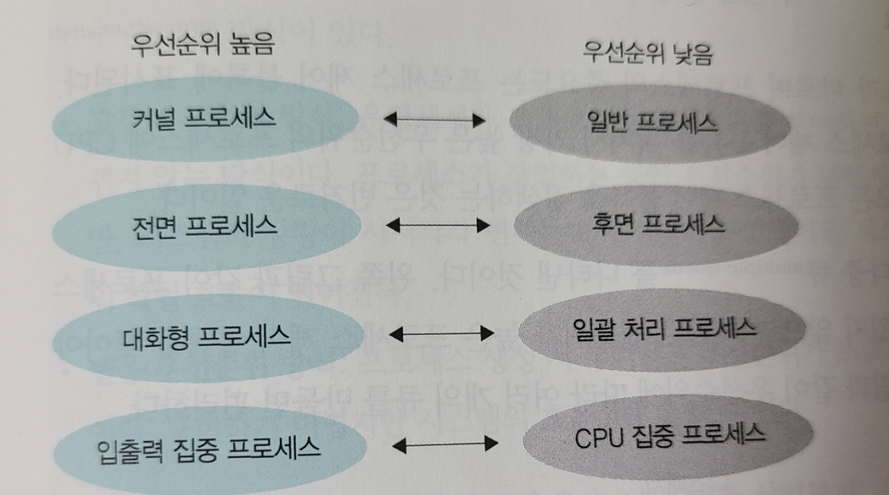
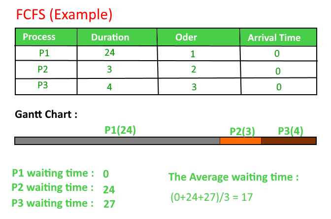
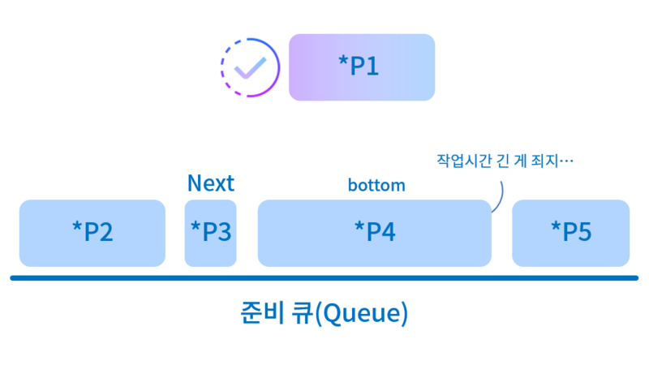
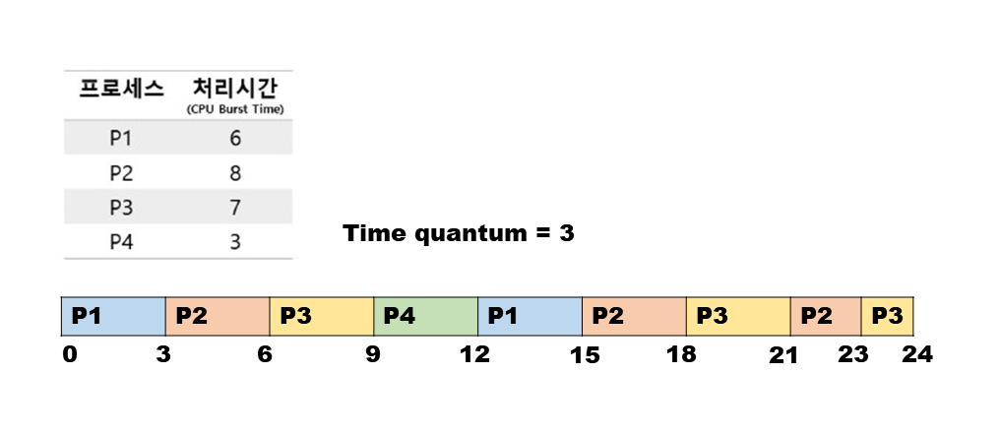
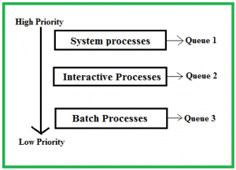
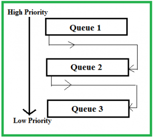

# CPU 스케줄링?

> 프로세스가 CPU에 할당을 받아야 작업을 수행  
이때 여러 프로세스 중 누가 CPU의 할당을 받을것인가??

운영체제의 CPU 스케줄러는 Ready 상태의 프로세스 중에서 어떤 프로세스에게 CPU를 할당할지 결정한다.
이를 CPU 스케줄링이라고 한다.

# 규모에 따라 구분한 CPU 스케줄링

## 1) 장기 스케줄링(Long-term-scheduler)
> 가장 큰 틀에서 이루어지는 CPU 스케줄링  
> 고수준 스케줄링, 작업 스케줄링이라고도 한다.

- 프로세스에 메모리 및 각종 자원을 주는 문제를 스케줄링한다.
- 전체 시스템의 부하를 고려하여 작업 요청을 받아들일지, 거부할지에 대한 결정을 한다.
- 즉, 장기 스케줄링의 결정에 따라 시스템 내의 프로세스 총 개수가 정해진다.
- 최근 운영체제에서는 프로그램 실행시키면 곧바로 ready 상태에 돌입하기 때문에, 장기 스케줄러가 없다.

## 2) 중기 스케줄링(Medium-term-scheduler, Swapper)
> 중기 스케줄링은 이미 활성화가 된 프로세스들에 대한 관리를 한다. 

-  시스템의 과부화를 막기 위해 활성화된 프로세스들의 중지 여부를 결정하여 프로세스 수를 조절한다.
- 즉, 여유 공간 마련을 위해 프로세스를 통쨰로 메모리에서 디스크로 쫓아낸다.(Swap out)
- 중기 스케줄링에 의해 중지된 프로세스들은 보류상태(Suspened, Stopped)가 된다.

## 3) 단기 스케줄링(Short-term scheduler, CPU scheduler)
> 가장 작은 단위의 스케줄링 

- 어떤 프로세스에 CPU를 할당할지, 어떤 프로세스를 대기 상태로 보낼지 등을 결정한다.
- 단기 스케줄러가 어떤 기준에 따라 프로세스를 선택(스케줄링 알고리즘)하고 어느정도 자원을 배분(Time slice와 관련)할지에 따라 시스템에 큰 영향을 끼친다.

# CPU 스케줄링의 목적

> 모든 프로세스가 적당히, 공평하게, 효율적으로 자원을 할당받는 것

- 공평성 
  - 프로세스에게 자원을 배분하는 과정이 공평해야한다.
- 효율성
  - 시스템 자원이 쉬는 시간이 없어야한다.(CPU를 놀게하면 안된다.)
- 안정성
  - 중요 프로세스들은 우선권을 줘야한다. 또한 프로세스가 증가해도 안정적으로 돌아가야한다.
- 확장성
  - 시스템 자원이 늘어나는 경우 이 해택이 시스템에 반영되어야 한다.
- 반응 시간 보장
  - 프로세스의 요구가 있을 경우 적절한 시간 안에 반응을 해줘야한다.
- 무한 연기 방지
  - 특정 프로세스의 작업이 무한정 연기되면 안된다.

# 스케줄링 시 고려사항

## 1) 선점형 스케줄링과 비선점형 스케줄링
### 1-1) 선점형 스케줄링
> 운영체제가 필요하다고 판단하면, 실행 상태에 있는 프로세스의 작업을 중단시키고 새로운 작업을 시작할 수 있다.

- Timeout 상황, I/O Interrupt, System call 등이 발생한 경우 현재 실행 상태에 있는 프로세스의 CPU를 강제로 회수하고, 다른 프로세스에게 CPU를 할당해줄 수 있는 스케줄링 방식이다.

- Context switch로 인한 오버헤드가 발생한다. 

- 그러나 하나의 프로세스가 CPU를 독점한다는 것은 동시에 여러작업을 할 수 없다는 의미이므로 대부분의 저수준 스케줄러는 선점형 스케줄링 방식을 사용한다.

### 1-2) 비선점형 스케줄링
> 비선점형 스케줄링의 경우 어떤 프로세스가 실행 상태에 들어가면 그 프로세스가 끝나거나 CPU를 자진 반납하는 경우가 아니면 계속 실행되는 것

- Context switch에 대한 오버헤드도 없고 스케줄러가 할 일도 적어져 효율적이다.

- 그러나 전체 시스템의 처리율이 떨어지게 된다.

## 2) 프로세스 우선순위
> 프로세스는 크게 커널 프로세스와 일반 프로세스로 나뉜다. 
> CPU 스케줄러는 보통 커널 프로세스를 높은 우선순위에 둔다. 
> 커널과 관련된 작업들이 보통 일반 프로세스보다 중요하기 떄문이다.

- 우선 순위가 높다 == 일반적으로 더 빨리 자주 실행된다. == 시스템 자원을 더 많이 받는다.

- 일반 프로세스 간에서도 우선순위가 존재한다.
  - 비디오 플레이어와 워드 작업이 같은 우선순위라면, 실시간으로 영상을 출력해야하는 비디오 플레이어가 끊기고 만다.
  - 이러한 문제 해결을 위해서는 일반 프로세스 간에도 우선순위를 매겨야 한다는 사실이 합리적임을 알 수 있다.

## 3) CPU bound process 와 IO bound process

프로세스의 여러 상태 중 실제 작업이 일어나는 상태는  
CPU를 사용하는 실행 상태와 입출력을 요청하여 완료되기를 기다리는 대기상태이다.

이때 CPU를 할당 받아 실행하는 작업을 CPU 버스트, 입출력 작업을 I/O  버스트라고 한다.

> CPU 버스트가 많은 프로세스를 CPU bound process  
> I/O 버스트가 많은 프로세스를 IO bound process

두 프로세스 간에는 IO bound process를 먼저 실행 상태로 옮기는 것이 효율적이다.
IO bound process의 경우 CPU를 할당 받아도 금방 대기 상태로 빠지는 반면, CPU bound process의 경우 할당 받는 CPU시간을 전부 사용하는 경우가 많기 때문이다.

따라서 스케줄링 시 IO bound process의 우선순위를 CPU bound process보다 높이는 것이 시스템 효율 향상에 도움이 된다.

## 4) 전면 프로세스와 후면 프로세스

전면 프로세스
>  GUI를 사용하는 OS에서 화면 맨 앞에 놓인 프로세스를 말한다.(ex_ 브라우저)

- 현재 입출력을 사용하는 프로세스이며 사용자와 상호작용 

후면 프로세스
> 사용자와 상호작용이 없는 프로세스 (ex_ 압축 프로그램)

전면 프로세스는 사용자의 요구를 즉각 반응해야하지만, 후면 프로세스는 상호작용이 없다.

따라서 전면프로세스에 우선순위를 더 높게 쳐주는 것이 합리적이다.

즉, 전면 프로세스가 후면 프로세스보다 CPU를 할당 받을 확률이 높다.

[각 고려사항에 대한 우선순위]

# 스케줄링 알고리즘

## CPU 스케줄링 성능 척도

1)  시스템 입장에서의 성능
> CPU를 쉬지 않고 최대한 많이 돌리는 것이 중요
  - CPU Utilzation(CPU 이용률): 전체시간 중 CPU가 일한 시간의 비율
  - Throughput(처리량): 단위 시간 당 처리량 즉, 단위 시간당 프로세스를 몇개 완료시켰는가가 중요
  
2) 사용자 입장에서의 성능 척도
> 자신이 요청한 작업이 빨리 처리되는 것이 중요
  - Waiting time(대기 시간): 프로세스가 Ready queue에서 기다린 시간
  - Response time(응답 시간): 프로세스가 최초로 CPU를 얻기까지 걸린 시간
  - Turnaround Time(소요시간, 반환시간): 프로세스가 처음 도착해서 끝나기까지 걸린 시간

## FCFS(First-Come-First-Served) 스케줄링

> 먼저 온 프로세스를 먼저 처리해주는 방식
> 비선점 방식
> 실생활에서의 줄서기와 비슷, 간편하고 공평함

하지만 FCFS는 도착한 프로세스의 순서에 따라 평균 대기시간이 크게 달라진다는 단점이 있다.
먼저 온 프로세스가 엄청 오래 걸리는 경우 그 뒤 프로세스들이 많은 시간을 기다려야한다.

간편한 만큼 불합리한 점이 많은 스케줄링 알고리즘이다.

특히, IO 작업이 많은 프로세스의 경우 더욱 불합리하게 느낄 수 있는 스케줄링 방식이다.

## SJF(Shortest Job First) 스케줄링

> FCFS 알고리즘을  개선한 방식 
> CPU를 가장 짧게 쓰려는 프로세스에게 먼저 CPU를 주는 방식

주어진 프로세스들에 대해 최소 평균 대기 시간을 보장한다.

SJF는 비선점과 선점(SRTF) 두가지 방식으로 구현할 수 있다.
Non-preemptive 방식의 경우 일단 프로세스가 CPU를 잡으면 CPU burst가 완료될 때까지 CPU를 빼앗기지 않는다.

반면에 Preemptive 방식에서는 현재 수행중인 프로세스의 남은 burst time보다 더 짧은 CPU burst time을 가진 새 프로세스가 도착하면 CPU를 빼앗아 버린다.

### SJF의 약점
- Starvation 발생
  - CPU burst time이 긴 프로세스의 경우 영원히 CPU를 못 얻는 경우가 생길 수 있다.
  - 긴 CPU 사용시간을 가진 프로세스 입장에서는 불리하다.

- 프로세스의 CPU burst time을 정확히 알 수 없다.
  - 프로세스의 CPU burst time을 예측하고자 할 때 과거 CPU burst time을 가지고 예측할 수 있지만, 하나의 프로세스의 CPU사용 시간을 정확히 미리 알기란 어렵다.

## Priority Scheduling(우선순위 스케줄링)

> 우선순위 값을 설정하여 스케줄링하는 방식
> SJF도 일종의 우선순위 스케줄링이다.(CPU 사용시간 기준)

우선순위 스케줄링 방식 역시 비선점 또는 선점 방식으로 구현이 가능하다.

약점 
Starvation 문제가 있을 수 있다.
하지만 우선순위 스케줄링에서는 이를 Aging기법을 사용하여 해결한다.

### Aging이란?
프로세스가 기다리는 시간이 길어질 수록 우선순위를 높여 한 프로세스가 무한정 기다리지는 않도록 해주는 방법이다.

## Round Robin(RR)

> 각 프로세스에 동일한 크기의 시간을 할당
> 할당시간이 지나면 프로세스를 CPU에서 빼앗고 다시 Ready Queue에 제일 뒤에 줄을 서게 한다.

- 이러한 방식은 n개의 프로세스가 Ready Queue에 있고, time slice가 t일 때 어떤 프로세스도 (n-1)*t 이상 기다리지 않게 해준다.

- 사용자 입장의 성능면에서 좋다.

### 이때 time slice를 어느정도로 설정해야하나??

*만약, time slice가 너무 커진다면?*
- 사실상 FCFS 알고리즘이 되어버린다.

*만약, time slice가 너무 작아진다면?*
- Context Switch에 대한 오버헤드가 커지게 된다.

> 따라서 time slice를 IO bound process의 CPU burst time정도로 잡게 된다면 합리적이고 일반적으로 10ms~ 100ms정도로 설정하게 된다.

**RR 스케줄링 방식은 일반적으로 SJF보다 turnaround time은 길지만 response time이 작다.**

따라서 interactive환경에서 장점이 될 수 있다.

## Multilevel Queue

> Ready Queue를 여러 개로 분할하여 작업한다.

- 우선순위가 높은 큐에는 System Process나 Interactive Process들을 삽입
- CPU bound process의 경우 후순의 큐에 삽입

또한 각 큐마다 독립적인 스케줄링 알고리즘을 적용하여 효율성을 높일 수 있다.

ex) Interactive process들이 있는 큐에서는 RR알고리즘을  
    Batch Process들이 있는 큐에서는 FCFS 알고리즘을 적용하여 각 프로세스의 성격에 맞게 효율적인 알고리즘을 적용할 수 있다.

Multilevel Queue에서는 큐들에 대한 스케줄링 역시 필요하다.

가장 우선순위가 높은 큐부터 비워나가는 방식

각 큐마다 CPU 시간을 적절한 비율로 할당해주는 경우

전자의 경우 우선순위가 높은 프로세스부터 빠르게 처리해 나갈 수 있겠지만 Starvation 가능성이 있어 후자처럼 보완하는 경우가 있는 것이다.

## Multilevel Feedback Queue

> 큐를 여러개로 분할  
> 프로세스가 다른 큐로 이동이 가능하다.

- 우선순위가 낮은 큐에 있는 프로세스가 Starvation 가능성이 있다는 점을 고려했을 때 다른 큐로 이동한다는 것은 일종의 Aging 기법 구현 방식 중 하나가 될 수 있다.

-minyoung.png)

위 방식은 Multilevel Feedback Queue의 대표적인 구현 예시이다.
새로운 프로세스는 무조건 우선순위가 높은 큐에 들어가서 8ms의 time slice 받고 계속해서 우선순위가 낮은 큐로 진행해 나아가는 방식이다.

출처  
[CPU 스케줄링-(1) CPU스케줄링의 개념](https://kjhoon0330.tistory.com/entry/%EC%9A%B4%EC%98%81%EC%B2%B4%EC%A0%9COS-CPU-%EC%8A%A4%EC%BC%80%EC%A4%84%EB%A7%81#4.%203.%F0%9F%91%80%EC%8A%A4%EC%BC%80%EC%A4%84%EB%A7%81%20%EC%95%8C%EA%B3%A0%EB%A6%AC%EC%A6%98
)

[CPU 스케줄링-(2) 스케줄링 알고리즘](https://kjhoon0330.tistory.com/entry/%EC%9A%B4%EC%98%81%EC%B2%B4%EC%A0%9COS-CPU-%EC%8A%A4%EC%BC%80%EC%A4%84%EB%A7%81-2-%EC%8A%A4%EC%BC%80%EC%A4%84%EB%A7%81-%EC%95%8C%EA%B3%A0%EB%A6%AC%EC%A6%98
)
