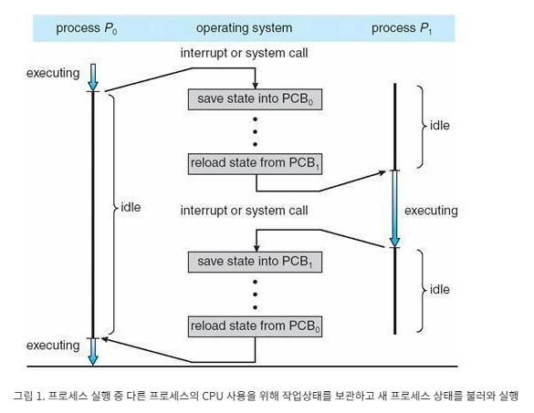

# PCB와 Context Switching

# **PCB**

1) OS의 기본, Process Control Block

2) 프로세스 제어 블록은 특정한 프로세스를 관리할 필요가 있는 정보를 포함하는 운영체제 커널의 자료구조입니다. PCB는 운영 체제가 프로세스를 표현한 것이라 할 수 있습니다. 

3) 운영체제가 프로세스 스케줄링을 위해 프로세스에 관한 모든 정보를 가지고 있는 데이터 베이스를 PCB라 합니다. 

4) 운영체제에서 프로세스는 PCB로 나타내어지며, PCB는 프로세스에 대한 중요한 정보를 가지고 있는 자료입니다. 각 프로세스가 생성될 때마다 고유의 PCB가 생성되고, 프로세스가 완료되면 PCB는 제거됩니다. 

5) 프로세스는 CPU를 점유하여 작업을 처리하다가도 상태가 전이되면, 진행하던 작업 내용들을 모두 정리하고 CPU를 반환해야 하는데, 이 때 진행하던 작업들을 모두 저장하지 않으면 다음에 자신의 순서가 왔을 때 어떠한 작업을 해야하는지 알 수 없는 상황이 발생합니다. 

따라서 프로세스는 CPU가 처리하던 작업의 내용들을 자신의 PCB에 저장하고, 다음에 다시 CPU를점유하여 작업을 수행해야 할 때, PCB로부터 해당 정보들을 CPU에 넘겨와서 계속해서 하던 작업을 진행할 수 있게 됩니다. 

**포함정보**

1) 포인터 : 프로세스의 현재 위치를 저장하는 포인터 정보

2) 프로세스 상태 : 프로세스의 각 상태(생성, 준비, 실행, 대기, 종료)를 저장합니다. 

3) 프로세스 번호 : 모든 프로세스에는 프로세스 식별자를 저장하는 프로세스 ID 또는 PID 라는 고유한 ID가 할당됩니다. 

4) 프로그램 카운터 : 프로세스를 위해 실행될 다음 명령어의 주소를 포함하는 카운터를 저장합니다. 

5) 레지스터 : 누산시, 베이스, 레지스터 및 범용 레지스터를 포함하는 CPU 레지스터에 있는 정보입니다. 

6) 메모리 제한 : 이 필드에는 운영체제에서 사용하는 메모리 관리 시스템에 대한 정보가 포함됩니다. 여기에는 페이지 테이블, 세그먼트 테이블 등이 포함될 수 있습니다. 

7) 열린 파일 목록 : 이 정보에는 프로세스를 위해 열린 파일 목록이 포함됩니다. 

---

# Context Switching

멀티 프로세스 환경에서 CPU가 어떤 하나의 프로세스를 실행하고 있는 상태에서 인터럽트 요청에 의해 다음 우선순위의 프로세스가 실행되어야 할 때 기존의 프로세스의 상태 또는 레지스터 값을 PCB에 저장하고 CPU가 다음 프로세스를 수행하도록 새로운 프로세스의 상태 또는 레지스터 값을 PCB에서 가져와 교체하는 작업

### 컨텍스트 스위칭이 일어나는 과정

| 단계 | 절차 | 설명 |
| --- | --- | --- |
| 1 | 인터럽트 / 시스템 호출 | 운영체제에서 프로세스 스케줄러에 의해 인터럽트 발생 |
| 2 | 커널 모드 전환 | 프로세스 P0이 사용자 모드(executing) 에서 커널 모드(idle)로 전환              (프로세스 P0 이 CPU 점유 → 대기로 상태 변경) |
| 3 | 현재 프로세스 상태 PCB에 저장 | P0 프로세스 정보를 PCB에 저장 |
| 4 | 다음 실행 프로세스 로드 | PCB에 있는 다음 실행 프로세스 P1 상태 정보 복구 |
| 5 | 사용자 모드 전환 | P1 프로세스 커널 모드에서 사용자 모드로 전환하여 실행 |

즉, 컨텍스트 스위칭이란, P0과  P1처럼 서로 대기 ↔ 실행을 번갈아가며 하는 것이다. 이러한 컨텍스트 스위칭을 통해 멀티 프로세싱, 멀티 스레딩 운영이 가능하다. 

### 컨텍스트 스위칭이 발생하는 경우

1. I/O interrupt
2. CPU 사용시간 만료
3. 자식 프로세스 Fork
4. 인터럽트 처리를 기다릴 때 등등

⇒ 컨텍스트 스위칭이 일어날 때, 다음 번 프로세스는 스케줄러가 결정하게 됩니다. 즉 컨텍스트 스위칭을 하는 주체는 스케줄러입니다.  

### 단점

컨텍스트 스위칭이 너무 잦으면 오버헤드가 발생하여 성능이 떨어집니다. 

왜냐하면 그림1 처럼 기존상태(P0)를 PCB에 저장하고 다음 상태(P1)를 PCB에서 가져와야 하는데 이러한 작업을 할 때에는 CPU가 아무런 일도 하지 못하게 되기 때문입니다. 

| 해결방안 | 설명 |
| --- | --- |
| 프로그램 다중화 수준 낮춤 | 다중 프로그래밍 수준을 낮춰 컨텍스트 스위칭 발생 빈도 줄이기 |
| 스레드 이용 | Light Weight 프로세스인 스레드를 이용하여 컨텍스트 스위칭 부하 최소화          스레드의 text, data, heap 영역은 프로세스의 것이기 때문에 자신의 PCB에는 스택 및 간단한 정보만 저장하기에 프로세스 컨텍스트 스위칭보다 빠르다.  |
| 스택포인터 활용 | 스택 이용 프로그램의 경우, 스택 포인터를 이용하여 컨텍스트 스위칭 부하 최소화 |

📚 출처

- https://jwprogramming.tistory.com/16
- https://yoongrammer.tistory.com/52
- https://gaeunhan.tistory.com/70