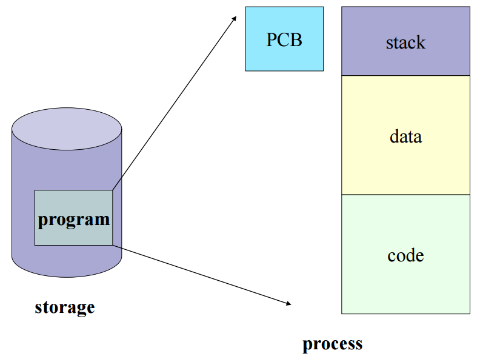

# Process Management

CPU가 프로세스가 여러개일 때, CPU스케줄링을 통해 관리하는 것을 말한다.
이때, CPU는 각 프로세스들이 누군지 알아야 관리가 가능하다.
이러한 프로세스들의 특징을 갖고 있는 것이 바로 Process Metadata이다.

# Process Metadata에는 다음과 같은 정보들이 있다.

## - Process ID  
  - PID(Process Identification Number)
  - 프로세스 고유 식별 번호

## - Process State
  - 프로세스의 현재 상태(준비, 실행, 대기 상태)를 기억시킨다.

## - Process Priority
  - 프로세스 우선순위 등과 같은 스케줄링 관련 정보를 기억시킨다.

## - CPU Registers
  - 프로세스의 레지스터 상태를 저장하는 공간 등 
    CPU 내 범용 레지스터, 데이터 레지스터, 세그먼트 레지스터 등이 갖고 있는 값을 기억시킨다.

## - Owner
  - CPU 사용시간의 정보, 각종 스케줄러에 필요한 정보를 기억시킨다.
  
## - 기억장치 관리 정보
  - 프로그램이 적재될 기억 장치의 상한치, 하한치, 페이지 테이블 등의 정보를 기억시킨다.

## - 입출력 정보
  - 프로세스 수행 시 필요한 주변 장치, 파일들의 정보를 기억시킨다.

## - 프로그램 카운터(계수기)
  - 다음에 실행되는 명령어의 주소를 기억시킨다.

이러한 정보들이 담긴 메탇이터는 프로세스가 생성되면 PCB(Process Control Block)이라는 곳에 저장된다.

# PCB
> 프로세스 메타 데이터들을 저장해 놓는 곳이다.
> 하나의 PCB 안에는 하나의 프로세스 정보가 담겨있다.

프로그램 실행 -> 프로세스 생성 -> 프로세스 주소 공간에(코드, 데이터, 스택) 생성 
-> 이 프로세스의 메타데이터들이 PCB에 저장

# PCB가 필요한 이유?

CPU에서는 프로세스의 상태에 따라 교체 작업이 이루어진다.
(Interrupt가 발생해서 할당받은 프로세스가 Waiting 상태가 되고 다른 프로세스를 running으로 바꿔 올릴 때)

이때 앞으로 다시 수행할 대기 중인 프로세스에 관한 저장 값을 PCB에 저장해 두는 것이다.

# PCB는 어떻게 관리되나요?

Linked List 방식으로 관리된다.

PCB List Head에 PCB들이 생성될 때마다 붙게 된다.
주소값으로 연결이 이루어져 있는 연결리스트이기 때문에 삽입 삭제가 용이하다.

즉, 프로세스가 생성되면 해당 PCB가 생성되고 프로세스 완료 시 제거된다.

이렇게 수행 중인 프로세스를 변경할 때, CPU의 레지스터 정보가 변경되는 것을 Context Switching이라고 한다.

# Context Switching

> CPU가 이전의 프로세스 상태를 PCB에 보관하고, 또 다른 프로세스의 정보를 PCB에서 읽어 레지스터에 적재하는 과정

보통 인터럽트가 발생하거나, 실행 중인 CPU 사용 허가시간을 모두 소모하거나, 
입출력을 위해 대기해야 하는 경우에 Context Switching이 발생한다.

즉, 프로세스가 Ready ->Running, Running -> Ready, Running -> Waiting 처럼 상태 변경 시 발생

# Context Switching 수행 과정
1. Task의 대부분 정보는 Register에 저장되고 PCB(Process Control Block)로 관리가 되고 있다.

2. 현재 실행하고 있는 Task의 PCB 정보를 저장하게 된다.(Process Stack, Ready Queue)

3. 다음 실행할 Task의 PCB 정보를 읽어 Register에 적재하고 CPU가 이전에 진행했던 과정을 연속적으로 수행할 수 있게 된다.

# Context Switching이 필요한 이유?

만약 컴퓨터가 매번 하나의 Task만 처리할 수 있다면?
- 다음 Task를 처리하기 위해서 현재 Task가 끝날 때까지 기다려야한다.
- 반응 속도가 매우 느리고 사용하기 불편하다.

## 다양한 사람들이 동시에 사용하는 것처럼 하기 위해서 Context Switching이 필요하게 되었다.

- 컴퓨터 멀티태스킹을 통해 빠른 반응 속도로 응답 가능하다
- 빠르게 Task를 바꾸면서 실행하기에 사람은 실시간 처리가 되는 것처럼 보인다.
- CPU가 Task를 바꿔가며 실행하기 위해 Context Switching이 필요하게 되었다.

# Context Switching Cost

Context Switcing이 발생하게 되면 다음과 같은 Cost가 소요된다.

1.Cache 초기화
2. Memory Mapping 초기화
3. 메모리의 접근을 위해서 Kernel은 항상 실행되어야 한다.

따라서 잦은 Context Switching은 성능 저하를 가져온다.

# Context Switching Cost

CPU는 하나의 프로세스 정보만을 기억한다. 
여러 개의 프로세스가 실행되는 다중 프로그래밍 환경에서 CPU는 각각의 프로세스의 정보를 저장했다 복귀하고
다시 저장했다 복귀하는 일을 반복한다.
프로세스의 저장과 복귀는 프로세스의 중단과 실행을 의미한다.
프로세스의 중단과 실행 시 인터럽트가 발생하므로, 문맥 교환이 많이 일어난다는 것은 인터럽트가 많이 발생한다는 것을 의미한다.

# Context Switching과 시간 할당량

- 시간 할당량이 적어지면 : 문맥 교환 수, 인터럽트 횟수, 오버헤드가 증가하지만 여러 개의 프로세스가 동시에 수행되는 느낌을 갖는다.

- 시간 할당량이 커지면 : 문맥 교환 수, 인터럽트 횟수, 오버헤드가 감소하지만 여러 개의 프로세스가 동시에 수행되는 느낌을 갖지 못한다.

프로세스를 수행하다가 I/O event가 발생하여 BLOCK 상태로 전환시켰을 때, 
CPU가 그냥 놀게 놔두는 것보다 다른 프로세스를 수행시키는 것이 효율적이므로, 
CPU에 계속 프로세스를 수행시키도록 하기 위해서 
다른 프로세스를 실행시키고 Context Switching을 할 때 Overhead가 발생한다.

CPU가 놀지 않도록 만들면서, 사용자에게 빠르게 일처리를 제공해 주기 위한 것이다.

# Process vs Thread
Context Switching 비용은 Process가 Thread보다 많이 든다. 

그 이유는 Thread는 Stack 영역을 제외한 모든 메모리를 공유하기에 
Context Switching 발생 시 Stack 영역만 변경하면 되기 때문이다.

출처: 

https://m.blog.naver.com/adamdoha/222019884898

