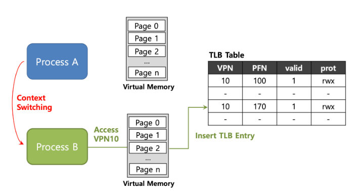
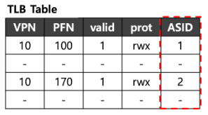
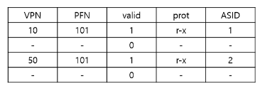

# TLB
- MMU안에 내장된 캐시로 주소 변환의 하드웨어 캐시


- 자주 사용하는 VPN, PFN 정보가 쌍으로 존재하며 이를 사용해 가상 주소를 실제주소로 변환하도록 도와줌


- 프로세스 페이지는 자신의 물리적 주소를 얻기 위해 TLB에 먼저 접근하고, TLB에 자신이 물리적 주소가 있으면, 해당 주소로 바로 접근하면 됨


- TLB에 자신의 물리적 주소가 없으면?
    - 페이지 테이블(메인 메모리)까지 갔다온 뒤에 TLB에서 가장 오래된 엔트리와 교체

    
- TLB hit : TLB에 페이지 물리적 주소가 있음
- TLB miss : TLB에 페이지의 물리적 주소가 없음


- TLB hit이면 곧바로 물리적 주소로 접근 가능
- TLB miss이면 페이지 테이블을 한 번 거쳐야 함
- TLB는 페이지 테이블 엔트리를 저장한 캐시에 불과하기 때문에 위 그림과 같이 모든 엔트리는 page number, frame number의 정보를 가지고 있음
    - 페이지 테이블에서는 page number를 인덱스로 사용할 수 있음
    - TLB에서는 불가능 >> TLB에 저장되는 엔트리는 페이지 테이블의 일부분이기 때문
        - TLB에서 page number를 찾을 때는 '탐색'을 해야함.


- TLB hit일 때는 시간이 많이 단축
- TLB miss일 때는 오히려 시간이 늘어남
    - **TLB에 접근하는 시간까지 낭비되기 때문**

성능 중요!

- 성능 평가 척도: Hit Ratio
    - TLB에서 page number 검색 성공 비율
    - Effective Access Time(EAT)
        - Hit ratio, 메모리 접근 시간, TLB 접근 시간을 알면 메인 메모리에서 값을 가져오는데 걸리는 평균 시간을 구할 수 있음


# TLB entry


- TLB는 Full Associative method에 의해 관리됨
  - 일반적인 TLB는 32,64 또는 128개의 항목을 가질 수 있음
  - 하드웨어는 **전체 TLB를 병렬로 검색**하여 원하는 변환을 찾음
  
>정리하자면, 자주 사용하는 TLB에는 VPN(virtual page number)과 PFN(Page Frame Number) 정보가 쌍으로 존재하며, 
> 이를 사용해 주소 변환을 하도록 도와주는 Hardware Cache임.


# Effective Access Time(EAT)
실제 메모리에 접근하는 시간(EAT)
단위 : ns
```
메모리 접근 시간 = Mns
TLB 접근 시간 = Tns
Hit ratio = α%

Effective Access Time 
= {α * (T+M)}+{(1-α) * (T+M+M)} ns
={TLB hit일 때 메모리 접근 시간}+{TLB miss일 때 메모리 접근 시간}
```


# Locality
- TLB는 Spatial Locality(공간 지역성)로 인해, 성능을 향상시킴

- Temporal Locality(시간 지역성)
  - 최근에 접근한 데이터에 접근할 가능성이 높다는 의미
  - 주로 반복문에서 확인 가능
  - 하드웨어에서는 cache라는 작고 빠른 메모리에 저장하여 지역성을 활용한다.
  - 캐시의 크기가 커진다면 빠르게 메모리에 정보 저장 불가능
  

- Spatial Locality(공간 지역성)
  - 어떤 요소에 접근한 상황이라면 그 주변의 요소들에 접근할 가능성이 높다는 의미


# TLB를 사용할 때 Context Switching이 발생하면? **VPN이 동일할 때**
Process마다 각자의 가상 메모리를 가지고 있음



위와 같이 TLB에 정보를 저장하게 되면 어떤 정보가 어떤 프로세스의 정보인지 알 수 없음.

프로세스에서 서로의 주소 공간이 아닌 곳에 접근을 하게 될 경우 문제 발생!


# 문제 해결 방법 : ASID


- 어떤 프로세스의 정보인지 구별하기 위해 TLB에서 ASID를 제공
- 이를 통해 프로세스마다 다른 ASID 정보를 저장하여 주소 변환을 성공적으로 수행할 수 있음

# PFN이 동일할 때


- 두개의 프로세스가 PFN이 같으므로 page를 공유할 수 있음
  - 메모리의 사용을 줄일 수 있음
  - 어떤 프로세스인지 구별을 확인하기 위해 ASID값도 같이 저장됨.

# TLB Replacement Policy
- TLB에 저장 가능한 공간이 꽉 찼을 경우 새로운 프로세스가 실행된다면, 어떤 프로세스를 빼고 새로운 것을 넣어야 하는지??

- 목표: TLB miss rate 최소화
- 접근 방법: LRU, Random policy

- LRU(Least-recently-used): 최근에 사용하지 않는 프로세스를 내보냄 
  - LRU는 위에서 설명한 Temporal Locality의 장점을 이용한다.

- Random policy : 랜덤하게 제거


출처: <br/> 
https://hyenakim.github.io/2020/06/11.-translation-lookaside-buffer/

https://charles098.tistory.com/110

https://github.com/devSquad-study/2023-CS-Study/blob/main/OS/os_tlb_advanced.md

