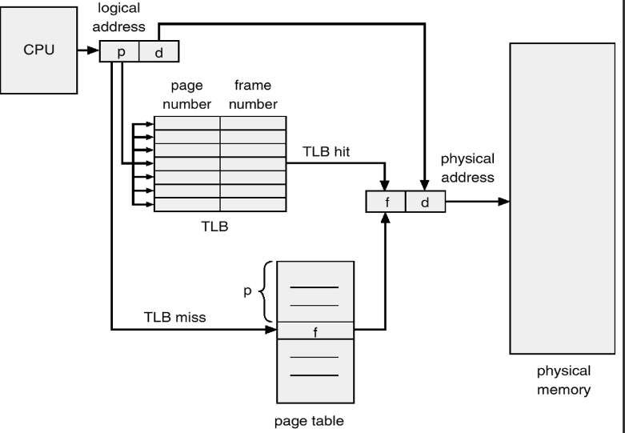

# TLB
- MMU안에 내장된 캐시로 가장 최근에 참조된 페이지 엔트리만 저장

- 자주 사용하는 페이지 테이블 엔트리를 CPU와 가까운 곳에 둬서 CPU가 빨리 쓸 수 있도록 함.

- 프로세스 페이지는 자신의 물리적 주소를 얻기 위해 TLB에 먼저 접근하고, TLB에 자신이 물리적 주소가 있으면, 해당 주소로 바로 접근하면 됨

- TLB에 자신의 물리적 주소가 없으면?
  - 페이지 테이블(메인 메모리)까지 갔다온 뒤에 TLB에서 가장 오래된 엔트리와 교체


- TLB hit : TLB에 페이지 물리적 주소가 있음
- TLB miss : TLB에 페이지의 물리적 주소가 없음



- TLB hit이면 곧바로 물리적 주소로 접근 가능
- TLB miss이면 페이지 테이블을 한 번 거쳐야 함
- TLB는 페이지 테이블 엔트리를 저장한 캐시에 불과하기 때문에 위 그림과 같이 모든 엔트리는 page number, frame number의 정보를 가지고 있음
  - 페이지 테이블에서는 page number를 인덱스로 사용할 수 있음
  - TLB에서는 불가능 >> TLB에 저장되는 엔트리는 페이지 테이블의 일부분이기 때문 
    - TLB에서 page number를 찾을 때는 '탐색'을 해야함.

  
## TLB MISS
- TLB hit일 때는 시간이 많이 단축
- TLB miss일 때는 오히려 시간이 늘어남
  - **TLB에 접근하는 시간까지 낭비되기 때문**

성능 중요!

- 성능 평가 척도: Hit Ratio
  - TLB에서 page number 검색 성공 비율
  - Effective Access Time(EAT)    
    - Hit ratio, 메모리 접근 시간, TLB 접근 시간을 알면 메인 메모리에서 값을 가져오는데 걸리는 평균 시간을 구할 수 있음


- Effective Access Time(EAT)

```
메모리 접근 시간 = M
TLB 접근 시간 = T
Hit ratio = α

Effective Access Time 
= {α * (T+M)}+{(1-α) * (T+M+M)}
={TLB hit일 때 메모리 접근 시간}+{TLB miss일 때 메모리 접근 시간}
```


출처: https://charles098.tistory.com/110
