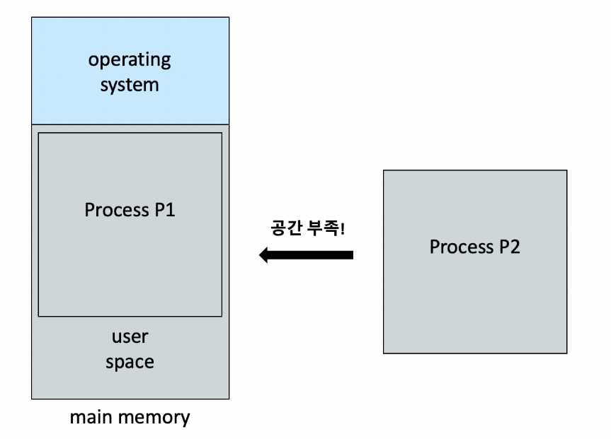
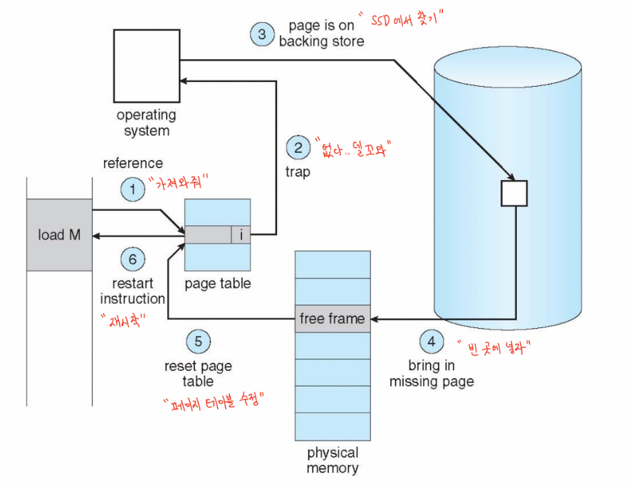
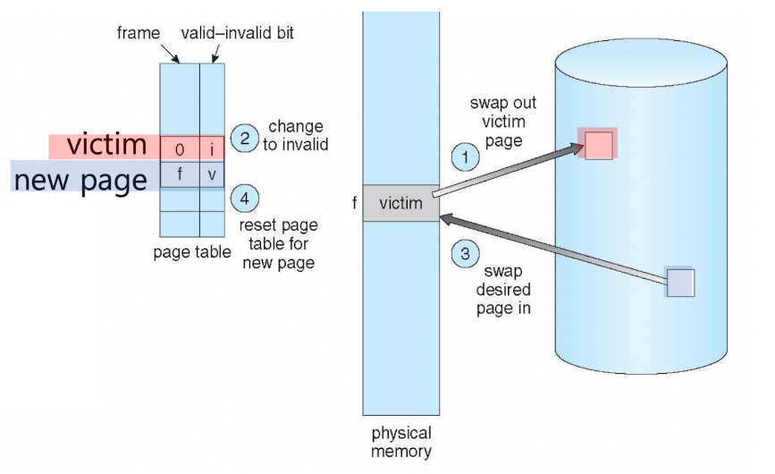

# Swapping
프로그램을 실행시키려면 데이터가 메모리 위에 올라가야함.

프로세스 P2가 실행되기 위해서는 메인메모리에 로딩이되어야하는데, 공간이 보족

- Swapping : P1을 그대로 보조기억장치(SSD)에 옮겨 자리를 만들어주고, 빈자리에 P2를 넣는 방법이 있음

> Swapping : 두 개의 프로세스를 **통째로 바꿔치기** 하는 개념
> 메인 메모리에서 SSD로 가는 것 : swap out
> SSD에서 메인 메모리로 가는 것 : swap in

**오버헤드 심함 -> 비효율적임**

그래서 현대의 OS는 다른 방법을 사용  -> 요구 페이징(Demand Paging)

# 요구 페이징 (Demand Paging)

프로그램을 실행 할 때 사용하는 기능은 극히 일부
-> SSD에 저장되어 있는 모든 내용을 다 메모리에 옮기 필요 없음 : 그때 그때 끌어다 쓰면 OK

> Demand Paging
> : 프로그램 실행 중에 필요한 페이지를 그때그때 로딩하는 방법. 사용하지 않는 페이지는 물리적 메모리에 로딩되지 않는다.

가상 메모리의 페이지는 8개로 A~H까지 존재
모든 페이지는 SSD에 저장되어 있음
현재 A,C,F 페이지만 메인 메모리 위에 올라가 있음

이제 CPU는 프로그램 실행 중 페이지를 요구할 때, 메인 메모리에 이미 존재하는 페이지는 페이지 테이블을 통해 그대로 접근하면 되고,
메인 메모리에 존재하지 않는 페이지는 SSD에서 가져와서 쓰면 됨.

**valid bit**
- 페이지 테이블에서 접근하고자 하는 페이지가 메인 메모리에 로딩되어 있는지, 로딩되어 있지 않은지를 구별해주는 비트

> valid bit : 해당 페이지가 메인 메모리에 존재하는지 알려주는 값으로 page table entry에 있다.
> v(valid): 해달 페이지가 메인 메모리에 있다.
> i(invalid): 해당 페이지가 메인 메모리 위에 없다. 따라서 SSD에서 가져와야 한다. 이를 Page Fault라고 한다.

Page Fault가 발생하면 SSD에서 페이지를 가져와야 하기 때문에 소프트웨어 인터럽트가 발생

1. 페이지 테이블에서 valid bit 검사
2. 값이 i면 page fault이므로 trap 발생시킴
3. SSD에서 필요한 페이지 탐색
4. 메인 메모리 free frame에 로딩
5. 페이지 테이블에 vaild bit를 v로 수정
6. 명령 재수행

Page Fault가 발생하면 SSD까지 갔다와야 하기 때문에 오버헤드 발생
따라서 Page Fault발생 비율은 페이지 성능에 큰 영향을 미침

Page Fault가 발생하는 비율을 알 수 있다면, 수식을 통해  Demand Paging 성능을 도출해낼 수 있음.

> Effective Access Time(EAT) for Demand Paging
>
> memory acess time = M
> page fault time = T
> page fault ratio = p (0<=p<=1)
> 
> Effective Access Time(EAT) = {(1 - p)*M} +{p * T}
>  
> = {no page fault 일 때 시간}+ {page fault일 때 시간}

Page Fault Ratio가 낮을 수록 EAT값이 단축

# Page Fault

- free frame 존재 : 그냥 할당하면 됨.
- free frame 없음 : 메인 메모리에 있는 페이지를 하나 빼야함.

어떤 페이지를 뺄 것? 중요
-> **페이지 교체 알고리즘** 등장

# 페이지 교체 알고리즘

- 필요한 이유
  - page fault ratio를 낮추기 위해서
  - 메인 메모리의 용량이 한정적이기 때문

- 교체 대상이 되는 페이지 : victim page

Vaild bit는 찾고자 하는 페이지가 메인 메모리에 존재하는지 알려주는 값으로,
PTE(Page Table Entry)마다 가지고 있음

PTE구성 중 하나의 값일 뿐임.

# PTE 구성 요소 중 하나 Modify Bit(= Dirty Bit)

> Page Fault 발생 시 free frame이 없는 경우
> 초기에 SSD에서 메인 페모리로 Page A를 로딩했다고 가정

만약 Page A의 내용이 전혀 수정되지 않았다면, Page A가 교체될 때 SSD에 다시 저장할 필요? 없음
**즉, 수정되지 않는 페이지는 swap out과정이 필요 없음**

- **페이지 수정 여부만 알 수 있으면 페이지 교체시 swap out시간을 절약할 수 있음**
- 이를 알려주는 값이 Modify Bit임
- 초기값 0
- 페이지가 수정되면 1로 바뀜

# 페이지 교체 알고리즘

1. First-In-First-Out(FIFO) Algorithm : 할당된 순서대로 교체되는 알고리즘
2. Optimal Algorithm : 앞으로 가장 사용 안할 페이지를 교체하는 알고리즘 
3. Least Recently Used(LRU) Algorithm : 가장 마지막에 쓴 페이지를 교체하는 알고리즘
    - Counter Implemantation
    - Stack Implementation
    - Second-Change Algorithm
    - Enhanced Second-Change Algorithm

5. Counting Algorithm : 발생 빈도를 보고 교체하는 알고리즘
   - Least Frequently Used(LFU) Algorithm : 가장 조금 사용된 페이지를 교체하는 알고리즘
   - Mosr Frequently Used(MFU) Algorithm : 가장 많이 사용된 페이지를 교체하는 알고리즘
   - 각 페이지의 사용빈도를 어떻게 구함? 
     - Aging Algorithm : 참조 비트를 이용해 각 페이지의 사용 빈도를 구해줌

출처: https://charles098.tistory.com/115?category=947356
