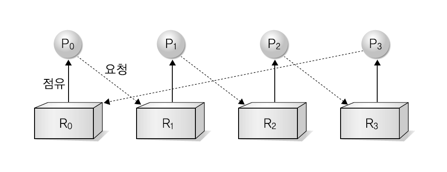
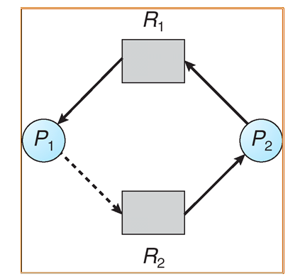

# Deadlock(교착상태)

일련의 프로세스들이 서로가 가진 자원을 기다리며 block 되어 더 이상 진행이 될 수 없는 상태

둘 이상의 프로세스가 결코 일어나지 않을 사건을 기다리는 상태
교착 상태는 언제 일어날까?
교착 상태는 시스템 자원에 대한 요구가 엉킨 상태로, 두 프로세스가 사용하는 자원을 서로 기다리고 있을 때 발생한다.

다음 그림을 보면,
P1 이 R1을 갖고 있고, P2는 R2를 갖고 있다. 그런데 P2는 R1을 필요로 하고 P1은 R2를 필요로 한다. 그러면 서로에게 필요한 것을 서로가 갖고 있지만, 요구가 뒤엉킨 상태로 계속 서로가 가진 자원을 받을 때 까지 무한정 대기 하게 되는 것이다.

프로세스가 자원을 사용하는 절차
자원 요청 (Request)
프로세스가 자원을 요청한다. 만약 다른 프로세스가 자원을 사용하고 있어 받을 수 없다면 대기한다.

자원 받음 (Allocate)

자원 사용 (Use)
프로세스가 받은 자원을 사용한다.

자원 해제 (Release)
프로세스가 자원을 놓아준다.

Deadlock은 모든 프로세스가 Request 상태가 되어 있는 상황이다.

Deadlock Chracterization
교착 상태가 발생하기 위해 다음 4가지 조건을 만족해야 한다.

1. Mutual exclusion (상호 배제)
   매 순간 하나의 프로세스만이 자원을 사용할 수 있다.

2. Hold and wait (보유 대기)
   자원을 가진 프로세스가 다른 자원을 기다릴 때, 보유하고 있는 자원을 놓지 않고 계속 가지고 있다.

3. No preemption (비선점)
   프로세스는 OS에 의해 강제로 자원을 빼앗기지 않는다.
   즉, 자원을 강제로 빼앗는게 아니라, 자원을 점유하고 있는 프로세스가 해당 자원을 해제해야 한다는 것이다.

4. Circular wait (순환 대기)
   자원을 기다리는 프로세스 간에 사이클이 형성어되야 한다.

>1. 상호 배제 : 돌 하나만 디딜 수 있음
>2. 점유와 대기 : 자원(돌) 하나를 가진채 다른 프로세스가 점유한 자원(돌) 요구
>3. 비선점 조건 : 돌을 강제로 제거할 수 없음
>4. 순환 대기 : 반대편에서 오는 사람을 기다리고, 다른 사람은 나를 기다림

# 교착 상태의 표현

교착 상태는 어떻게 해결할까?
1. 둘 중 한 사람이 되돌아 간다 (복귀)
2. 징검다리 반대편을 먼저 확인하고 출발한다.
3. 강의 한편에 우선순위를 부여한다.

출처: https://velog.io/@zioo/Deadlock%EA%B5%90%EC%B0%A9-%EC%83%81%ED%83%9C%EC%9D%98-%EA%B0%9C%EB%85%90%EA%B3%BC-%EB%B0%9C%EC%83%9D-%EC%9B%90%EC%9D%B8
