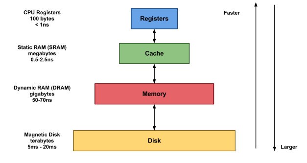

# 메모리계층

## 메모리

- **CPU가 직접 접근할 수 있는 기억장치**
- 현재 실행되는 프로그램의 명령어와 데이터를 저장하는 부품
- 프로그램이 실행되려면 반드시 메모리에 저장되어 있어야 함

 

## 메모리 계층

- 메모리 관련 세 가지 주요 특성인 **용량**, **접근 속도**, **비용** 간의 절충 관계를 파악해 필요에 따라 채택할 수 있게 나타낸 구조
- 컴퓨터의 설계에 있어 각각의 특징이 있는 서로 다른 여러 종류의 저장 장치를 함께 사용하여 최적의 효율을 낼 수 있게 함
- 상황에 맞게 여러 저장 장치를 각각 사용할 수 있도록 하여 저렴하고 성능 좋은 컴퓨터를 구현하는 설계
- 계층구조 아래로 내려갈수록
    1. 비트당 비용 감소
    2. 용량 증가
    3. 접근 시간 증가 (속도 느림)
    4. 처리기에 의한 메모리 접근 횟수 감소
- 계층구조 위로 올라갈수록
    1. 비트당 비용 증가
    2. 용량 감소
    3. 접근 시간 감소 (속도 빠름)
- 특징 표

|명칭|위치|접근 속도|기억용량|휘발성 여부|
|------|---|---|---|---|
|레지스터|CPU 내부|빠름|가장 적음|휘발성|
|캐시|CPU 내부|빠름|적음|휘발성|
|메모리|CPU 내부|레지스터와 캐시보다 느림|보통|휘발성|
|하드디스크|CPU 내부 직접 접근 불가|데이터를 메모리로 이동시켜 접근 가능|많음|비휘발성|

 

### 1. 레지스터

- CPU 내에서 데이터를 기억하는 저장장치
- CPU는 자체적으로 데이터를 저장할 방법이 없으므로 메모리로 직접 데이터를 전송할 수 없음
- 따라서 연산을 위해 반드시 레지스터를 거쳐야 하며 이를 위한 레지스터는 특정 주소를 가리키거나 값을 읽어올 수 있음
- CPU 내에서 처리할 명령어나 연산에 사용할 값이나 연산 결과를 일시적(휘발성)으로 기억
- 프로세서에 위치한 고속 메모리
- 메모리 장치 중 가장 빠름
- 프로세스가 바로 사용할 수 있는 데이터를 담고 있는 영역
- CPU 내부 레지스터 종류

|종류|설명|
|---|---|
|프로그램 계수기 (PC, Program Counter)|다음에 실행할 명령어(instruction)의 주소를 가지고 있는 레지스터|
|누산기(AC, ACcumulator)|연산 결과 데이터를 일시적으로 저장하는 레지스터|
|명령어 레지스터(IR, Instruction Register)|현재 수행 중인 명령어를 가지고 있는 레지스터|
|상태 레지스터(SR, Status Register)|현재 CPU의 상태를 가지고 있는 레지스터|
|메모리 주소 레지스터(MAR, Memory Address Register)|메모리로부터 읽어오거나 메모리에 쓰기 위한 주소를 가지고 있는 레지스터|
|메모리 버퍼 레지스터(MBR, Memory Buffer Register)|메모리로부터 읽어온 데이터 또는 메모리에 써야할 데이터를 가지고 있는 레지스터|
|입출력 주소 레지스터(I/O AR, I/O Address Register)|입출력 장치에 따른 입출력 모듈의 주소를 가지고 있는 레지스터|
|입출력 버퍼 레지스터(I/O BR, I/O Buffer Register)|입출력 모듈과 프로세서 간의 데이터 교환을 위해 사용되는 레지스터|

 

### 2. 캐시 (Cache)

- 얻고자 하는 데이터를 필요한 순간마다 데이터가 저장되어 있는 저장소에서 가져오는 일에 대한 시간을 줄일 때 사용하는 임시 저장소
- 데이터를 미리 복사해놓음
- **자주쓰는 데이터는 계속 자주 쓰인다**는 개념을 이용
- 다시 사용할 확률이 높은 것은 더 빠르게 접근 가능한 저장소를 사용한다는 개념
- 중앙처리장치가 주기억장치에서 필요한 데이터를 가져와야 할 때 미리 캐시 기억장치에 저장하여 중앙처리장치가 주기억장치에 접근하는 대신 캐시기억장체서 데이터를 가져오게 함
- 중앙처리장치와 주기억장치 간의 속도 차이 개선을 목적으로 함
- 서버간 불필요한 트래픽을 줄일 수 있음
- CPU와 가까운 위치에 용량을 작게하여 빠른 액세스 가능한 메모리를 두는 것
- 하위 캐시인 경우는 메인보드에 있는 경우도 있음
- 보통 프로그래머가 직접 제어할 수 없으며 CPU에 의해 자동으로 통제됨
- CPU와의 거리에 따라 L1, L2, L3 등 여러 단계로 나뉨
- 사용 경우 : 
    - 단순한 데이터(정보)
    - 동일한 데이터를 반복적으로 제공해야하는 경우
    - 데이터의 변경주기가 빈번하지 않고 단위 처리 시간이 오래걸리는 경우
    - 데이터의 최신화가 반드시 실시간으로 이뤄지지 않아도 서비스 품질에 영향을 거의 주지 않는 데이터

|종류|설명|CPU 성능에 직접적인 영향|
|---|---|---|
|L1 캐시|일반적으로 CPU 칩안에 내장되어 데이터 사용 및 참조에 가장 먼저 사용되는 캐시 메모리, 각 코어마다 가지고 있는 캐시|O|
|L2 캐시|- L1 캐시 메모리와 용도와 역할이 비슷 - 속도 : L1 캐시 > L2 캐시 > 일반메모리(RAM), 각 코어마다 가지고 있는 캐시| O|
|L3 캐시|- L1 캐시, L2 캐시와 동일한 원리로 작동 - 대부분 CPU가 아닌 메인보드에 내장, 모든 코어가 공유하는 캐시|X|

- 종류
    1. CPU 캐시
        - 대용량의 메인 메모리 접근을 빠르게 하기 위해 CPU 칩 내부나 바로 옆에 탑재
        - 하드웨어를 통해 관리
    2. 디스크 캐시
        - 하드디스크에 내장된 작은 컴퓨터가 소유한 작은 메모리 
        - 일종의 기법
    3. 페이지 캐시
        - 운영체제의 메인 메모리를 하드 디스크에 복사해놓는 캐시

 

### 3. 메인 메모리 (Main Memory)

- **주기억장치**
- 컴퓨터에서 수치, 명령, 자료 등을 기억하는 컴퓨터 하드웨어 장치
- 기억된 명령은 한 번에 하나씩 제어장치에 의해 가져와서 해독된 후 신호로 바뀌어 각 장치로 전달
- 주깅거장치와 중앙처리 장치 사이에서 데이터의 이동을 위해 연결된 선들을 버스라고 함
- 주기억장치 구성 : RAM, ROM

- **RAM(Random Access Memory)**
    - 휘발성 기억 장치
    - 전원이 꺼지면 기억된 내용이 모두 사라지는 메모리
    - CPU가 사용하기 좋도록, 빠른 액세스를 위한 각종 정보를 임시 저장
    - 사용자가 요청하는 프로그램이나 문서를 스토리지 디스크에서 메모리로 로드하여 각각의 정보에 액세스
    - 전원이 유지되는 동안 CPU의 연산 및 동작에 필요한 모든 내용이 저장
    - 전원 종료시 기억된 내용 삭제
    - Random Access : 어느 위치에서든 똑같은 속도로 접근하여 읽고 쓸 수 있다는 의미
    - HDD에 비해 월등히 빠른 속도로 CPU가 정보를 원활히 이용할 수 있도록 함
    - DRAM과 SRAM
        - DRAM (Dynamic RAM) : 동적 메모리
            - 주기억장치는 주로 DRAM을 의미
            - 전원이 계속 공급되더라도 주기적으로 재충전되어야 기억된 내용을 유지할 수 있음
            - 주로 대용량의 기억장치에 사용
            - 가격이 저렴
        - SRAM (Static RAM) : 정적 메모리
            - 전원 공급이 되는 동안은 기록된 내용이 지워지지 않기 때문에 재충전이 필요 없음
            - 접근 속도가 빠르고 가격이 비쌈
            - 주로 캐시메모리나 레지스터로 사용

- **ROM(Read Only Memory)**
    - 고정 기억 장치
    - 컴퓨터에 지시사항을 영구히 저장하는 비휘발성 메모리
    - 전원 종료시 기억된 내용 유지
    - 주기억장치로 사용되기보다 주로 기본 입력, 출력 시스템, 자가진단프로그램 같은 변경 가능성이 희박한 시스템 소프트웨어를 기억시키는데 이용
    - 변경 가능성이 희박한 기능 및 부품에 사용
        - 소프트웨어 : 초기 부팅 관련 부분
        - 하드웨어 : 프린터 작동에 관여하는 펌웨어 명령 등

 

### 4. 보조 기억 장치 (Secondary Memory)

- **물리적 디스크가 연결되어 있는 기억장치**

#### 4.1 하드 디스크 드라이브 (HDD, Hard Disk Drive)

- 순차접근이 가능한 컴퓨터의 보조기억장치
- 비휘발성
- 뷔휘발성 데이터 저장소 가운데 가장 대중적이며 용량 대비 가격이 가장 저렴
- 물리적으로 동작하여 병목현상으로 인한 속도 저하가 심함
- 하드 디스크, 하드 드라이브, 고정 디스크
- 작동 원리 : 
    - 보호 케이스 내부의 플래터를 회전 → 플래터에 자기 패턴으로 정보 기록
    - 플래터 표면의 코팅된 자성체에 데이터 기록
    - 회전하는 플래터 위에 부상하는 입출력 헤드에 의해 자기적으로 데이터 기록 및 조회 가능
- 구성 요소 표

|요소|설명|
|---|---|
|제어회로|하드 디스크의 총괄적인 부분을 제어하는 회로, 제어회로 내부의 버퍼 메모리는 하드 디스크에 입출력될 데이터를 임시 저장함|
|스핀들 모터 (Spindle Motor)|플래터의 회전을 담당하는 부분|
플래터 (Platter)|데이터 기록 담당, 하나의 하드디스크에 한 개 이상 장착, 플래터 수 ↑ → 용량 저장 크기 ↑, 안정성 ↓|
|액추에이터 (Actuator)|제어회로의 명령에 따라 액추에이터 암 구동 → 헤드가 원하는 데이터 조회 가능|
|액추에이터 암 (Actuator Arm)|액추에이터를 통해 구동됨, 하나의 디스크에 여러 개 달려 있음, 암의 끝 부분에 입출력을 위한 헤드 달려 있음|
|헤드(Head)|데이터를 읽고 쓰는 헤드|

 

#### 4.2 솔리트 스테이트 드라이브 (SSD, Solid State Drive)

- HDD를 대체하려고 개발된 보조 기억 장치
- 데이터 입력, 출력 속덕 HDD에 비해 매우 빠르고 작고 가벼움
- 컴퓨터 체감 속도를 비약적으로 상승시킴

 

## 메모리 계층의 필요성

### 1. 디코딩(명령어 해독 단계) 속도

- 디코딩(Decoding) : 
    - 복호화
    - 부호화된 정보를 부호화되기 전으로 되돌리는 처리 방식
    - CPU는 3개의 버스를 통해 메모리에 접근
        1. 주소 전달 버스 : CPU가 메모리의 어느 부분의 데이터를 접근할지 나타냄
        2. 데이터 전달 버스 : 메모리와 CPU 간 데이터 전송
        3. 컨트롤 신호 버스 : CPU의 메모리 접근 여부 표시
    - 주소 전달 버스 및 데이터 전달 버스에 값이 존재하고 컨트롤 신호를 전송한 후 CPU와 메모리 업무 수행
    - 큰 메모리 용량을 사용할 경우 디코딩하는 데 더 많은 시간 소요
    - CPU가 빠르게 데이터에 접근하기 위해서는 데이터를 저장하는 메모리가 작아야 함
    - 속도와 용량의 상호보완을 위해 고안한 방법

 

### 2. 참조의 지역성 

- 참조의 지역성 
    - 자주 쓰는 데이터는 계속 자주 쓰임
    - 큰 메모리를 사용한다고 해도 그 안의 모든 데이터를 고르게 접근하지 않음
    - 운영체제·CPU → 자동으로 자주 쓰이거나 쓰일 것 같은 데이터를 메모리에서 캐시로 읽어옴
    - 자주 쓰이는 데이터는 전체 데이터 양에 비해 작은 양
    - 캐시는 메모리보다, 메모리는 하드디스크보다 더 작아도 됨
    - 프로세서가 필요로 하는 데이터를 최대한 가까운 곳에 위치시켜 속도를 향상시키는 것

 

### 3. 경제성

- 경제성
    - 메모리 구조에서 상층에 갈수록 가격이 상승함
    - 메모리 계층 구조의 모양이 피라미드인 이유
        - 비싼 하드웨어는 꼭 필요한 만큼의 크기만 사용
        - 싼 하드웨어를 넉넉한 크기만큼 사용
