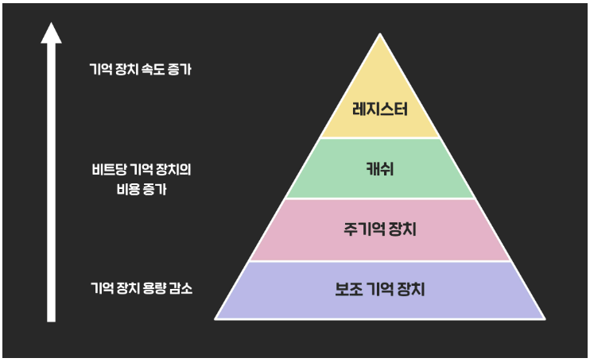

# 메모리계층

# 메모리 구조

- 메모리의 계층 구조
    - 메모리 계층 구조란 여러가지 기억장치를 필요에 따라 속도, 용량, 성능에 따라 계층적으로 나누어 둔 것을 의미합니다.
- 메모리의 계층 특징
    
    
    
    - 하위 계층으로 갈수록 용량이 늘어나고, 가격이 저렴하지만, 속도가 느리다. 반대로 상위 계층은 빠른 대신 용량이 작고 가격이 비싸다. 이를 보완하기 위하여 메모리 계층 구조를 사용한다.
    - 레지스터와 캐시는 CPU 내부에 존재한다. CPU에 아주 빠르게 접근할 수 있다.
    - 메모리 = 주기억장치는 CPU외부에 존재한다. 레지스터와 캐시보다 더 느리게 CPU에 접근한다.
    - 하드디스크 = 보조기억장치 는 CPU가 직접 접근할 방법 조차 없다. CPU가 하드디스크에 접근하기 위해서는 하드디스크의 데이터를 메모리로 이동시키고, 메모리에서 접근해야 한다. 아주 느린 접근만 가능하다.

---

# 보조기억장치

보조기억장치는 물리적인 디스크가 연결되어 있는 기억장치이다. .주기억장치보다는 느리지만 컴퓨터의 전원을 끄더라도 저장된 데이터가 사라지지 않고, 영구적으로 보관할 수 있는 장치이다. 대표적인 보조기억장치는 HDD와 SSD가 있다. 

**HDD(Hard Disk Driver)**

하드디스크라 불리우는 보조기억장치로, 물리적인 디스크를 고속으로 회전시켜 데이터를 저장하는 장치이다. 디스크에 물리적으로 저장하기 때문에 충격에 약하며, 소음이 다소 발생한다. 가장 대중적인 보조기억장치였지만, 크기가 작고 처리속도가 향상된 SSD가 나오면서 최근에 많이 소명되는 상황이다. 

**SSD(Solid State Driver)**

반도체 기반의 정보를 저장하는 보조기억장치이다. SSD는 물리적으로 데이터를 저장하지 않고, 전기적으로 데이터를 저장하기 때문에 HDD에 비해서 속도가 월등히 빠르고, 소음도 발생하지 않는다. 또한, 전력소모가 적고, 경량화, 소형화 할 수 있습니다. 그러나 HDD에 비해서는 가격이 높습니다. 

---

# 주기억장치

주기억장치는 컴퓨터 내부에서 현재 CPU가 처리하고 있는 내용을 저장하고 있는 기억장치이다. 즉, CPU의 명령에 의해 기억된 장소에 직접 접근하여 읽고 쓸 수 있다. 

대표적인 주기억장치는 ROM과 RAM으로 나누어진다. 

**RAM(Random Access Memory)**

RAM은 읽고 쓰기가 가능하며, 응용프로그램, 운영체제 등을 불러와 CPU가 작업할 수 있도록 하는 기억장치이다. 

데이터를 읽는 속도와 기록하는 속도가 같고 프로그램을 로딩하거나 데이터를 임시 저장하거나 하는 곳에 사용된다. 

전원이 끊어지면 데이터가 전부 지워지기 때문에 휘발성 메모리 라고 한다. 따라서, 실행하고 있는 파일은 항상 보조기억장치에 저장을 해줘야 한다. 

**ROM(Read Only Memory)**

ROM은 전원이 끊어져도 기록된 데이터들이 소멸되지 않는 비휘발성 메모리이다. 오직 기억된 데이터를 읽기만 가능한 장치이다. 

ROM은 데이터를 저장한 후 반영구적으로 사용할 수 있다. 그래서 시스템에 기억시키고 변화시키면 안되는 BIOS와 같은 주요 데이터는 이 장치에 저장된다. 

---

# 주기억장치의 구조

**1) 코드 영역**

실행할 프로그램의 코드가 저장되는 영역으로 텍스트 영역이라고 부른다. CPU는 코드 영역에 저장된 명령어를 하나씩 가져가서 처리한다. 

**2) 데이터 영역**

프로그램의 시작과 동시에 할당되며, 프로그램이 종료되면 소멸한다. 전역변수, 정적변수, 배열, 구조체 등이 저장되는 영역이다. 

초기화된 데이터는 데이터 영역에 저장, 그 외에는 BBS(Blocked Stated Symbol) 에 저장된다. 

BBS 영역은 데이터 영역과 비슷하지만 초기화되지 않은 전역변수, 즉 정적변수만 저장한다. 

**3) 힙영역**

사용자가 직접 관리할 수 있는 메모리영역이다. 메모리 주소 값에 의해서만 참조되고 사용되며, 참고타입에 대한 저장 공간이다. 

힙영역은 사용자에 의해 메모리 공간이 동적으로 할당되고 해제된다. 

낮은 주소에서 높은 주소의 방향으로 할당된다. 

**4) 스택영역**

함수의 호출과 관계되는 지역변수와 매개변수, 메소드, return값 등이 저장되는 영역이다. 스택 영역은 프로그램이 자동으로 사용하는 임시 메모리 영역이기에 함수의 호출과 함께 할당되며, 함수의 호출이 완료되면 소멸한다. 이렇게 스택영역에 저장되는 함수의 호출 정보를 스택 프레임이라고 한다. 

---

# 캐시메모리

캐시메모리는 CPU의 처리 속도와 주기억장치의 접근 속도 차이를 줄이기 위해 사용하는 고속 Buffer Memory이다. 

### 캐시메모리 특징

- CPU가 주기억장치에서 저장된 데이터를 읽어 올 때, 자주 사용하는 데이터를 캐시 메모리에 저장한 뒤 다음 이용할 때 메모리에서 먼저 가져오면서 속도를 향상시킨다.
- 캐시메모리는 메모리 계층 구조에서 가장 빠른 소자이며, 처리속도가 거의 CPU의 속도와 비슷하다.
- 캐시메모리를 사용하면 주기억장치를 접근하는 횟수가 줄어들어 컴퓨터의 처리속도가 향상된다.

### 캐시메모리 작동원리

- 캐시가 효율적으로 동작하려면, 캐시에 저장할 데이터가 지역성을 가져야 한다. 지역성이랑 데이터 접근이 시간적, 혹은 공간적으로 가깝게 일어나는 것을 의미한다.
- 시간 지역성 : 특정 데이터가 한번 접근되었을 경우, 가까운 미래에 또 한 번 데이터에 접근할 가능성이 높다. 예를 들어, for, while 반복문에 사용되는 데이터는 참조 가능성이 높으므로 다시 저장한다.
- 공간 지역성 : 액세스된 기억장소와 인접한 기억장소가 액세스될 가능성이 높다. 예를 들어, 배열에서 같은 연속 접근시, 참조된 데이터 근처에 있는 데이터가 참조 가능성이 높으르모 저장한다.

### 캐시 미스

- CPU가 요청한 데이터가 캐시에 있으면 Cache Hit라고 하며, 반대로 없어서 주기억장치에서 가져오게 되면 Cache Miss 라고 한다. 그리고 이 캐쉬 미스에는 3가지 종류가 있다.
    - Cold Miss : 해당 메모리 주소를 처음 불러서 나는 miss
    - Conflict Miss : A와 B를 저장해야 하는데, A와 B가 같은 주소에 할당되어 있는 경우 나는 miss
    - Capacity Miss : 공간이 부족해서 나는 miss

---

# 레지스터

CPU가 요청을 처리하는데 필요한 데이터를 일시적으로 저장하는 다목적 공간이다. 프로세스 내부에 있는 작은 공간으로 연산 제어, 디버깅 등등의 목적으로 사용한다. 

레지스터는 공간은 작고 가격은 비싸지만, CPU에 직접 연결되어 있어서 연산속도가 RAM, HSS, SDD보다 빠르다.

CPU는 자체적으로 데이터를 저장할 수 없으므로 레지스터를 이용하여 연산처리 및 번지 지정을 도와준다. 

### 레지스터와 캐시의 차이점

- 캐시 : CPU와 별도로 있는 공간이며, 메인 메모리와 CPU간이 속도 차이를 극복하기 위한 것
- 레지스터 : CPU안에서 연산을 처리하기 위하여 데이터를 저장하는 공간

### 레지스터와 캐시의 공통점

- 어떤 명령어나 데이터를 저장해두는 저장 공간