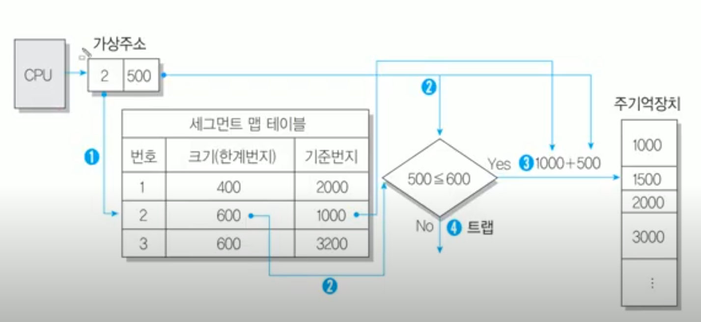

# 세그멘테이션

## 의미

- **가상기억장치에 보관되어 있는 프로그램을 다양한 크기의 논리적인 단위로 나눈 후 주기억장치에 적재시켜 실행하는 기법**
- 프로그래머가 인지하는 메모리의 모습을 실제 물리 메모리의 모습으로 변환
- 프로그래머가 생각하는 모양을 그대로 지원 (사용자 관점을 보존하는 기억장치 관리 기법)
- 시스템은 메모리를 관리하는 데 있어 더 많은 자유로운 선택을 할 수 있음
- 프로그래머는 더 자연스러운 프로그래밍 환경에서 프로그래밍 할 수 있음
- 사용자 관점의 메모리는 실제 메모리와 같지 않고 매핑(mapped)되며 이러한 매핑을 통해 논리적 메모리와 물리적 메모리를 구분할 수 있음
- 기억공간을 절약하기 위해 사용

 

## 세그먼트

- **프로그램을 배열이나 함수, 기능 등과 같은 논리적인 크기로 나눈 단위**
- 각 세그먼트는 고유한 이름과 크기를 갖음
- 페이지과 달리 크기가 다 다름

 

## 세그먼트 테이블

- 세크먼테이션을 위한 테이블
- 구성 :
    - 세그먼트 번호
    - 시작 주소 (base)
    - 세그먼트 크기 (limit)

 

 

## 주소변환

- 페이징 방법과 동일
- 주기억장치를 구성할 때 영역별로 나누지 않고 하나를 전부 사용
- 주소 형식에 따른 주소와 세그먼트 테이블의 구성
    - 가상주소 : 
        - 세그먼트 번호를 나타내는 s와 세그먼트 내에 실제 내용이 위치하고 있는 곳까지의 거리를 나타내는 변위값 d로 구성
        - 가상주소 형식 : 

        |세그먼트 번호(s)|변위값(d)|
        |------|---|

    - 실기억 주소 : 
        - 완전주소 형태를 사용하며 이는 세그먼트의 기준번지와 변위값을 더함으로써 얻을 수 있음
        - 실기억주소 형식

        |실기억주소(세그먼트 기준번지 + 변위값)|
        |------|

- ex)
    - a, b라는 프로그램이 있음
    1. a, b 각각 세그먼트 크기로 나눔
    2. a-1 세그먼트가 필요하여 주기억장치에 적재 후 실행
    3. b-4 세그먼트가 필요하여 주기억장치에 적재 후 실행
    4. 더이상 적재할 수 없을 때까지 세그먼트를 주기억장치에 올림
    5. 공간이 없을 경우 더이상 사용하지 않는 세그먼트를 찾아서 빼고 추가로 적재
    6. 교체할 때마다 중간에 빈공간이 생길 수 있음 (이전 세그먼트보다 교체한 세그먼트 크기가 작을 경우)
    7. garbage collect을 통해 주기적으로 공간을 압축하여 빈 공간을 한 곳에 모음 -> 내부단편화 문제 해결

 

## 보호 기능

- 세그멘테이션에서는 모든 논리 주소들은 세그멘테이션 테이블을 경유
- 테이블을 이용해서 보호 기능을 수행
- 세그먼트 테이블에 r(read), w(write), x(excute)비트들을 추가해서 해당 세그먼트에 대한 접근 제어를 가능하게 해줌
 - 페이지 테이블마다 r(read), w(write), x(excute) 비트를 두어 해당 비트가 켜져있을 때 그 수행이 가능하도록 함
    - 만약 쓰기 비트가 꺼져있는 페이지에 쓰기작업을 시도하면 CPU에 인터럽트가 발생하여 ISR(Interrupt Service Routine)에서 강제로 해당 프로세스를 종료

 

## 공유 기능

- 공유는 메모리 낭비를 방지
- 특히 코드 공유가 유용
-  같은 프로그램을 사용하는 여러 개의 프로세스가 있다면 메모리에 하나만 적재한 뒤 프로세서의 세그먼트 테이블 코드 영역이 같은 곳을 가리키게 해서 프로세스 간 동일한 세그먼트에 대한 공유가 쉬워짐
- 각각의 프로세스들의 특정 페이지가 실제 물리 메모리에 같은 프레임으로 연결되도록 페이지 테이블 정보를 가지고 있게 된다면 서로 다른 프로세스이지만 동일한 메모리를 사용 가능

 

## 한계 - 외부단편화

- 세그먼트 크기는 가변적
- 크기가 다른 세그먼트를 메모리에 두기 위해 동적 메모리를 할당해야 함
- 불규칙하게 hole이 생겨 외부 단편화 발생
- 외부 단편화로 인해 메모리 낭비가 크게 발생
    
 
 
 

### 참고 자료

- https://www.youtube.com/watch?v=CUXyGuHx6Io
- https://blackjellybear.tistory.com/51
- https://4legs-study.tistory.com/50
- https://doh-an.tistory.com/24
- https://velog.io/@sunkyuj/OS-%EC%84%B8%EA%B7%B8%EB%A9%98%ED%85%8C%EC%9D%B4%EC%85%98
- https://bellog.tistory.com/159
- https://resilient-923.tistory.com/394
- https://m.blog.naver.com/kgr2626/222146539396
- https://code-lab1.tistory.com/57
- https://velog.io/@codemcd/%EC%9A%B4%EC%98%81%EC%B2%B4%EC%A0%9COS-14.-%EC%84%B8%EA%B7%B8%EB%A9%98%ED%85%8C%EC%9D%B4%EC%85%98
- https://copycode.tistory.com/108