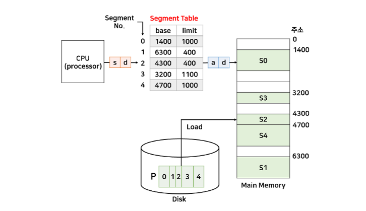

# 세그먼테이션

### Paging vs Segmentation

- 가상 메모리를 관리하는 기법
- 가상 메모리는 메모리에 로드된 즉, 실행중인 프로세스가 가상의 공간을 참조하여 마치 커다란 물리 메모리를 갖고 있는 것처럼 사용할 수 있도록 하는 것이다.
- 간단하게 말해 실제 메모리 주소가 아닌 가상의 메모리 주소를 주는 방식이다.

가상 메모리는 각 프로세스당 메인 메모리와 동일한 크기로 하나씩 할당된다. 

그 공간은 보조기억장치 공간을 이용한다. 프로세스의 일부만 메모리에 로드하고 나머지는 보조기억장치에 두는 형태이다. 

이렇게 할당되면 메모리 관리 장치(MMU)에 의해 물리 주소로 변환되어 사용자가 메모리 맵핑이 어떻게 되는지 의식할 필요 없이 알아서 가상 메모리를 활용하여 작업한다. 

내부단편화 : 메모리 빈 공간에 프로세스가 적재되었을 때, 발생하는 빈 공간을 내부단편화라고 한다. 

외부단편화 : 메모리에 남아있는 공간의 합은 프로세스의 크기보다 크지만, 실제로 그 작업을 받아들이지 못하는 경우를 외부 단편화라고 한다. 

---

# 세그먼테이션

사용자 / 프로그래머 관점의 메모리 관리 기법

페이징 기법은 같은 크기의 페이지를 갖는 것과는 다르게 논리적 단위(세그먼트)로 나눠서 메모리에 배치되는 것을 세그먼테이션이라고 한다. 

논리적 단위로 나뉘기 때문에 미리 분할하는 것이 아니고 메모리 사용할 시점에 할당된다. 

- 프로세스를 서로 크기가 다른 논리적인 블록 단위인 ‘세그먼트’로 분할하고 메모리에 배치하는 것을 말하며, 각 세그먼트의 크기는 일정하지 않다.
- 프로세스를 Code + Data + Stack  영역으로 나누는 것 역시 세그먼테이션의 모습이다. 물론, code, data, stack 각각 내부에서 더 작은 세그먼트로 나눌 수도 있다.
- 세그먼트를 메모리에 할당할 때는 페이지를 할당하는 것과 동일하다. 하지만, 테이블은 조금 다르다. 세그먼테이션을 위한 테이블은 세그먼트 테이블이라고 한다.
- 세그먼트 테이블은 세그먼트 번호(s)와 시작 주소(base), 세그먼트 크기(limit)를 엔트리를 갖는다.
- 세그먼트에서 주소변환 역시, 페이징과 유사하다. 한 가지 주의할 점은 세그먼트의 크기는 일정하지 않기 때문에, 테이블에 limit 정보가 주어진다. 그리고 CPU 에서 해당 세그먼트의 크기를 넘어서는 주소가 들어오면 인터럽트가 발생해서 해당 프로세스를 강제로 종료시킨다.

위 그림은 세그먼트 테이블과 프로세스가 할당된 메모리의 모습이다. 

- 페이징 주소 변환과 동일하게 d(변위 : 변하지 않는 값)는 논리주소와 물리주소가 동일하다.
- 물리 주소 a는 base[s] + d 로 계산된다.
- 논리 주소 (2, 100) → 물리주소 4400번지
- 논리 주소(1, 500) → limit이 400밖에 안되므로 인터럽트로 인해 프로세스 강제 종료

### 장점

내부 단편화가 없다. 

메모리 사용 효율 개선

### 단점

외부 단편화 문제가 발생할 수 있다. 

### 세그먼테이션에서 보호와 공유

먼저, 결론부터 말하면 페이징보다 세그먼테이션에서의 보호와 공유는 더 효율적이다. 

보호에서는 세그먼테이션 역시 r, w, x 비트를 테이블에 추가하는데, 세그먼테이션은 논리적으로 나누기 때문에 해당 비트를 설정하기 매우 간단하고 안전하다. 페이징은 code + data + stack 영역이 있을 때, 이를 일정한 크기로 나누므로 두 가지 영역이 섞일 수 있다. 그러면 비트를 설정하기가 매우 까다롭다. 

공유에서도 마찬가지다. 페이징에서는 code 영역을 나눈다해도 다른 영역이 포함될 확률이 매우 높다. 하지만, 세그먼테이션은 정확히 code 영역만을 나누기 때문에 더 효율적으로 공유를 수행할 수 있다. 

### 세그먼테이션과 페이징

세그먼테이션은 페이징과 유사하고 보호와 공유 측면에서는 더 나은 성능을 보여주었지만, 현재 대부분은 페이징 기법을 사용한다. 그 이유는 세그먼테이션에는 치명적인 단점이 존재하기 때문이다. 

메모리 할당을 처음 시작할 때, 다중 프로그래밍에서의 문제는 크기가 서로 다른 프로세스로 인해 여러 크기의 hole이 발생한다. 이로 인해 hole에 프로세스를 할당하는 것에 대한 최적화 알고리즘이 존재하지 않고, 외부 단편화로 인해 메모리 낭비가 크다고 했었다. 

세그먼테이션도 똑같은 문제점이 발생한다. 왜냐하면 세그먼테이션은 논리적인 단위로 나누기 때문에 세그먼트의 크기가 다양하다. 이로 인해 다양한 크기의 hole이 발생하므로 메모리 낭비 문제가 발생한다. 

***결론적으로***

세그먼테이션은 보호와 공유에서 효율적이고, 페이징은 외부 단편화 문제를 해결할 수 있다. 그러므로 이 두 가지를 합쳐서 사용하는 방법이 나왔다. 두 장점을 합치기 위해서는 세그먼트를 페이징 기법으로 나누는 것이다. 

하지만, 이 역시 단점이 존재한다. 세그먼트와 페이지가 동시에 존재하기에 주소 변환도 두번해야 한다. 즉, CPU에서 세그먼트 테이블에서 주소 변환을 하고, 그 다음 페이지 테이블에서 또 주소 변환을 해야 한다. 

📚 출처

- https://dar0m.tistory.com/269
- [https://gyoogle.dev/blog/interview/운영체제.html](https://gyoogle.dev/blog/interview/%EC%9A%B4%EC%98%81%EC%B2%B4%EC%A0%9C.html)
- [https://velog.io/@codemcd/운영체제OS-13.-페이징](https://velog.io/@codemcd/%EC%9A%B4%EC%98%81%EC%B2%B4%EC%A0%9COS-13.-%ED%8E%98%EC%9D%B4%EC%A7%95)