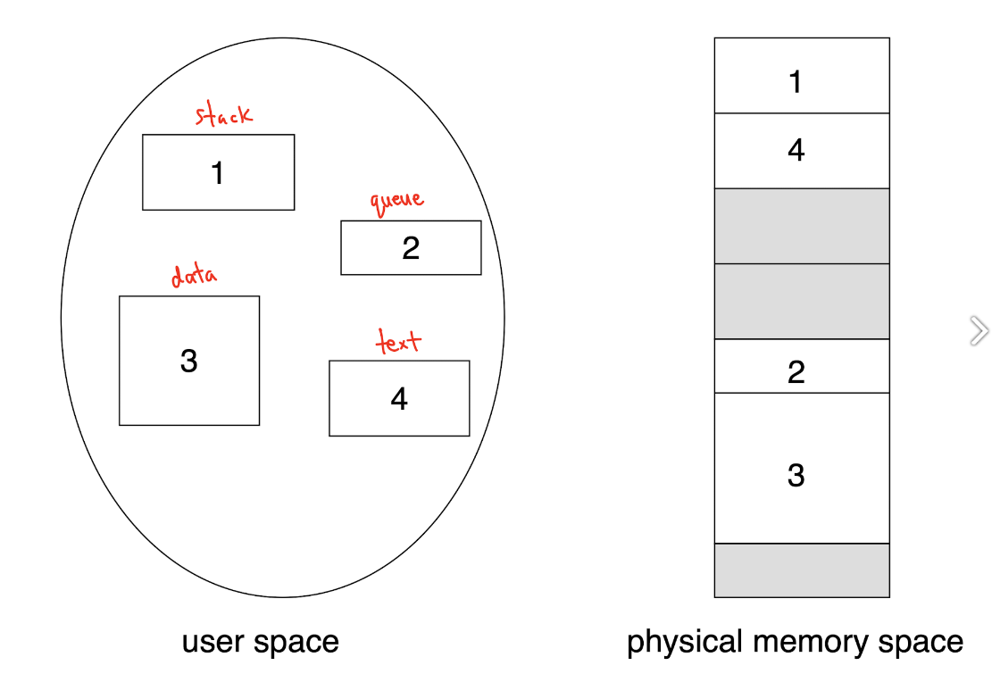
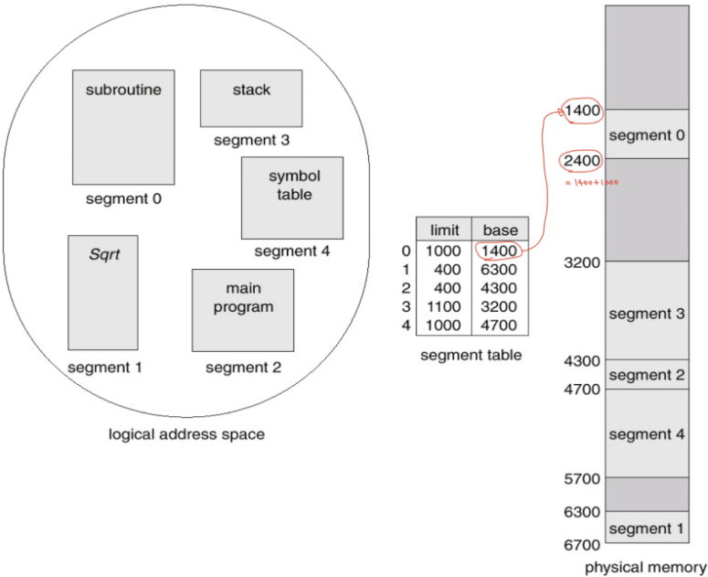
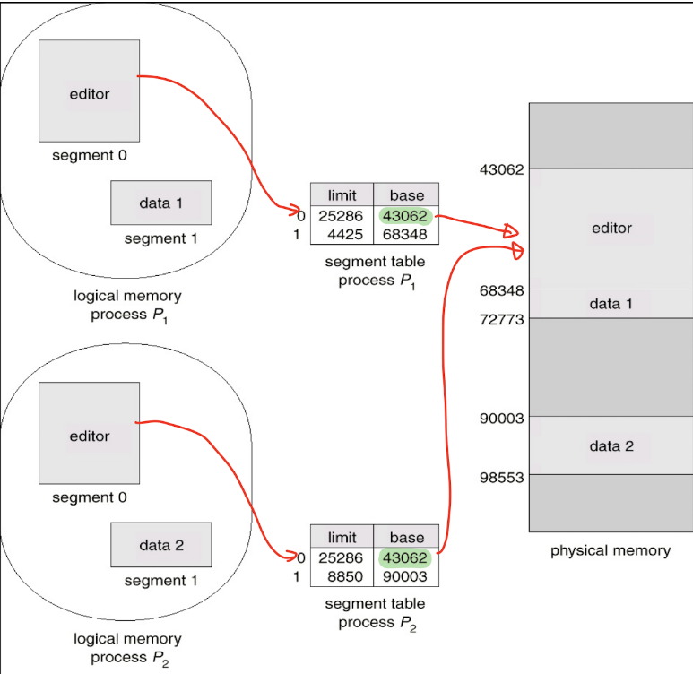

# 세그멘테이션

## 세그먼트란?
- 일정한 크기의 연속된 주소 공간, 사용자 관점의 논리적 데이터 단위
- 세그먼트는 Main program , Function, Stack, Arrays와 같은 논리적 단위
- 프로그램은 세그먼트의 집합

## 세그멘테이션?
- 가상 메모리를 논리적인 데이터 단위로 조각화 하는 것
- 사용자 관점에서 **연관성 있는 코드 조각으로 분리**하는 것

- 각 세그먼트가 갖는 크기는 제각각 >> **물리적 주소를 고정된 크기로 나눌 필요 X**
- 각 세그먼트는 물리적 주소에 불연속적으로 할당 가능
- 페이징과 마찬가지로 모든 프로세스는 각 세그먼트의 물리적 주소를 저장해주는 Segment Table 필요

- 각 세그먼트는 물리적 메모리 안에서는 연속적으로 존재 >> 메모리 보호를 위해 base, limit 값 필요
- 페이징과 유사하게 논리적 주소는 <segment-number, offset>으로 나눠짐
- segment-number은 segment table의 인덱스로 사용 가능
- Segment table도 메인 메모리 위에 있기 때문에 실제 물리적 주소를 찾기 위해서는 Segment table의 시작 위치를 알아야 함
  - 이를 각각 Segment Table Base Register(STBR), Segment Table Length Register(STLR)이라고 함
  - segment table의 0번째 인덱스의 실제 물리적 주소는 STBR의 값과 일치

## 장점
1. 같은 종류의 데이터 모음이기 떄문에 Protection bit가 통일될 수 있음.
2. 세그먼트 테이블의 base,limit값으로 세그먼트끼리의 침범을 막을 수 있음.
3. segment table의 base값을 같게 설정하면 물리적 주소의 값이 일치하기 때문에 서로 다른 프로세스의 세그먼트끼리 공유가 쉬움

4. 쓰는 메모리 공간만큼만 할당 받기 때문에 내부 단편화가 발생하지 않음. 외부 단편화는 발생 가능

## 단점
1. 논리적 주소의 segment number로 segment table의 인덱스가 결정되기 때문에 같은 프로세스의 세그먼트끼리 데이터 공유가 어려움
2. Segment table이 메모리 공간을 차지하는 문제 발생
3. 쓰는 메모리 공간만큼만 할당 받기 때문에 외부 단편화가 발생할 수 있음

출처: https://charles098.tistory.com/110
