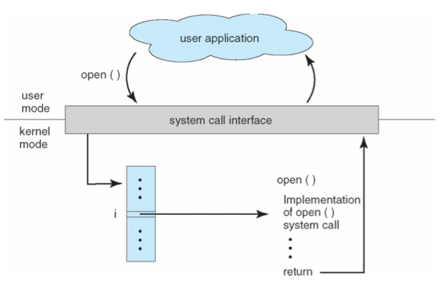
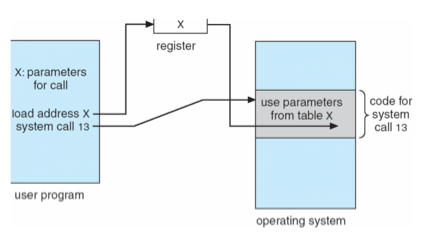
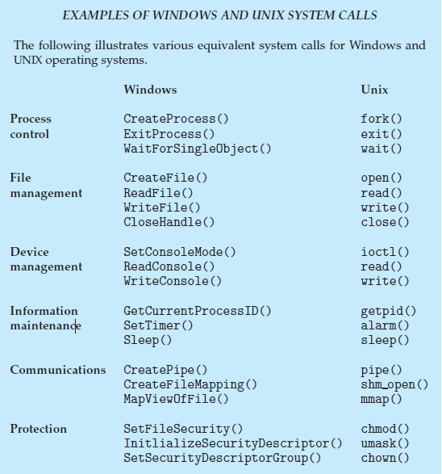

# 시스템 콜, System Call
> 시스템 호출(system call)은 운영 체제의 커널이 제공하는 서비스에 대해, 응용 프로그램의 요청에 따라 커널에 접근하기 위한 인터페이스이다.

사용자 프로그램이 디스크 파일을 접근하거나 화면에 결과를 출력하는 등의 작업이 필요한 경우, 즉 사용자 프로그램이 특권 명령의 수행을 필요로 하는 경우, 운영체제에게 특권 명령의 대행을 요청하는 것이 시스템 콜이다.


- 통상적으로 시스템 콜은 여러 종류의 기능으로 나누어진다. 
- 각 시스템 콜에는 번호가 할당되고 시스템 콜 인터페이스는 시스템 콜 번호와 시스템 콜 핸들러 함수 주소로 구성되는 시스템 콜 테이블을 유지한다. 
- 운영체제는 자신의 커널 영역에서 해당 인덱스가 가리키는 주소에 저장되어 있는 루틴을 수행한다. 
- 작업이 완료되면 CPU에게 인터럽트를 발생시켜 수행이 완료 되었음을 알린다.

open의 호출

open() 이라는 시스템 콜의 인덱스가 가리키는 곳에 이에 대한 처리 과정이 저장되어 있다.

> 경우에 따라 시스템 콜이 발생했을 때, 추가적인 정보가 필요할 수도 있는데 그러한 정보가 담긴 매개변수들을 OS 에 어떻게 전달할까?

- 매개변수를 CPU 레지스터에 전달한다. 
  - 전달해야 하는 매개변수 보다 레시스터의 수가 작을 수 있다. 

- 매개변수를 메모리에 저장해 해당 메모리의 주소를 레지스터에 전달 할 수 있다. 

- 매개변수는 프로그램에 의해 스택(stack)에 전달(push) 될 수도 있다. 
  - 2,3 번의 경우 매개변수의 갯수나 길이의 제한이 없기 때문에 선호되는 방식이다.

메모리를 사용한 매개변수 전달

# 시스템 콜 예시

```
cp in.txt out.txt
```
- in.txt에 있는 파일내용과 같은 내용을 복사하여 out.txt 파일을 만드는 것

리눅스 터미널에 위와 같은 명령어를 입력한다면 이때 순차적으로 호출되는 시스템 콜은 어떤 것이 있을까?


- 먼저 사용자로부터 입력을 받는데 이때 I/O 시스템 콜 호출이 필요하다. 


- 이후 'cp' 프로그램을 실행시키면 먼저 'in.txt' 파일이 현재 디렉토리에서 접근 가능한지를 확인하기 위한 시스템 콜이 호출된다. 
  - 이때 접근이 불가능하다면 에러를 발생시킨 후 프로그램이 종료되는데 이때 시스템 콜이 호출된다. 


- 파일이 존재해 접근 가능하다면 복사한 파일을 저장하기 위해 'output.txt' 파일명이 있는지 검사하기 위한 시스템 콜이 호출된다. 


- 이 때도 마찬가지로 이 파일 명이 존재하는지 존재하지 않는지 검사하기 위해 시스템 콜을 통해 확인한다. 
  - 만약 파일 명이 이미 존재한다면, 덮어 씌워야 할지 아니면, 이어서 붙여야 하는지 User에게 물어볼 수 있는데 만약 저장하고자 하는 파일 이름이 겹치지 않다면, 파일을 저장해야 하는데 이 때도 시스템 콜을 이용한다.
  

```
open(data.txt".O_RDONLY);
```
### 실제 기계어로 어떤 방식으로 컴파일이 되나?

- eax 레지스터에 시스템 콜 번호를 넣고 | (시스템 콜은 각각의 고유 번호를 가지고 있다.)
- ebx 레지스터에는 시스템 콜에 해당 인자값을 넣고 | 여기서는 ("data.txt".O_RDONLY) 부분을 인자로 볼 수 있다.
- 소프트웨어(내부) 인터럽트 명령을 호출하면서 0x80값을 넘겨준다.

```
mov eax, 5  // 5는 시스템 콜 고유 번호
mov ebx, 0  // 0은 인자
int 0x80 // 소프트웨어 인터럽트 명령
```

항상 마지막에 int 0x80 명령어가 들어가는데 CPU가 제공하는 OP code 중 int와 인터럽트의 번호를 넣어주는 것인데 0x80이 의미하는 것이 바로 시스템 콜의 번호이다.

인터럽트는 내부의 코드와 별개로 외부에서 실행이 되지만 해당 명령어를 통해 내부 코드안에서 강제로 실행을 시킬 수 있다. 
다른 인터럽트와는 다르게 동작한다는 의미.


### 그렇다면 시스템 콜 인터럽트 명령을 호출하면서 0x80 값을 넘겨주면 어떤일이 일어날까?
해당 인터럽트를 받으면 첫 번째로 CPU는 사용자 모드를 커널 모드로 변경해주는데, 위에서 얘기한 int라는 OP code가 해당 역할을 수행한다. 

그래야 시스템 자원에 접근할 수 있다.

그리고 **IDT(Interrupt Descriptor Table)**라고 하는 주소에 접근한다. 

해당 주소에 **인터럽트의 번호와 해당 번호에 맞는 코드가 들어가 있는 주소**가 있기 때문입니다. 

위는 0x80 값을 넘겨주었기 때문에 그에 해당하는 주소(함수)를 찾아서 실행한다. 
그리고 해당 함수에는 **system_call() 이라는 함수가 저장**되어 있다.

즉, system_call() 함수를 실행한건데 해당 함수에서는 위에서 얘기한 **eax로부터 받은 시스템 콜 번호에 해당하는 함수를 (call)호출**합니다. 

그리고 이때 ebx로 받은 인자 값을 같이 넘겨준다. 
위는 5와 (data.txt".O_RDONLY)를 넣어줬다.

그리고 **커널 모드에서 호출한 함수를 실행**하게되고 실행이 완료되면 **다시 사용자 모드로 변경**되면서 **다시 해당 프로세스의 다음 코드를 실행**하게 된다.


프로세스는 마치 계속 실행되고 있는것럼 보이지만 내부적으로는 사용자 모드와 커널 모드를 수도없이 왔다갔다하면서 실행이 되고 있다.

# 시스템 콜이 필요한 이유


우리가 일반적으로 사용하는 프로그램은 '응용 프로그램' 이다. 

유저레벨의 프로그램은 유저레벨의 함수들 만으로는 많은 기능을 구현하기 힘들기 때문에, 커널(kernel) 의 도움을 반드시 받아야 한다. 

이러한 작업은 응용프로그램으로 대표되는 유저 프로세스(User Process)에서 유저모드에서는 수행할 수 없다. 

반드시 kernel에 관련된 것은 커널모드로 전환한 후에야, 해당 작업을 수행할 권한이 생긴다.


> 그렇다면 권한은 왜 필요한 것일까? <br/> <br/>
그 이유는 만약 권한이 없을 때, 해커가 피해를 입히기 위해 악의적으로 시스템 콜을 사용하는 경우나 초보 사용자가 하드웨어 명령어를 잘 몰라서 아무렇게 함수를 호출했을 경우에 시스템 전체를 망가뜨릴 수도 있기 때문이다. 
<br/> 따라서 이러한 명령어들은 특별하게 커널 모드에서만 실행할 수 있도록 설계되었고, 만약 유저 모드에서 시스템 콜을 호출할 경우에는 운영체제에서 불법적인 접근이라 여기고 trap을 발생시킨다.


# 시스템 콜의 유형

시스템 콜은 여섯 가지의 중요한 범주로 나눌 수 있다.

1. 프로세스 제어
2. 파일 조작
3. 장치 조작
4. 정보 관리
5. 통신
6. 보호

### 프로세스 제어
- 프로세스 생성 및 종료 
- 메모리에 로드, 실행 
- 프로세스 속성 값 확인, 지정 
- wait 이벤트, signal 이벤트 
- 메모리 할당
예) fork, wait, exec 등

### 파일 조작
- 파일 생성, 파일 삭제 
- 열기, 닫기 
- 읽기, 쓰기, Reposition 
- 파일 속성 값 확인, 지정
예) open, read, write, close 등

### 장치 조작
- 디바이스 요청 및 해제 
- 읽기, 쓰기, Reposition 
- 디바이스 속성 확인, 지정 
- 비 물리적인 디바이스 해제 및 장착


### 정보 관리
- 시간 확인, 시간 지정 
- 시스템 데이터 확인, 지정 
- 프로세스, 파일, 디바이스 속성 가져오기 
- 프로세스, 파일, 디바이스 속성 설정하기
예) getpid(), alarm(), sleep()

### 통신
- 커뮤니케이션 연결 생성 및 삭제 
- 메시지 송신, 수신 
- 상태 정보 전달 
- remote 디바이스 해제 및 장착
예) pipe(), shm_open(), mmap()

### 보안
- Permission 획득 
- Permission 설정 
예) chmod(), unmask(), chown()

> 일반적인 통신 모델에는 메시지 전달과 공유 메모리 두 가지가 있다.
> 
> **메시지 전달 모델에서는 두 프로세스의 통신에 정보 교환을 위한 메시지를 주고 받는다.**<br/>
> **공유 메모리 모델**에서는 **다른 프로세스가 소유한 메모리에 접근을 위해 특정 시스템 콜을 호출**한다.<br/>
> **일반적으로 운영체제는 서로 다른 프로세스간의 메모리 접근을 차단한다.** <br/>
> 공유 메모리 기법을 사용하기 위해서는 **통신하려는 프로세스들이 이러한 차단을 풀어주는데 동의**해야한다.
> 
# 유저 모드와 커널 모드

### 유저 모드
> PC register 가 사용자 프로그램이 올라가 있는 메모리 위치를 가리키고 있을 때 현재 사용자 프로그램을 수행중이라고 하며 CPU 가 유저모드에서 수행중이라고 말한다.


### 커널 모드
> PC register 가 운영체제가 존재하는 부분을 가리키고 있다면 현재 운영체제의 코드를 수행중이라고 하며 CPU가 커널모드에서 수행중이라고 말한다.

## UNIX System Calls



# 일반 명령과 특권 명령
> CPU 내에 모드 비트를 두어서 구분한다.
> 0 - 커널모드 / 1 - 유저모드

### 일반 명령 (유저 모드)
- 메모리에서 자료를 읽어와서 CPU 에서 계산하고 결과를 메모리에 쓰는 일련의 명령들, 모든 프로그램이 수행 가능하다.


### 특권 명령 (커널 모드)
- 보안이 필요한 명령, 입출력 장치, 타이머 등 각종 장치에 접근하는 명령


출처<br/>
https://dar0m.tistory.com/264

https://velog.io/@becooq81/%EC%9A%B4%EC%98%81%EC%B2%B4%EC%A0%9C-%EC%8B%9C%EC%8A%A4%ED%85%9C%EC%BD%9C

https://velog.io/@hyun0310woo/7.-%EC%9A%B4%EC%98%81%EC%B2%B4%EC%A0%9C-%EC%9D%B8%ED%84%B0%EB%9F%BD%ED%8A%B8%EC%97%90-%EB%8C%80%ED%95%B4%EC%84%9C


