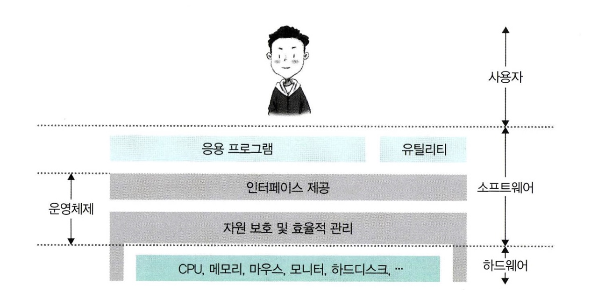

# 운영체제와 컴퓨터

## 운영체제 (OS, Operating System)

 

- **사용자가 컴퓨터를 편리하고 효과적으로 사용할 수 있도록 환경을 제공하는 시스템 소프트웨어**
- 하드웨어를 관리하고 컴퓨터 시스템을 효율적으로 관리
- 응용 프로그램과 하드웨어 간의 인터페이스로써 다른 응용 프로그램이 유용한 작업을 할 수 있도록 환경을 제공

 

### 운영체제 종류

1. Windows : 
    - microsoft에서 개발한 운영체제
    - 가장 인지도 높음
    - 노트북 및 서버 시스템에서 주로 사용
    - 그래픽카드와 같은 다양한 하드웨어 대응할 수 있음
    - 인터페이스가 사용자 친화적
    - 호환되는 응용 프로그램 많음
    - 다른 OS에 비해 RAM을 많이 잡아먹으며 용량도 많이 차지함

 

2. masOS : 
    - apple 사에서 개발한 운영체제
    - mac 컴퓨터, 노트북에서 사용
    - 시스템 안정성과 사용자 편의성에 중점을 둠
    - windows보다 권한 체계가 엄격하여 비교적 안전
    - UNIX의 특징을 갖고 있어 커널이 자유로움
    - 독자적인 OS이기 때문에 다른 기기에서 사용 불가능
    
 

3. 리눅스 (LINUX) :
    - 오픈 소스 운영체제
    - 다양한 배포판 있음
    - 서버 시스템 및 임베디드 시스템이서 주로 사용
    - 안정성과 보안성이 높은 운영체제
    - 높은 이식성
    
 

4. 유닉스 (UNIX) :
    - 다중 사용자 및 다중 작업을 지원하는 운영체제
    - 서버 환경에서 주로 사용
    - 안정성과 신뢰성이 높음
    - 이식성이 높음
    - 파일 시스템이 계층적인 트리 구조로 구성되어 있어 특정 파일에 쉽게 접근 가능

 

- 동시 작업 가능 여부
    - 다중 작업 처리(multi tasking) : Windows, LINUX, UNIX
    - 단일 작업 처리(single tasking) : MS-DOS
- 사용자의 수
    - 단일 사용자(single user) : MS-DOS, Windows
    - 다중 사용자(multi user) : UNIX, NT server
    - 주로 Windows는 개인용, UNIX, LINUX는 서버용 운영체제로 많이 사용

 

### 운영체제 구조

 

1. 인터페이스 (Interface)
    - 사용자는 커널에 직접 접근할 수 없기 때문에 운영체제가 제공하는 인터페이스를 사용해 커널에 명령을 내림
    - 사용자와 어플리케이션은 인터페이스를 통해 커널에 명령을 전달하고 인터페이스를 통해 실행결과를 전달받음
    - 대표적인 인터페이스 : 
        - GUI(Graphical User Interface) : 윈도우 바탕화면처럼 아이콘과 마우스 클릭이 되게끔 만들어져서 사용자 편의성을 가진 인터페이스
        - CLI(Command Line Interface) : 마우스가 없고 명령어를 키보드에 입력하면 글씨만 나오는 인터페이스

 

2. 커널 (Kernel)
    - 프로세스, 메모리, 저장장치를 관리하는 핵심적인 기능
    - 커널에 시스템 호출과 드라이버 있음

 

3. 시스템 호출(System Call)
    - 커널이 자신을 보호하기 위해 만든 인터페이스
    - 애플리케이션이 직접 하드웨어 자원에 접근하여 발생하는 실수를 막기 위해 시스템 호출이라는 시스템 자원 사용과 관련된 함수 제공
    - 애플리케이션이 하드웨어에 접근해야 하거나 운영체제가 제공하는 서비스를 이용하기 위해서는 커널 함수를 호출하는 시스템 호출을 사용해야 함
    - 시스템 호출을 사용함으로써 운영체제는 컴퓨터 자원을 보호

 

4. 드라이버 (Driver)
    - 커널과 하드웨어의 인터페이스
    - 복잡한 하드웨어의 경우 하드웨어 제작사가 만든 소프트웨어를 따로 설치하여 사용해야 함
    - 이를 디바이스 드라이버라고 함
    - 특수한 목적을 갖고 있는 하드웨어와 소통할 수 있게 만들어줌
    - 하드웨어 예 : 프린터, 키보드 등

 

### 운영체제 목적

- 처리 능력 향상
    - 처리 능력 : 일정 시간 내 시스템이 처리하는 일의 양
- 사용 가능도 향상
    - 사용가능도 : 시스템을 사용할 필요가 있을 때 즉시 사용 가능한 정도
- 신뢰도 향상
    - 신뢰도 : 시스템이 주어진 문제를 정확하게 해결하는 정도
- 반환 시간 단축
    - 반환 시간 : 시스템에 작업을 의뢰한 시간부터 처리 완료될 때까지 걸린 시간

 

### 운영체제 역할

#### 1. 프로세스 관리

1. 프로세스, 스레드
2. 스케줄링
3. 동기화
4. IPC 통신

- 운영체제에서 작동하는 응용 프로그램인 프로세스 관리하는 기능
- 프로세스 스케줄링 및 동기화 관리
- 프로세스 생성과 제거, 시작과 정지, 메시지 전달 등의 기능 담당

 

#### 2. 저장장치 관리

1. 메모리 관리
2. 가상 메모리
3. 파일 시스템

- 프로세스에게 메모리 할당 및 회수 관리
- 1차 저장장치에 해당하는 메인 메모리와 2차 저장장치에 해당하는 하드디스크, NAND 등을 관리
- 메모리를 효율적으로 관리하여 응용 프로그램에 필요한 메모리 공간을 할당
    - 1차 저장장치(Main Memory) :
        - 프로세스에 할당하는 메모리 영역의 할당과 해제
        - 메인 메모리의 효율적 활용을 위한 가상 메모리 기능
    - 2차 저장 장치(HDD, NAND Flash Memory 등)
        - 파일 형식의 데이터 저장
        - 이런 파일 데이터 관리를 위한 파일 시스템을 OS에서 관리
        - FAT, NTFS, EXT2, JFS, XFS 등 많은 파일 시스템이 개발되어 진행중 

 

#### 3. 네트워킹

1. TCP/IP
2. 기타 프로토콜

- 컴퓨터 네트워크를 관리하고 네트워크 프로토콜을 지원하여 컴퓨터간 통신을 가능하게 함
- TCP/IP 기반의 인터넷에 연결하거나, 응용 프로그램이 네트워크를 사용하려면 운영체제에서 네트워크 프로토콜을 지원해야 함
- 현재 상용 OS들은 다양하고 많은 네트워크 프로토콜을 지원
- 운영체제는 사용자와 컴퓨터 하드웨어 사이에 위치해서 해드웨어를 운영 및 관리하고 명령어를 제어하여 응용 프로그램 및 하드웨어를 소프트웨어적으로 제어 및 관리
- 인터넷 연결, 데이터 전송, 네트워크 보안 등도 관리

 

#### 4. 사용자 관리

1. 계정 관리
2. 접근권한 관리

- 여러 사람이 하나의 PC를 사용하는 겨우도 많음
- 각자의 계정을 만들어 PC를 사용하면 여러 명이 하나의 컴퓨터를 사용한다고 말할 수 있음
- 운영체제는 각 계정을 관리
- 사용자별로 프라이버시와 보안을 위해 개인 파일에 대해선 다른 사용자가 접근할 수 없도록 함
- 파일이나 시스템 자원에 접근 권한을 지정할 수 있도록 지원

 

#### 5. 디바이스 드라이버

1. 순차접근 장치
2. 임의접근 장치
3. 네트워크 장치

- 운영체제는 시스템의 자원, 하드웨어를 관리
-  시스템에는 여러 하드웨어가 붙어 있으며 이들을 운영체제에서 인식하고 관리하게 만들어 응용 프로그램이 하드웨어를 사용할 수 있게 만들어야 함
- 운영체제 안에 하드웨어를 추상화 해주는 계층이 디바이스 드라이버
- 하드웨어의 종류가 많은 만큼 운영체제 내부의 디바이스 드라이버도 많이 존재
- 디바이스 드라이버들을 관리하는 기능을 운영체제가 맡음

 

## 컴퓨터

### 컴퓨터 정의

- **전자 회로를 이용한 고속의 자동 계산기**
- 숫자 계산, 자동 제어, 데이터 처리, 사무 관리, 언어나 영상 정보 처리 따위에 광범위하게 이용
- 최초의 컴퓨터는 군사목적의 수학적 계산에 주로 활용됨
- 이후 IBM은 컴퓨터의 사용 범위를 비즈니스 영역으로 확장시킴
- microsoft와 apple은 개인이 사용하는 용도인 PC(Personal Computer)로 발전시킴
- 2000년대 후반에는 스마트폰을 통해 이동하면서도 사용가능한 모바일 환경으로까지 확대됨
- 지금은 가전제품과 인공지능 스피커 등 웨어러블 디아비스까지 영역이 확대되어 모든 기계장치에 컴퓨터가 내장되는 형태가 됨

 

### 컴퓨터의 구조

**폰노이만 구조**

- 버스로 연결되어 있는 구조
- 하드웨어는 그대로 둔 채 작업을 위한 프로그램만 교체하여 메모리에 올리는 방식
- 모든 프로그램은 메모리에 올라와야 실행할 수 있음

 

1. CPU(Central Processing Unit)
    - 중앙처리장치
    - 컴퓨터 성능의 중요한 요소
    - 전원이 공급될 때 작동 시작
    - 명령어를 해석하여 메모리에 적재된 프로그램 실행
    
 

2. RAM(Random Access Memory)
    - 램, 메모리, 기억장치라고 부름
    - CPU의 연산결과를 저장하고 처리할 수 있는 공간
    - 프로그램 실행 시 프로그램들이 메모리에 읽혀져 동작
    - 메모리 용량이 클수록 여러 프로그램을 실행할 수 있고 높은 성능을 보장
    - 램은 전원이 꺼지는 경우 내용이 지워지기 때문에 영구적으로 저장해야 하는 데이터는 HDD로 불리우는 디스크 장치를 사용

 

3. HDD(Hard Disk Drive)
    - 하드디스크
    - 영구적으로 데이터를 저장하기 위한 저장장치
    - 컴퓨터에서 실행하는 프로그램 및 원드, 파워포인트 등의 데이터 파일, mp3 등 파일의 형태로 데이터를 저장하고 관리
    - 최근에는 메모리 기반의 HDD인 SSD(Solid State Disk)의 가격이 저렴해지고 많이 보급되고 있음

 

4. 메인보드(Main Board)
    - 컴퓨터의 하드웨어 모듈들이 통합되어 구성된 형태
    - CPU, RAM, HDD 등이 메인 보드에 장착되는 형태
    - 부품의 교체와 확장이 가능한 구조
    - 컴퓨터에 문제가 있을 때 메인보드를 통채로 교체할 수도 있고 일부 부품만 교체할 수도 있음

 

5. GPU(Graphical Processing Unit)
    - 그래픽 처리를 전문적으로 다루는 하드웨어
    - GPU 성능의 고도화로 머신러닝이나 인공지능 등 빠른 계산처리가 필요한 경우 CPU를 보조하여 사용하게 됨
    - VR, AR, 고해상도 동영상 처리 등 시각적인 요소가 중요해지면서 GPU가 빠른 속도로 발전하고 있음

 

6. 입력장치
    - 컴퓨터가 처리할 수 있는 형태로 데이터와 명령을 받아들이는 물리적 장치
    - 컴퓨터에 연결하여 무언가를 입력할 수 있는 장치
    - 예 : 기보드, 마우스, 스캐너, 조이콘

7. 출력장치
    - 처리된 데이터를 사람이 이해할 수 있는 형태로 출력하는 물리적 장치
    - 컴퓨터에서 나오는 글자, 그림 등의 결과를 화면에 보여주는 장치
    - 예 : 모니터

 

8. 산술/논리 연산 장치 (ALU, Arithmetic Logic Unit)
    - 산술적인 연산과 논리적인 연산을 담당하는 장치
    - 가산기, 보수기, 누산기, 기억 레지스터, 데이터 레지스터로 구성
    - 캐시나 메모리로부터 읽어 온 데이터는 레지스터라는 CPU 전용 기억장소에 저장
    - ALU는 레지스터에 저장된 데이터를 이용하여 덧셈 등의 산술 연산을 수행
    - 부동소숫연산장치(FPU), 정수연산장치, 논리연산장치 등이 있음

 

9. 레지스터 (Register)
    - 중앙처리장치 내부에 있는 기억장치
    - 주로 산술연산논리장치에 의해 사용되는 범용 레지스터와 PC 등 특수 목적에 사용되는 전용 레지스터로 구분 가능
    - 종류 : 
        - IR(Instruction Register) : 현재 수행 중에 있는 명령어를 부호로 저장하고 있는 레지스터
        - PC(Program Counter) : 명령이 저장된 메모리의 주소를 가리키는 레지스터
        - AC(Accumulator) : 산술 및 논리 연산의 결과를 임시로 기억하는 레지스터