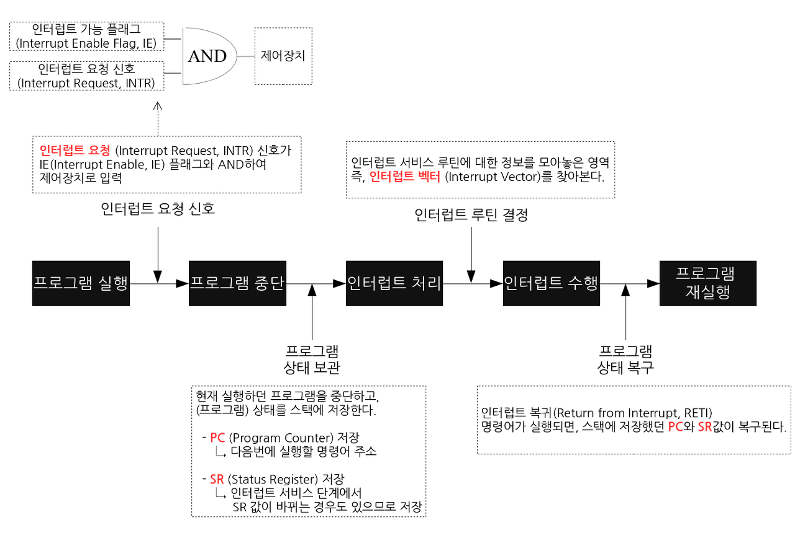
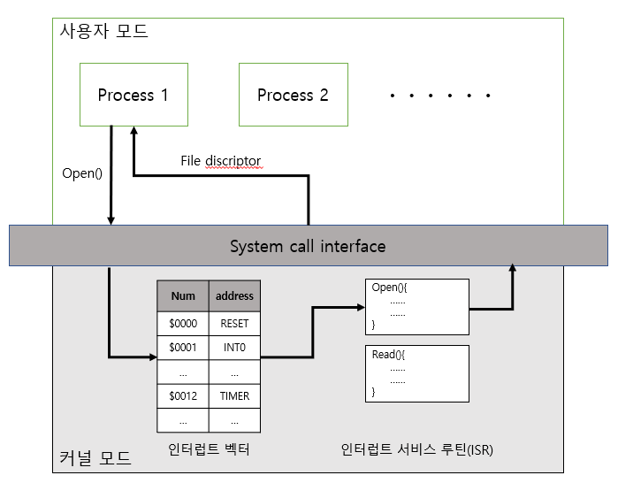
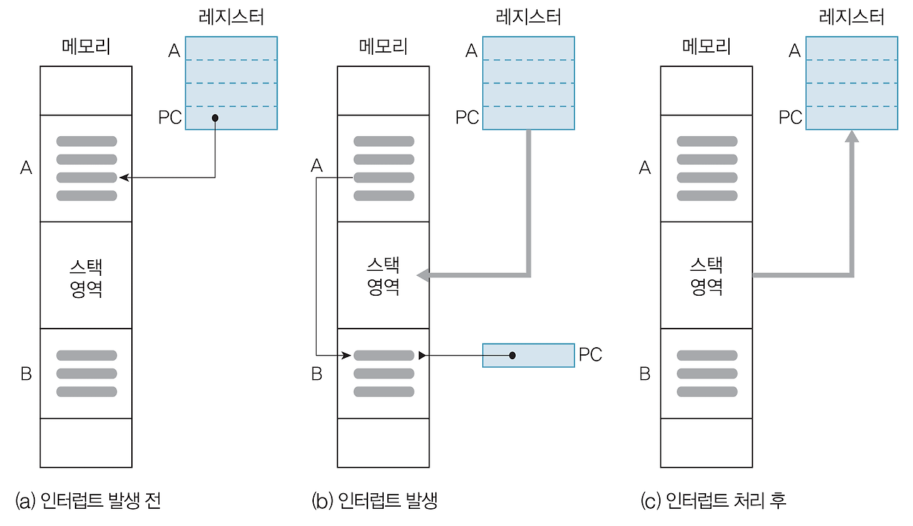

# 인터럽트

> CPU가 프로그램을 실행하고 있을 때 예외상황이 발생해 처리가 필요할 경우 현재 실행중인 작업을 중단하고 발생된 상황을 처리한 뒤 다시 실행중인 작업으로 복귀하는 것을 말한다

입출력 연산이 CPU 연산 수행속도보다 현저히 느리기 때문에 사용한다.

- 대부분의 컴퓨터는 한 개의 CPU[1]를 사용하므로 한 순간에는 하나의 일 밖에 처리할 수 없기 때문에 [2] 어떤 일을 처리하는 도중에 우선 순위가 급한 일을 처리할 필요[3]가 있을 때 대처할 수 있는 방안이
  필요하다.

    - 예) 키보드의 키를 하나 누르면, 눌려진 키 코드 값이 키보드 버퍼에 입력된 후 CPU에 인터럽트가 걸린다. 그럼 현재 처리하던 작업에 대한 정보를 수집하여 저장한 뒤에 인터럽트 서비스 루틴(
      Interrupt Service Routine)을 수행한다.(이 경우에는 키보드 버퍼에 있는 키 코드 값을 가져가는 일을 한다.) 이렇게 인터럽트 처리를 마친 후에는 다시 이전에 처리하던 작업으로
      돌아간다.

I/O 연산이 끝난 이후 I/O Device는 인터럽트를 통해 CPU에게 알리고 CPU는 I/O 연산 결과를 이용해 작업을 완료한다.

# 인터럽트 구성 요소

1. 발생원(Source) : 누가 인터럽트를 요청했는지
2. 우선순위(Priority) : 2개 이상의 요청시 어떤 서비스를 먼저 할 것인지 ? (중요도)
3. 인터럽트 벡터(Interrupt Vector) : 서비스 루틴의 시작 번지는 어디인지

- Interrupt Vector
- 인터럽트가 발생했을 때 해야할 일이 무엇인가를 정해놓은 것으로 인터럽트 서비스 루틴(ISR)의 시작주소이다.

- IDT (Interrupt Descriptor(=Vector) Table)
    - 미리 정의되어 있는 인터럽트들의 번호와 실행 코드를 가리키는 주소들이 저장되어 있는 테이블

    1. 컴퓨터 부팅 시 운영체제가 IDT에 인터럽트들을 기록하고
    2. 인터럽트 발생 시 IDT를 확인해 Interrupt 번호에 해당하는 함수를 호출해서 인터럽트를 처리하게 된다.

- Interrupt Handler
    - 인터럽트가 발생하면 이를 핸들링하기 위한 함수가 호출되는데 이를 인터럽트 핸들러라고 한다.
    - 함수 형태로 존재하며 커널 내부의 IRQ(Interrupt ReQuest) 서브 시스템을 통해 호출한다.
    - 인터럽트 핸들러의 최소 요구 조건은 인터럽트를 받았다는 사실을 인터럽트를 발생시킨 하드웨어에 알려줘야 한다는 것이다.

- Interrupt Context
    - 현재 실행 중인 프로세스가 현재 인터럽트를 처리중이라는 것을 의미한다.

# 인터럽트 종류

- 외부 인터럽트 : 입출력 장치, 타이밍 장치, 전원 등의 외부적인 요인에 의해서 발생하는 인터럽트
    - 전원 이상 인터럽트
    - 기계 고장 인터럽트
    - 입출력 인터럽트
      - > 마우스가 클릭이 될때마다 그것을 운영체제에게 알려줘야 할텐데 그것을 알려주는 인터럽트
    - 타이머 인터럽트(선점형 스케줄러를 위해 필요)
      - > 타이머 인터럽트를 발생시키는 장치가 컴퓨터 안에 칩으로 존재하는데 해당 칩에서 일정 간격으로 인터럽트를 계속해서 발생시킵니다.
                  여기서는 1초 주기로 발생시킨다고 가정하겠습니다.    
                그러면 하드웨어에서는 1초 간격으로 운영체제에게 인터럽트를 발생시키고 그것을 받은 운영체제는 해당 인터럽트를 누적시켜서 가지고 있습니다.
                 여기서 우리가 선점형 스케줄러를 사용한다고 가정했을때 10초마다 프로세스를 교체한다고 한다면 운영체제는 하드웨어로부터 받은 인터럽트의 누적이 10초가 되는 순간 프로세스를 교체해야
                한다는 시기를 알 수 있습니다.  
                  이것이 외부 인터럽트 처리 방법이고 선점형 스케줄러에게 필요한 기능입니다.

- 내부 인터럽트 :
    - 0 으로 나누는 경우
    - 오버플러우 또는 언더 플로우가 발생하는 경우
    - 프로그램 상의 오류
    - 프로그램에서 함수 등 명령어를 잘못 사용한 경우
    - 예외를 처리하던 중 또 다른 예외가 발생한 경우, Double Fault이라고 부른다.
    - Double Fault가 발생하여 이를 처리하는 중에 또 다른 예외가 발생하는 경우,Triple Fault라고 부르며 이 경우 CPU Reset가 발생한다.
    - 소프트웨어 인터럽트: CPU가 인스트럭션을 수행하는 도중에 일어나는 인터럽트

# 인터럽트 동작 순서

시스템 콜에 의하여 발생하는 인터럽트
1. process A는 system call을 통해 인터럽트를 발생시킨다.
2. CPU는 현재 진행 중인 명령어를 완료시키고 인터럽트 신호를 확인한다.
3. 현재까지 수행중이었던 상태를 해당 process의 PCB(Process Control Block)에 저장한다. (수행중이던 MEMORY주소, 레지스터 값, 하드웨어 상태 등...)
4. PC(Program Counter, IP)에 다음에 실행할 명령의 주소를 저장한다.
5. 발생한 인터럽트의 번호를 IDT에서 확인하여 ISR 주소값을 얻어 ISR(Interrupt Service Routine)로 점프하여 루틴을 실행한다.
6. 해당 코드를 실행한다.
7. 해당 일을 다 처리하면, 대피시킨 레지스터를 복원한다.
8. ISR의 끝에 IRET 명령어에 의해 인터럽트가 해제 된다.
9. IRET 명령어가 실행되면, 대피시킨 PC 값을 복원하여 이전 실행 위치로 복원한다.

> open()의 결과는 파일 디스크립터를 프로그램에 반환합니다. 시스템 콜의 결과를 사용자 프로그램에 전달하기 위해서 운영체제 설계 시 선택한 방법을 사용하고 있습니다.
- Block 방식 : 반환 값을 레지스터, 크기가 크다면 메모리에 저장 해 두고 주소를 반환합니다.
- Stack 방식 : 반환 값을 프로그램 상태처럼 스택에 기록해 두고 반환합니다.

1. 인터럽트 신호에 의하여 현재 실행 중인 명령어를 종료
2. 레지스터의 모든 정보를 스택 영역(또는 프로세스 제어 블록/PCB)에 전송
3. 프로그램 카운터에 인터럽트 처리 프로그램(인터럽트 핸들러/서비스 루틴)의 시작 위치를 저장
4. 제어권이 인터럽트 처리 프로그램을 실행
5. 4번이 완료되면 스택 영역(또는 PCB)에 위치한 내용을 다시 레지스터에 저장
6. 프로그램 카운터에 중단된 프로그램의 시작 위치를 저장
7. 중단된 프로그램을 재실행

# 인터럽트 우선순위

> 인터럽트가 한 개씩만 실행되면 좋겠지만 여러 인터럽트가 동시에 발생하는 경우는 많이 존재한다.
> 이 때 한 개의 CPU인 상황이라면 동시에 여러 개의 인터럽트가 발생한다면 우선 순위를 정해서 순차적으로 처리해야 한다. 이를 인터럽트 우선 순위라 하고 이런 우선 순위는 아래와 같이 중요하고 심각한 인터럽트가
> 우선적으로 처리되어야 한다.

1. 전원 공급의 이상
2. CPU의 기계적인 오류
3. 외부 신호에 의한 인터럽트
4. 입출력 전송 요청 및 전송 완료, 전송 오류
5. 프로그램 검사 인터럽트
6. 수퍼바이저 호출(SVC 인터럽트)

# 인터럽트 우선순위 판별법

## 소프트웨어적인 방법

> CPU에 의해 실행 되고 있는 프로그램에 의한 인터럽트를 가리킨다.

- 폴링(Polling)
    - 인터럽트 요청 플래그(INTR(INTerrupt Request))를 차례로 비교해 우선순위가 가장 높은 인터럽트 자원을 찾고, 이에 해당하는 인터럽트 서비스 루틴을 수행한다.

- 특징
    - 속도가 빠른 장치에 높은 등급을 부여한다.
    - 하드웨어를 추가할 필요가 없어 회로가 간단하다.
    - 우선 순위 변경이 쉽다.
    - 검사할 때 CPU 자원이 필요해 많은 인터럽트가 있을 경우 하드웨어적인 방법에 비해 우선순위 판단 속도가 느리다.

## 하드웨어적 방법

> MCU 자체가 하드웨적으로 변화를 체크하여 변화 시에만 일정한 동작을 하는 방식
> 인터럽트를 요청할 수 있는 장치와 CPU 사이에 장치번호를 식별할 수 있는 버스를 직별/병렬로 연결한다.

- 백터 인터럽트
    - 직렬 연결 방식
        - 데이지 체인이라고도 불린다.어디에 인터럽트가 발생했는지 확인하는 회로를 직렬로 연결하는 하드웨어적 방법으로 INTR, INTA 선에 장치들을 우선순위에 따라 순서대로 연결하는 방식이라 다른 방법에
          비해 구성이 간단하다.
        - 그러나 그 단순한 구조 때문에 CPU 가까이 연결된 장치에 비해 멀리있는 장치는 인터럽트 요청이 지연된다.

    - 병렬 연결 방식
        - I/O 제어기 마다 별도의 버스 선을 이용 하여 INTR, INTA(INTerrupt acknowledgements)선을 이용해서 확인하는 방법.
        - 이 방법은 인터럽트를 요청한 장치를 쉽게 찾을 수 있는 장점이 있다. 그러나 하드웨어 구성이 매우 복잡하며, CPU가 가지고 있는 인터럽트 포트 수에 의해서 연결할 수 있는 장치의 수가 제한 된다는
          점이 단점으로 꼽힌다.

# 인터럽트의 역할

1. 인터럽트는 현대의 운영체제가 하드웨어와의 상호작용을 향상시켜, CPU가 멀티 프로그래밍을 가능하게 하는 핵심적인 역할을 한다.
2. 인터럽트는 갑작스러운 컴퓨터의 전류 공급 중단이나, 사용자의 입력, 입출력 작업의 완료, 운영체제에 의한 긴급 요청 등과 같은 긴급한 상황에 대처하기 위해서도 필요하다.

만약 인터럽트가 없다면 CPU는 장치의 상태를 수시로 점검해야 하는 상황이 발생하는데,
그동안 다른 작업을 수행할 수 없어서 CPU의 사용성(utilization)을 낭비시킨다.

출처 

https://namu.wiki/w/%EC%9D%B8%ED%84%B0%EB%9F%BD%ED%8A%B8#s-3.1.1

https://velog.io/@hyun0310woo/7.-%EC%9A%B4%EC%98%81%EC%B2%B4%EC%A0%9C-%EC%9D%B8%ED%84%B0%EB%9F%BD%ED%8A%B8%EC%97%90-%EB%8C%80%ED%95%B4%EC%84%9C

https://nice-engineer.tistory.com/entry/%EC%9A%B4%EC%98%81%EC%B2%B4%EC%A0%9C-%EC%9D%B8%ED%84%B0%EB%9F%BD%ED%8A%B8Interrupt#%E2%9C%94%EF%B8%8F%20%EC%9D%B8%ED%84%B0%EB%9F%BD%ED%8A%B8%EC%9D%98%20%EC%A2%85%EB%A5%98%C2%A0-1

https://andy-archive.tistory.com/51

https://latter2005.tistory.com/43

