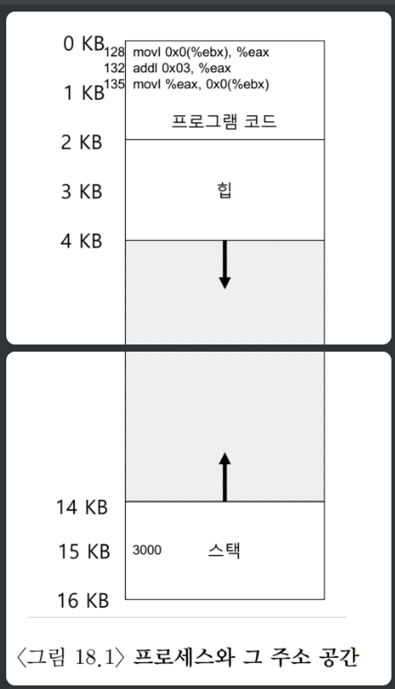
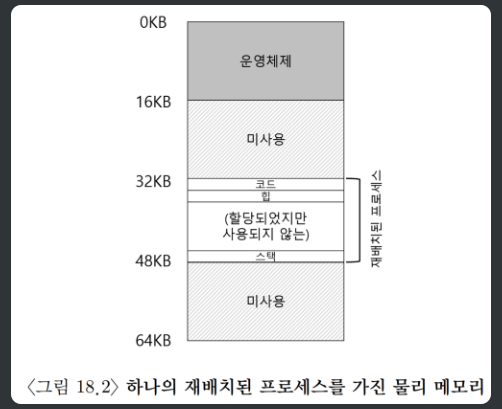

# 주소변환

### 주소바인딩과 주소변환

**배경지식**

기억장치 : 주소를 가지는 워드 또는 바이트 들로 구성됨

프로그램이 실행되기 위해서는 기억장치에 적재되어야 한다. - 적재된 프로그램 : 프로세스

프로세스의 일반적인 실행과정

프로그램 계수기에서 가리키고 있는 주소에서 명령어를 CPU로 가져옴 (fetch)

명령어를 해독 (decode)

기억장치에서 피연산자를 CPU로 가져와서 피연산자에 대해 명령어를 실행 (execute)

실행한 결과를 기억장치에 다시 저장 (store)

# 주소변환

주소 변환 : CPU 에서 생성되는 논리 주소를 물리 주소를 변환하는 것

MMU (Memory Management Unit)

주소 변환을 해주는 하드웨어 장치

프로세스가 생성하는 논리 주소에 재위치 레지스터의 값을 더해서 물리주소를 구한다. 

*<주소 변환 요약>*

- 운영체제는 어떤 프로세스에게 CPU를 할당하여 실행시킬 때, 그 프로세스의 시작 위치를 MMU의 재위치 레지스터에 셋팅한다.
- 이 후, 프로세스가 CPU에 의해 실행될 때, 생성되는 논리 주소는 MMU에 의해 물리 주소로 변환된다.

---

## 주소변환의 원리

운영체제는 효율성, 제어, 유연성을 추구하면서 주소 변환을 하려고 한다. 

- 효율성 : 레지스터, TLB 등의 하드웨어의 도움을 받는다.
- 제어 : 하드웨어의 도움을 받아 응용프로그램이 자기 자신의 메모리 이외의 공간에 접근하지 못하도록 막는다.
- 유연성 : 프로그래머가 원하는 대로 주소 공간을 사용할 수 있어야 한다.

 주소 변환의 핵심 기법은 하드웨어 기반 주소 변환이다. 이러한 주소 변환을 통해 가상 주소를 정보가 실제 존재하는 물리 주소로 변환한다. 

즉, 프로그램의 모든 메모리 참조를 실제 메모리 위치로 재지정한다. 운영체제는 메모리의 빈 공간과 사용중인 공간을 항상 파악하므로서 메모리를 제어할 수 있다. 

### 가정

아래의 비현실적인 가정들을 완화하면서 실제정인 메모리 가상화를 알아볼 것이다. 

1. 사용자의 주소공간은 물리 메모리에 연속적으로 배치된다. 
2. 주소공간의 크기는 물리 메모리 크기보다 작다. 
3. 각 주소공간의 크기는 같다.

```nasm
void func() {
	int x = 3000;
	x += 3;
}

// 어셈블리어로 변환하면
128 : movl 0x0 (\%ebx), \%eax;
132 : addl \$0x03, \%eax;
136 : movl \%eax, 0x0(\%ebx);
```



- ebx에 x의 주소가 저장되어 있다고 가정하면
- 주소 128의 명령어를 반입
- 명령어를 실행 : 주소 15kb에서 범용레지스터 eax로 탑재
- 주소 132의 명령어를 반입
- 명령어를 실행 : 레지스터 eax값에 3을 더함
- 주소 136의 명령어를 반입
- 명령어를 실행 : 주소 15kb에 eax 레지스터 값을 저장

프로세스는 상기 코드를 실행하기 위해 위와 같은 과정을 거치게 된다. 운영체제는 아래와 같이 메모리 가상화를 위해 상기 주소공간을 물리 메모리의 0번지가 아닌 다른 공간에 위치시키려고 한다. 

---

## 동적 (하드웨어 기반) 재배치



각 CPU마다 2개의 하드웨어 레지스터인 베이스 레지스터와 바운드 레지스터를 가지고 있다. 

- 베이스 레지스터
    - 프로그램이 물리 메모리에 탑재될 때, 운영체제는 어느 위치에 프로그램이 탑재될 지 결정하고 해당 위치를 베이스 레지스터 값으로 지정
    - 물리 주소 = 가상 주소 + 베이스
    - 하드웨어는 가상 주소에 베이스 값을 더하여 실제 물리 주소로 변환을 한다.
- 바운드 레지스터
    - 메모리 보호를 위해 존재하는 레지스터
    - 가상 주소가 바운드 안에 존재하는지 확인할 때, 필요한 값, 가상 주소의 최대 크기 저장되어 있음
    - 프로세스가 바운드보다 큰 가상 주소나 음수인 가상 주소를 참조하려고 하면 CPU는 예외를 발생시킨다.

한 쌍의 레지스터를 가지고 주소 변환에 도움을 주는 프로세서의 일부를 메모리 관리 장치(MMU)라고 한다. 

다른 프로그램으로 전환할 떄는 운영체제가 커널 모드에서 베이스와 바운드 레지스터의 값을 변경한다. 

---

### 운영체제 개입 시점

1. 프로세스가 생성될 때, 운영체제는 주소공간이 저장될 메모리 공간을 찾아야 한다 .
    1. 빈 공간 리스트라고 불리는 자료구조를 검색
2. 프로세스가 종료될 때, 프로세스가 사용하던 메모리를 회수하여 다른 프로세스나 운영체제가 사용할 수 있도록 해야한다 .
    1. 종료된 프로세스의 메모리를 빈 공간 리스트에 넣고 연관 자료구조를 정리
3. 프로세스 전환시, 베이스와 바운드 쌍을 저장하고 복원해야 한다. 
    1. 프로세스를 중단시킬 때, 프로세스 제어블럭(PCB)라고 불리는 프로세스별 자료구조에 베이스와 바운드 레지스터 값을 저장
    2. 프로세스를 처음 시작 혹은 재개 시킬 때, CPU의 베이스 바운드 값을 설정
4. 예외 핸들러 또는 호출될 함수를 제공해야 한다.
    1. 부팅시, 특권 명령어를 사용하여 예외 핸들러를 설치함
    2. CPU가 예외를 발생시킬 때, 예외에 따른 핸들러가 작동, 보통은 프로세스 종료

---

### 동적 재배치의 단점

프로세스 가상 메모리 공간 전체를 연속적으로 물리 메모리에 탑재하게 됨으로서 프로세스의 힙과 스택 사이의 공간이 낭비되는 현상이 발생한다. 

이를 내부단편화라고 한다. 이를 해결하기 위해 세그멘테이션이라는 일반화된 base-bound 기법이 등장하게 된다. 

---

## 주소바인딩

프로그램의 명령어와 데이터를 기억장치에 적재할 때, 그것들의 기억장치 주소를 결정하는 것

프로그램에서 사용하는 심볼(전역변수, 함수)은 기억장치의 어떤 주소가 있어야, 실행될 때 그 주소를 사용하여 접근(읽기 / 쓰기) 할 수 이다. 

예시 )

컴파일러는 심볼의 주소를 재배치 가능 주소로 바인딩 한다. 

실행파일을 실행하면, 운영체제는 재배치 가능 주소를 절대 주소로 바인딩한다. 

### 주소바인딩의 종류

**컴파일 시간 바인딩** 

컴파일 시간에 절대 코드를 생성한다. 

프로그램을 기억장치 내에 적재할 위치를 컴파일 시간에 결정함

적재 위치를 바꾸려면 다시 컴파일 해야 한다. 

**적재 시간 바인딩**

컴파일 시간에 재배치 코드를 생성한다. 

적재 시간에 적재할 위치를 결정한다. 

**실행 시간 바인딩**

프로세스가 실행 중에 기억장치의 한 세그먼트로부터 다른 세그먼트로 이동될 수 있다. 

바인딩은 실행시간에 결정됨

### 적재와 연결

**동적 적재**

함수가 호출될 때까지 디스크에 재배치 가능, 적재 형태로 존재하다가, 호출되면 기억장치로 적재됨

호출되지 않는 함수는 적재되지 않기에 기억장치 공간의 사용률을 높일 수 있다.

**정적 연결과 동적 연결**

정적 연결 : 라이브러리와 프로그램이 컴파일될 때, 정적으로 연결되어 실행 파일 안에 존재한다. 

동적 연결 : 라이브러리가 실행파일에 있지 않고, 연결 정보만 존재. 실행 시간에 라이브러리 함수가 호출될 때, 동적으로 연결되며 기억장치에 적재된다. 

### 물리 주소와 논리 주소

물리 주소 : 기억장치가 나타내는 주소, 실제 주소 라고도 한다. 

논리 주소 : 프로세스를 실행하면서 CPU가 생성하는 주소, 가상 주소라고도 한다. 

논리 주소 공간 : 프로세스가 실행하면서 생성되는 모든 논리 주소 집합

물리 주소 공간 : 이 논리 주소와 대응하는 모든 물리 주소 집합

📚 출처

- https://hyeonseong.tistory.com/93
- https://80000coding.oopy.io/88ff06d7-7931-4019-9ac2-75a120fc83de