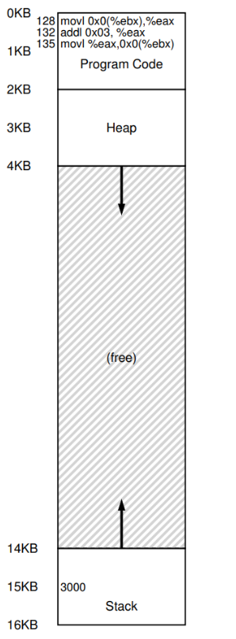
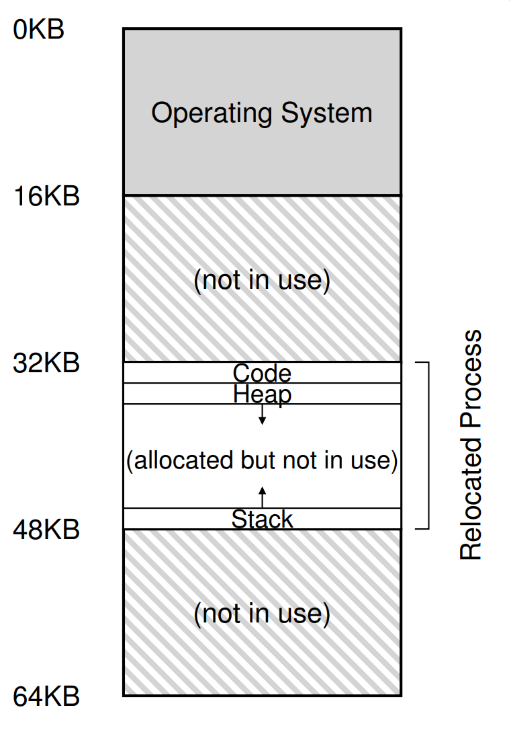
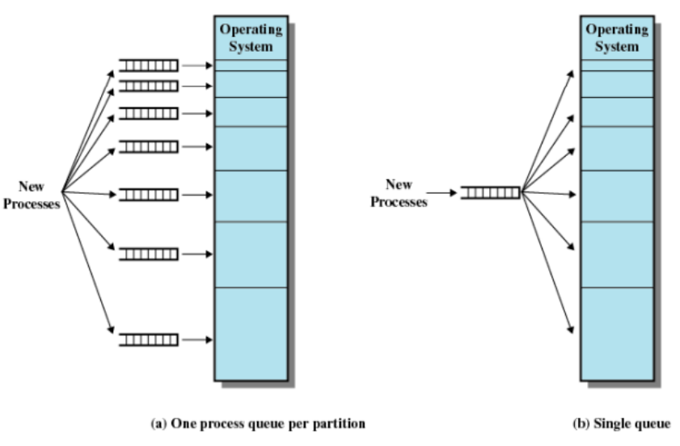
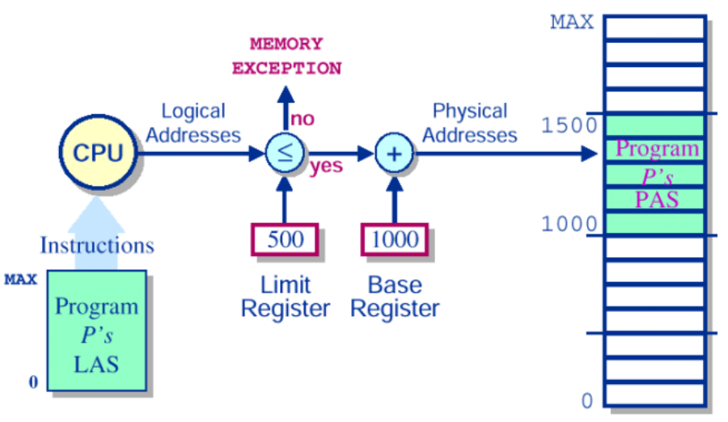
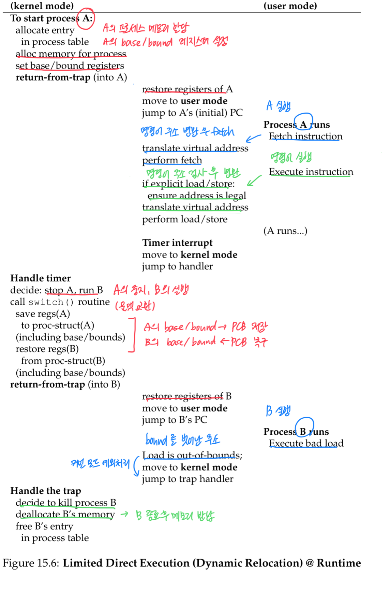

# 주소 변환에서 하드웨어와 운영체제의 역할

- 하드웨어 
  - 주소 변환을 통해 하드웨어는 가상 주소를 정보가 실제 존재하는 물리 주소로 변환한다.

- 운영체제 
  - 정확한 변환이 일어날 수 있도록 하드웨어를 셋업하기 위해 운영체제가 관여해야 한다.
  - 운영체제는 메모리의 빈 공간과 사용 중인 공간을 항상 알고 있어야하고, 메모리 사용을 제어하고 관리해야한다.




위와 같이 물리 주소 0 ~ 16KB 에 배치되어 있던 프로세스의 메모리는 아래 그림과 같이 물리 메모리 32KB ~ 48KB 에 재배치될 수 있다. 

만약 아래 그림이 물리 메모리가 아니라 가상 주소 기반의 주소 공간이라면, **재배치 시에 주소 변환이 필요**하다. 

앞에서 하드웨어에 의해 지원되는 그 주소 변환 (address translation)이 필요하다.




## 재배치의 목적

### 만약, 운영체제가 메모리를 재배치하지 않고, 항상 고정된 위치에 메모리를 배치한다면?

1. 모두 동등한 크기로 파티션을 나누는 경우
   - 파티션 별로 대기큐 없이, 컴피일 될 때 사용중이지 않은 파티션에 프로세스 메모리를 할당한다.
    > 파티션에 메모리를 적재할 때 항상 파티션의 크기보다 프로그램의 크기가 작아야하므로, 사용하지 않는 주소 공간이 낭비되는 문제가 발생한다.(내부 단편화)
   
2. 다른 크기로 파티션을 나누는 경우
   - 각 파티션마다 대기큐가 존재해야 한다.
   - 각 파티션마다 파티션을 사용중인 프로세스가 종료되어야 다음 프로세스가 메모리를 적재하고 실행할 수 있다.
   > 어느 파티션은 바쁘고, 어느 파티션은 한가해지므로 비효율이 발생한다.

### 재배치가 가능하다면??
- 파티션을 미리 나누는 경우에는 각 파티션마다 대기 큐가 존재해야 했지만, 재배치가 가능하다면 실행 시에 프로그램의 크기에 따라 프로세스 메모리를 적절한 파티션에 배치할 수 있기 때문에 각 파티션마다 대기큐가 필요하지 않다.
- 싱글 큐로 메모리 배치가 가능하다.



## 하드웨어 : 동적 재배치의 베이스 바운드 레지스터를 통한 파티션의 메모리 적재와 주소 결정

- 동적 재배치는 각 CPU마다 베이스, 바운드 2개의 하드웨어 레지스터가 필요하다.
- 베이스와 바운드 쌍은 우리가 원한는 위치에 주소 공간을 배치할 수 있게 한다.

### 베이스 레지스터
- 프로세스가 오직 자신의 주소공간에만 접근한다는 것을 보장한다.

- 각 프로그램은 주소 0에 탑재되는 것처럼 작성되고 컴파일되지만, **프로그램 실행 시에 운영체제가 프로그램이 탑재될 물리 메모리 위치를 결정하고 베이스 레지스터를 그 주소로 지정한다.**

- 프로세스는 주소 0 부터 가상 주소를 생성하고, 하드웨어는 운영체제가 설정한 베이스 레지스터의 내용을 이 가상 주소에 더하여 물리 주소를 생성한다.

- 프로그램 실행 중에 프로세스가 메모리 접근을 위해 가상 주소를 참조하면, CPU 의 프로세서 (하드웨어) 는 물리 주소를 생성할 때 사용했던 아래 식을 이용해 물리 주소로 변환한다.

```
pyhsical address (하드웨어) = base (운영체제) + virtual address (프로세스)
```

- 주소의 재배치는 실행 시에 일어난다.
- 프로세스가 실행을 시작한 이후도 주소 공간을 이동할 수 있다.

### 바운드 레지스터

- 보호를 지원하기 위해 존재한다.
- 프로세서는 먼저 메모리 참조가 합법적인가를 확인하기 위해 가상 주소가 바운드 안에 있는지 확인한다.

- 만약 프로세스가 바운드보다 큰 가상 주소나 음수인 가상 주소를 참조하면 예외 발생 및 종료된다.

#### 바운드 레지스터는 2가지 방식 중 하나로 정의 된다.
1. 주소 공간의 크기를 저장하는 방식
   > 하드웨어는 가상 주소를 베이스 레지스터에 더하기 전에 먼저 바운드 레지스터와 비교
2. 주소 공간의 마지막 물리 주소를 저장하는 방식
   > 하드웨어는 먼저 베이스 레지스터를 더하고 그 결과가 바운드 안에 있는지 검사
   
## MMU

- 주소 변환에 도움을 주는 프로세서의 일부를 MMU (memory management unit) 라고 부른다.


- MMU 의 베이스와 바운드 레지스터를 통해, 미리 시작 주소를 컴파일하기보다, 0번 주소를 기준으로 컴파일한 뒤 어느 파티션이든 적재하고, 실행할 떄 주소를 변환할 수 있게 된다. 아래와 같이 LAS (Logical Address Space) 의 파티션에 메모리를 적재하고, 베이스와 바운드 레지스터를 통해 PAS (Physical Memory Space) 의 파티션으로 주소를 변환해 배치할 수 있다.




## 주소 변환을 위해 하드웨어에게 제공되어야 하는 것

- 베이스/바운드 레지스터
- 가상 주소를 변환하고 범위 안에 있는지 검사하는 능력
- 베이스/바운드를 갱신하기 위한 특권 명령어
- 예외 핸들러 등록을 위한 특권 명령어
- 예외 발생 가능

## 운영체제의 관리

하드웨어 지원과 운영체제 관리가 결합되면 간단한 가상 메모리를 구현할 수 있다.

베이스와 바운드 방식의 가상 메모리 구현을 위해 운영체제가 반드시 결합해야하는 3개의 시점이 존재한다.

1. 프로세스가 생성될 때
    > 운영체제는 주소 공간이 저장될 메모리를 찾아 조치를 취해야한다.
    > 운영체제는 물리 메모리를 슬롯의 배열로 보고 각 슬롯의 사용여부를 관리하는데, 새로운 프로세스가 생성되면 새로운 주소 공간 할당에 필요한 영역을 찾기 위해 free list 자료 구조를 검색
2. 프로세스가 종료할 때
    > 프로세스가 사용하던 메모리를 회수하여 다른 프로세스나 운영체제가 사용할 수 있게 해야한다.
3. 프로세스 간 문맥교환 시
    > 운영체제는 프로세스의 베이스와 바운드 쌍을 저장하고 복원해야한다.    
    > 운영체제가 프로세스를 중단하기로 결정하면, 메모리에 존재하는 프로세스 별 자료 구조 안에 베이스와 바운드 레지스터의 값을 저장해야한다. 이 자료 구조는 PCB (process control block) 이라고 불린다.

    - 운영체제가 프로세스를 실행시킬 때는, 프로세스에 맞는 값으로 CPU의 베이스와 바운드 값을 설정해야 한다.
    - 프로세스가 중단됐을 때 운영체제의 프로세스 메모리 재배치
      - 운영체제는 먼저 프로세스의 실행을 중지시키고, 현재 위치에서 새 위치로 주소 공간을 복사한다.
      - 그리고 PCB에 저장된 베이스 레지스터를 갱신해, 새 위치를 가리키도록 한다.
    
4. 운영체제는 예외 핸들러 혹은 호출될 함수를 제공해야 한다.
    - 예) 프로세스가 바운드 밖의 메모에 접근하려는 경우, 허가 받지 않은 메모리에 접근하므로 CPU는 예외를 발생시킨다. 운영체제는 이런 예외가 발생할 때 조치를 취할 준비를 해야한다.


#### 프로세스 A 의 실행과 A → B 의 문맥 교환, 프로세스 B 의 예외 처리와 종료 과정은 아래와 같다.



#### 주목할 점 
**메모리 변환은 메모리 변환이 운영체제의 개입 없이 하드웨어에 처리된다는 것이다**

운영체제는 하드웨어를 적절하게 설정하고, 프로세스가 CPU에서 직접 실행할 수 있게 한다.


## 문제점
동적 재배치를 통해 할당된 영역은 내부 공간이 사용되지 않기 때문에 내부 단편화 (internal fragmentation) 가 발생하여 낭비되기 때문이다. 
물리 메모리의 이용률을 높이고 내부 단편화를 방지하기 위해 더 정교한 기법이 필요하다. 
그 기법으로 일반화된 베이스와 바운드 기법인 세그멘테이션 (segmentation) 이 등장한다.


출처: https://rxdcxdrnine.tistory.com/25
