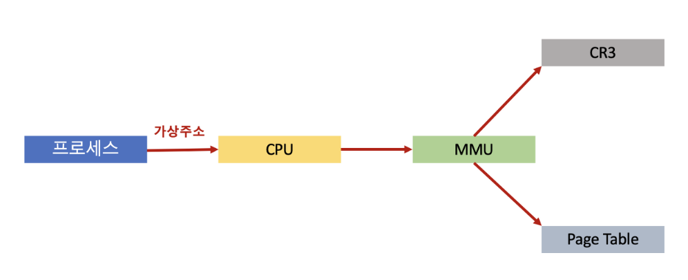

# 페이징

## 의미

- **프로세스가 차지하는 물리적 메모리 공간이 비연속적이 되도록 허용하는 메모리 관리 기법**
- 특정 데이터가 들어있는 데이터 조각 묶음을 계산하는 알고리즘
- 메모리 가상화에서 가상 주소와 물리 주소를 맵핑시킬 때 페이지 프레임을 단위로 하는 방식
- 각 페이지들의 크기는 같으며 생성된 순서대로 순번을 차례대로 부여받음
- 프로세스의 주소 공간을 0번지부터 페이지(page)로 불리는 고정 크기로 나누고 물리 메모리 역시 0번지부터 페이지로 동일한 크기로 분할하여, 프로세스의 각 페이지를 물리 메모리의 임의의 페이지에 분산 할당
- 프로세스마다 페이지와 물리 프레임을 매핑하는 페이지 테이블이 존재하며, MMU 장치는 페이지 테이블을 이용하여 논리 주소를 물리 주소로 변환
- 페이징 기법은 마지막 페이지에서의 내부단편화 1회만 발생하므로 효율적

 

## 용어

- page (페이지) : 가상 메모리를 일정한 크기로 나눈 블록
- frame (프레임) : 물리 메모리를 일정한 크기로 나눈 블록
- 페이지 크기 = 프레임 크기
- 논리적 메모리 특정 주소 값은 페이지1의 첫 번째 Offset 으로 표현 가능하고, 물리적 특정 주소값 또한 프레임1의 첫번째 Offset으로 표현이 가능
    - Offset : 객체 안에서 객체의 처음부터 주어진 인덱스

 

## 장점

1. 구현이 쉬움
    - 메모리를 0번지부터 고정 크기의 페이지로 분할
2. 이식성이 높음
    - CPU에 의존하지 않아 다양한 컴퓨터 시스템에 동일한 방식으로 구현 가능
3. 융통성이 높음
    - 시스템에 따라 혹은 응용에 따라 페이지의 크기를 달리 설정 가능
4. 세그먼테이션에서 발생하는 외부 단편화 x, 홀 선택 알고리즘 실행할 필요 x
    - 메모리 활용과 시간 오버헤드 면에서 훨씬 우수(내부 단편화 발생하나 매우 작음)

 

## 페이징 테이블
- ** 물리 주소의 페이지를 실제 물리 주소 정보와 매핑한 표를 담고 있는 테이블**
- 페이지 테이블은 CPU의 PCB(Process Control Block)에 저장

 

 

- 프로세스가 작업을 처리하기 위해 CPU에게 가상 주소를 넘겨주고 CPU는 그 가상 주소를 받아 실제 데이터를 찾아야 함
- CPU는 페이지 테이블에 접근해서 해당 가상 주소의 페이지 번호가 있는지 확인하고 페이지 번호가 있으면 페이지 번호와 매핑되어 있는 물리 주소를 알아냄
- 가상 주소와 찾아낸 페이지 번호의 주소값을 계산해서 실제 물리 주소를 알아낸 후 물리 메모리에서 실제 데이터를 가져옴

 

- CPU는 PCB에 각종 프로세스 정보 값을 저장
- CPU에는 CR3라는 레지스터가 있는데, CR3에는 PCB에 저장되어 있는 프로세스의 페이지 테이블 물리 주소를 저장
- CPU는 CR3에서 이 페이지 테이블 주소를 알아낸 뒤, 페이지 테이블에 접근
- CPU는 프로세스의 데이터를 읽어야할 때 데이터의 가상주소를 가지고 데이터를 조회
-  MMU는 이 가상 주소를 물리 주소로 변환하여 실제 데이터의 위치를 알아냄
- MMU는 CPU의 CR3에 들어있는 프로세스의 페이지 테이블 물리 주소(페이지 테이블이 위치해 있는 주소값)를 알아 낸 뒤 PCB 내부의 페이지 테이블에 접근
- 페이지 테이블에서 가상 주소와 매핑되어 있는 물리 주소를 알아낸 뒤 실제 물리 주소 값을 계산해서 데이터를 찾아 CPU에게 전달
- 페이지 테이블에는 모든 페이지의 물리 주소값이 저장되어 있는 것은 아님
- 페이지는 데이터별로 같은 크기로 나눌 수 있다고 했는데 나눠진 데이터별 페이지 중에서도 가장 첫번째로 생성된 페이지의 번호들만 저장

 

### 참고 자료
- https://velog.io/@suuzin/%EC%9A%B4%EC%98%81%EC%B2%B4%EC%A0%9C-%ED%8E%98%EC%9D%B4%EC%A7%95-%EB%A9%94%EB%AA%A8%EB%A6%AC-%EA%B4%80%EB%A6%AC
- https://charles098.tistory.com/106
- https://4legs-study.tistory.com/48
- https://jerryjerryjerry.tistory.com/187
- https://sunho-doing.tistory.com/entry/OS-%ED%8E%98%EC%9D%B4%EC%A7%95Paging-%EA%B8%B0%EB%B2%95
- https://zu-techlog.tistory.com/133
- https://resilient-923.tistory.com/390
- https://brightmango.tistory.com/entry/%EC%9A%B4%EC%98%81%EC%B2%B4%EC%A0%9C-%ED%8E%98%EC%9D%B4%EC%A7%95
