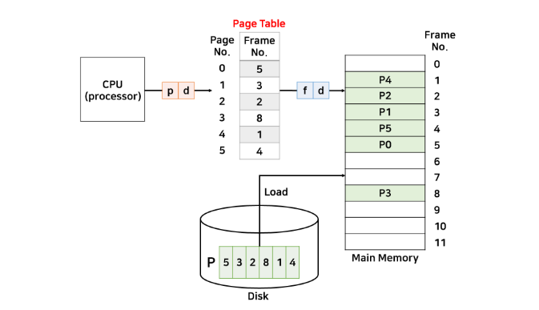
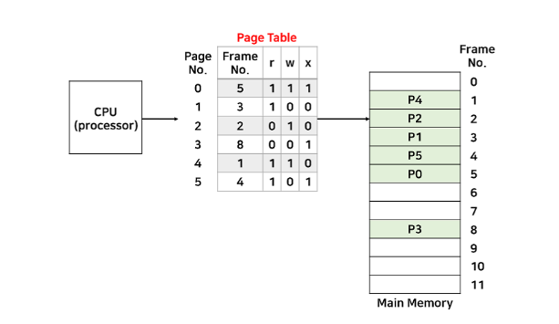

# 페이징

페이지 단위의 논리-물리 주소 관리 기법

- 프로세스의 주소 공간을 동일한(고정된) 사이즈의 페이지 단위로 나누어 물리적 메모리에 불연속적으로 저장하는 방식
- 외부 단편화와 압축 작업을 해소하기 위함이다.
- 프로세스는 page라 불리는 고정 크기로 분할되고, 메모리는 Frame이라는 고정 크기로 분할된다.
- 하나의 프로세스는 연속적인 동작을 수행하는데, 이를 작은 조각으로 나누어 여기저기 흩어져 있기에, MMU를 통해 논리 주소와 물리 주소를 나누어 사용함으로써 CPU를 속이게 된다.
- 실제 메모리는 전혀 연속적이지 않지만, CPU는 연속적으로 사용하고 있다는 것을 보장받으며 정상적으로 수행한다.

*예시*

50byte 크기의 프로세스가 있다고 가정하고, 페이징의 크기는 10byte로 나눠보자. 

프로세스 P1은 5개의 페이지로 나눌 수 있다. 이를 메인 메모리 5곳에 나눠서 할당했다. 

CPU는 논리주소로 프로그램이 설정한대로 연속적인 주소값으로 명령을 내리고 이는 메모리로 가기 전에 각 페이지의 실제 메모리 주소가 저장되어 있는 테이블에서 물리 주소로 변경되어야 한다. 

프로세스를 나눈 조각을 Page 라 하고, 메모리를 나눈 조각을 Frame이라 한다. 

프로세스는 페이지의 집합이고, 메모리는 프레임의 집합이다. 

프로세스를 정상적으로 사용하기 위해 MMU의 재배치 레지스터를 여러 개 사용해서 위의 그림과 같이 각 페이지의 실제 주소로 변경해준다. 이러한 여러 개의 재배치 레지스터를 페이지 테이블이라 한다. 

### 장점

외부 단편화가 없다. 

### 단점

페이지가 클수록 내부 단편화 문제의 비중이 늘어나게 된다. 

## 주소 변환 (Address Translation)

페이징 기법을 사용하기 위해서는 여러 개로 흩어진 페이지에 CPU가 접근하기 위해서 페이지 테이블을 통해 주소를 변환해야 한다. 

### 논리주소

CPU가 접근하는 주소로 2진수로 표현되고 이는 m비트가 있다고 가정한다. 

여기서 하위 n비트는 오프셋 또는 변위라고 한다. 

그리고 상위 m-n비트 는 페이지의 번호에 해당한다. (n = d, m - n = p)

논리주소를 물리주소로 변환하기 위해서 페이지 번호(p)는 페이지 테이블의 인덱스 값이고, p에 해당되는 테이블 내용은 메모리의 프레임 번호이다. 변위(d)는 변하지 않는 값이다. 

*예시*

Page size = 16 bytes, Page Table = 5, 3, 2, 8, 1, 4 일 때, 논리 주소 50번지는 물리 주소는 몇 번지인가?

프로세스 P가 메모리에 할당된 모습이다. CPU가 50번지에 접근할려고 한다. 그러면 페이지 테이블의 정보를 읽기 위해 논리 주소를 p와 d 값으로 나눠야 한다. 

d는 페이지 크기에 따라 달라지는데, 현재 페이지 크기는 16byte이다. 이는 2^4이르모 d = 4이다. 

p는 d를 제외한 나머지 크기이다. 

그러면 실제로 p, d를 계산해보자. 현재 논리주소는 50이며, 이진수로 나타내면 110010 이다. 먼저, d는 4이므로 이진수의 뒤에서 4칸이 d에 해당된다. d를 제외한 나머지 2칸이 p가 된다. 

50 = 110010, p = 11, d = 0010

p는 이진수 11이고, 십진수로 3이다. 즉 페이지 테이블의 페이지 번호 3을 가리킨다. 

페이지 3번에 해당하는 프레임 번호는 8번이므로, 물리주소를 구성하는 f값은 8이 된다. 

f = 1000, d = 0010, 물리주소 = 10000010

최종적으로 물리주소는 f와 d로 구성되어 있으므로 물리주소는 이진수로 10000010이 되고, 십진수로 130번지가 된다. 즉, 변위는 2이므로 8번째 프레임의 시작 주소는 130에서 2를 뺀 128번지(16 * 8)가 된다. 

연속 메모리 할당을 하면서 외부 단편화가 발생하여 이를 해결하기 위해 페이징 기법이 등장했지만, 페이징은 내부 단편화 문제가 발생한다. 

## 내부 단편화

내부 단편화는 프로세스 크기가 페이지 크기의 배수가 아닐 경우, 마지막 페이지는 한 프레임(페이지)를 다채울 수 없어서 발생하는 공간으로 메모리 낭비의 원인이 된다. 

예를 들어, 15bytes 크기의 프로세스 p가 있다. 페이지 크기는 4byte로 p를 페이지로 나누면, 4, 4, 4, 3의 크기로 총 4개의 페이지가 만들어진다. 마지막 3byte 페이지는 페이지의 크기보다 1byte 작으므로 사용하지 못하고, 이만큼의 메모리 공간이 비게 된다. 이렇게 비어진 공간은 프로세스 p에서도 쓰지 않고, 다른 프로세스에서도 쓰지 못하는 낭비되는 공간이 된다. 

**내부 단편화는 해결할 방법이 없다**. 하지만 내부 단편화는 외부 단편화에 비해 낭비되는 메모리 공간은 매우 적다. 내부 단편화의 최대 낭비되는 크기는 page size - 1이된다. (외부 단편화는 최대 전체 메모리의 1/3이 낭비된다고 한다.) 이는 무시할 정도로 작은 크기이다. 

## 보호와 공유

### 보호

모든 주소는 페이지 테이블을 경유하므로, 테이블을 이용해서 보호 기능을 수행할 수 있다. 대표적으로 페이지 테이블마다 r(read), w(write), x(execute) 비트를 두어, 해당 비트가 켜져있을때, 그 수행이 가능하도록 한다. 

페이지 테이블에 r, w, x비트를 추가한 모습이다. 만약 1번 페이지 엔트리처럼 쓰기 비트가 꺼져있는 페이지에 쓰기 작업을 시도하면 CPU에 인터럽트가 발생하면 ISR(Interrupt Service Routine)에서 강제로 해당 프로세스를 종료시킨다. 

### 공유

공유는 메모리 낭비를 방지하기 위함이다. 같은 프로그램을 쓰는 복수 개의 프로세스가 있ㄷ마ㅕㄴ, 프로세스의 메모리는 code + data + stack 영역으로 나뉘는데, 프로그램이 같다면 code 영역은 같을 것이다. 

그러므로 하나의 code영역을 복수 개의 프로세스가 공유하여 메모리 낭비를 줄이는 것이다. 단, code가 공유되려면 code가 변하지 않는 프로그램이어야 한다. 이를 non-self-modifying code = reentrant code(재진입 가능 코드) = pure code라고 한다. 

 

📚 출처

- https://dar0m.tistory.com/269
