# 연속 할당의 문제점 - 외부 단편화

## 연속 할당이란?
> 한 프로세스의 모든 노닐적 주소에 동일한 베이스 레지스터를 더해주는 것.
> 이는 MMU에 의해 이뤄지며, 주소는 실행시간에 바인딩 된다는 특징이 있다.


모든 프로세스는 논리적 주소가 0번지부터 시작해서 차례대로 증가하기 때문에, 물리적 주소도 시작주소만 다르지 연속적으로 배치되어 있다.


1. Partition : 프로세스의 메모리 공간
2. Hole(Free Partition) : 메모리에서 할당 받지 못한 공간. 사용 가능한 공간.

- 운영체제는 Hole을 제외한 파티션의 개수만큼 동시 실행 가능
- 요구하는 프로세스의 용량이 Hole크기보다 크면 메모리에 올라갈 수 없으므로 실행되지 못한다.

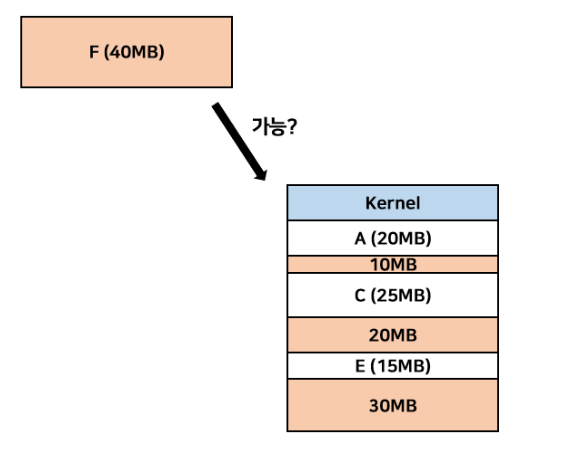

프로세스 F가 들어갈 연속된 자리가 없으면 F는 실행 불가능
흰색 칸이 Hole에 해당하는데 , Hole의 합은 60MB로 프로세스 F의 크기보다 크다.
이렇게 메모리에 공간이 있음에도 불구하고 연속된 Hole의 크기가 프로세스의 크기보다 작다는 이유로 할당되지 못하는 문제를 외부 단편화라고 한다.

> 외부 단편화 <br/>
> :메모리에 공간이 충분히 있음에도 불구하고 연속된 Hole의 크기가 프로세스의 크기보다 작다는 이유로 할당되지 못하는 문제


## 외부 단편화 해결 방법 1 - Compaction
파티션들을 재배치해서 모든 Hole들을 한 곳으로 결합하는 방법

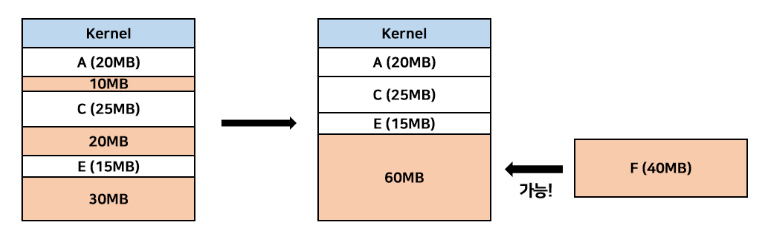

Compaction을 하려면 기존의 메모리를 임시 공간에 보사해야 한다.
메모리에 복사할 수 없기 때문에 하드디스크에 복사해야하는데, 하드디스크에 복사했다가 다시 가져오는 행위는 시간적 소모가 너무 심하다.
따라서 가능은하지만 오버헤드가 굉장히 심하므로 사용하지 않는 방법이다.

## 외부 단편화 해결 방법 2 - 불연속 할당

외부 단편화의 발생원인은 '연속 할당'이었다.
주소를 불연속적으로 할당하면 외부 단편화는 발생하지 않는다. 
이러한 메모리 관리 구조는 Paging이다.

# Paging
> 외부 단편화의 해결 방법으로, 주소를 불연속적으로 할당하는 메모리 관리 구조

1. Page : 가상 메모리를 일정한 크기로 나눈 블록
2. Frame : 물리 메모리를 일정한 크기로 나눈 블록

**페이지 크기 = 프레임 크기**

일정한 크기로 나눈 이유는 메모리의 효육적 관리를 위해서이다.
페이지와 프레임의 크기를 같게함으로써 페이지에 대응되는 프레임을 좀 더 쉽게 찾을 수 있다.

**페이지의 크기가 정해지면 이 크기가 메모리의 단위가 된다.
페이지의 크기는 CPU에서 정의된다.**

페이지와 프레임의 대응 관계도는 '페이지 테이블'에 저장되어 있다.

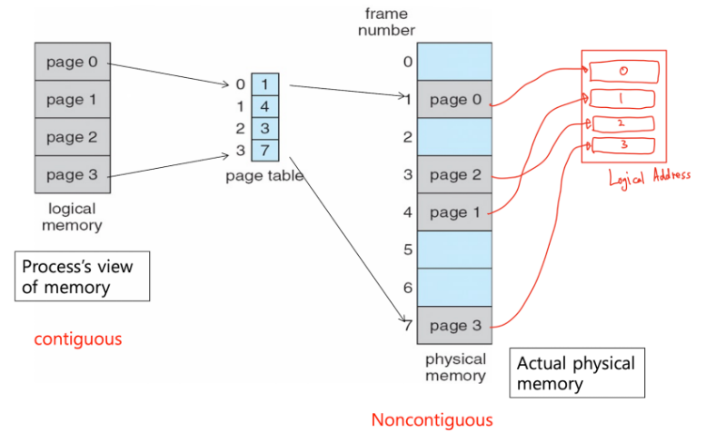

논리적 메모리에서는 연속적이었던 페이지들이 페이지 테이블을 거치고 나서는 불연속적으로 바뀐 것에 주목


### 페이지 테이블
> 모든 프로세스마다 개별적으로 가지고 있는 정보
> 커널에 저장되어 있다.

## 페이징을 사용했을 때의 이점
1. 외부 단편화 해결
   > 페이지와 프레임의 크기가 똑같으므로 다른 페이지가 2번 인덱스에 들어갈 수 있다.
   > 빈 공간(프레임)이 있어도 크기가 항상 페이지와 같으므로 빈공간을 걱정할 필요가 없다.

2. 프로세스끼리 메모리 공유도 훨씬 용이해진다.
   > 프로세스별로 공유하는 페이지의 물리적 주소를 페이지 테이블에 저장하면 되기 때문이다.
   
3. 압축 기능 제거

## 페이징을 사용했을 때의 단점
1. 페이징 사상을 위한 하드웨어 준비로 인한 가격 상승
2. 속도 저하


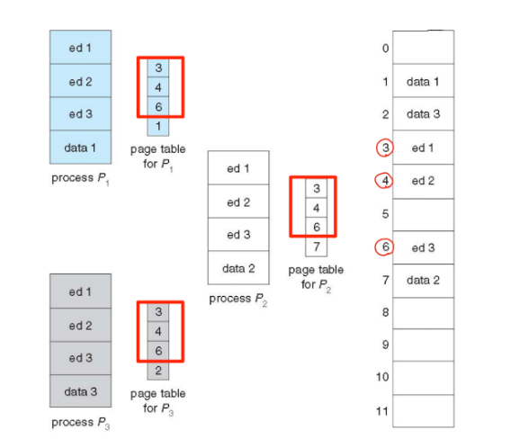

위 그림과 같이 P1,P2,P3는 페이지 ed1, ed2, ed3를 공유하고 있다.
각 프로세스의 페이지 테이블에 ed1, ed2, ed3의 물리적 주소를 저장해두면 메모리 공유를 쉽게 할 수 있다.

물리적 메모리에는 code와 같이 공유하는 부분을 저장해두고, 프로세스의 페이지에는 힙, 스택과 같은 private 데이터를 저장해두면 메모리 낭비를 줄일 수 있다.


## [Page -> Frame] Mapping과정 


1. 오프셋(Offset)

> 위치를 찾기 위해 더해주는 값

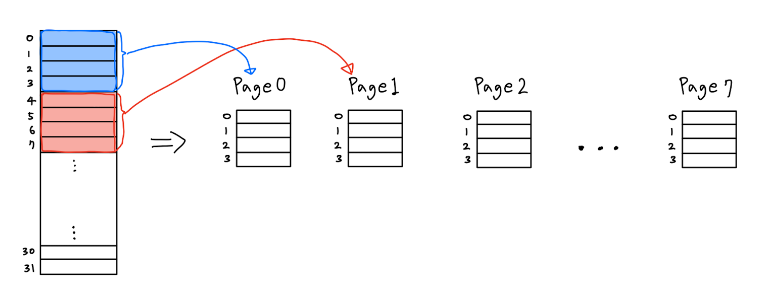
주소공간 0~31, 페이지 크기 4 => 8개의 페이지 생성

모든 주소를 페이지로 표현 
``` 현재 주소 = (#페이지 * 페이지 크기) + offset```

ex) 6 = (1*4) + 2 //6번지 주소는 Page1의 2번째 인덱스 
예시의 offset은 2이다.

오프셋의 크기는 페이지 크기보다 항상 작다.

2. 페이지 테이블

> 페이지 테이블에 저장되어 있는 값은 정확하게 말해서 각 페이지의 '물리적 주소에서의 시작 주소값(base address)'이다.
> 즉, 모든 논리적 주소는 페이지 테이블에서 자신의 base address를 찾고 이 값에 offset을 더해주면, 그 값이 물리적 주소가 되는 것이다.

- 메모리에 저장되는 정보이기 때문에 인덱스-값의 자료구조를 가진다.
- 페이지 개수만큼 필요하다.
- 페이지와 페이지 테이블의 값을 일대일 대응 관계이다.

### 각 페이지가 어떻게 페이지 테이블에 매핑되는가?

CPU에 의해 생성되는 모든 논리적 주소는 아래와 같이 두 부분으로 나뉜다.
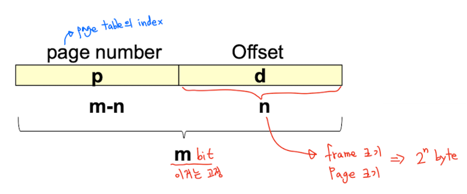

```
논리적 주소 공간의 크기 = 2^m(byte)
페이지 크기 = 2^n(byte)
페이지 테이블의 크기 = 2^(m-n)(byte)


page number(p) = m-n(bit)
page offset(d) = n (bit)

offset은 n개의 비트로 표현 가능한 수로, 페이지 크기 2^n보다 항상 작다.
```

예) 16bit CPU의 경우 논리적 주소는 16바트로 표현된다.

**만약에 페이지 크기를 4비트로 정하면 페이지 개수는 12비트로 자연스럽게 구해진다.

그런데 페이지의 개수는 페이지 테이블이 가지는 값의 개수와 일치해야 하므로 page number를 page table index로 봐도 무방하다.**

아래는 페이지와 페이지 테이블의 매핑 관계 그림이다.
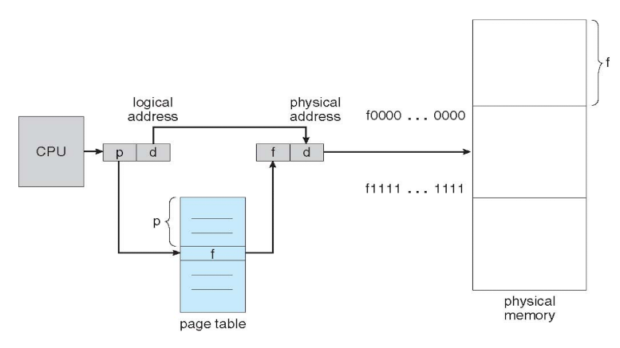

여기서 base address에 페이지 offset값을 더할 수 있는 이유는

페이지의 크기와 프레임의 크기가 동일하기 때문이다.


## 하드웨어의 도움(MMU)

- 페이지 테이블의 참조는 굉장히 빈번하게 일어나므로 하드웨어의 도움을 받아야한다.

불연속 할당일 때의 MMU 구조

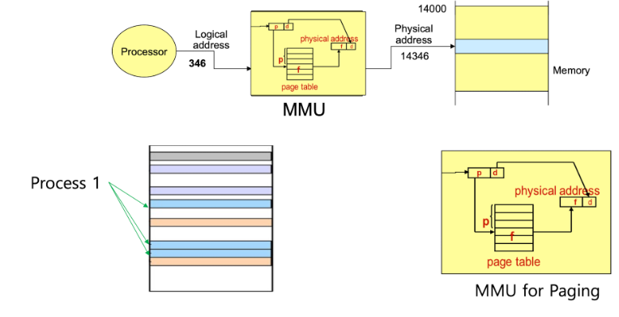


## 논리적 주소로 Page, Offset 구해보기

논리적 주소와 페이지 오프셋이 주어졌을 때, 이 주소가 몇 번째 페이지의 몇번째 오프셋인지 구해보는 예제

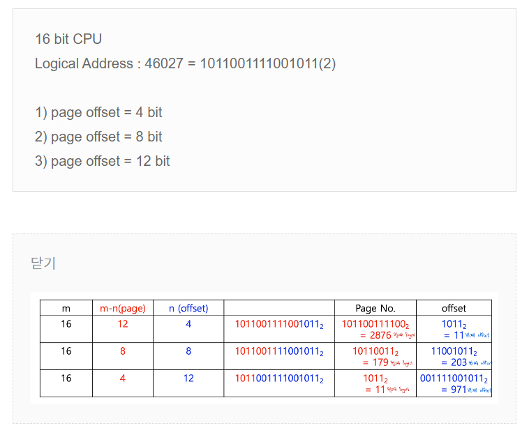

위의 문제로 알 수 있는 사실

페이지 개수와 페이지 크기는 trade-off 관계이다

페이지 개수가 너무 많으면 페이지 테이블 크기 또한 너무 커진다.

오프셋 크기가 너무 크면 내부 단편화가 발생할 수 있다.

<hr/>


### 빈 프레임은 **운영체제**가 free frame list에 가용 프레임을 저장해 놓고 새로운 프로세스가 생성되면 가용 프레임 주소를 페이지 테이블에 할당해준다.

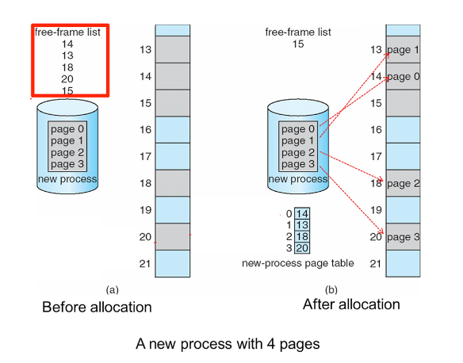

### 페이지 테이블의 물리적 주소?
   - 페이지 테이블도 메모리에 저장되어 있는 값이기 때문에 페이지테이블에 접근하기 위한 Base Register도 필요하다. 이를 Page-table base register(PTBR)이라고 한다.
   - 또한 자신의 메모리 공간의 보호를 위해 Limit Register도 필요한데 이를 Page-table length register(PTLR)이라고 한다.
  
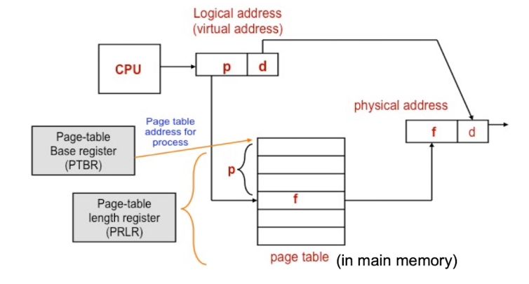

만약에 어떤 프로세스의 세 번째 페이지의 page number값이 k라면, 물리적 주소에서 k+PTBR주소에 있는 값이 Page3의 실제 물리적 주소이다.


## 페이지 테이블 구현방법 2가지
1. 페이지 테이블을 주기억 장치에 유지(PTBR)
2. TLB(translation look-aside buffer)사용


참고: https://charles098.tistory.com/106
