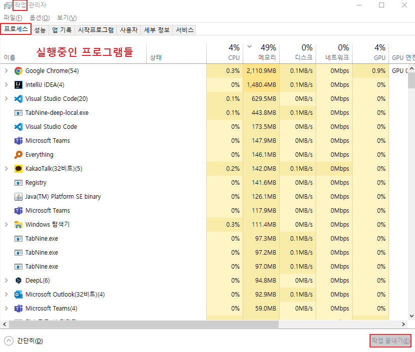
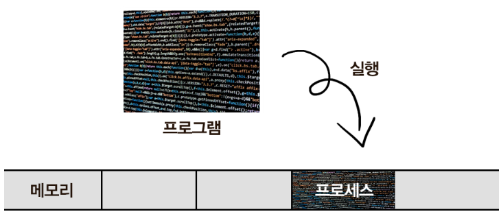
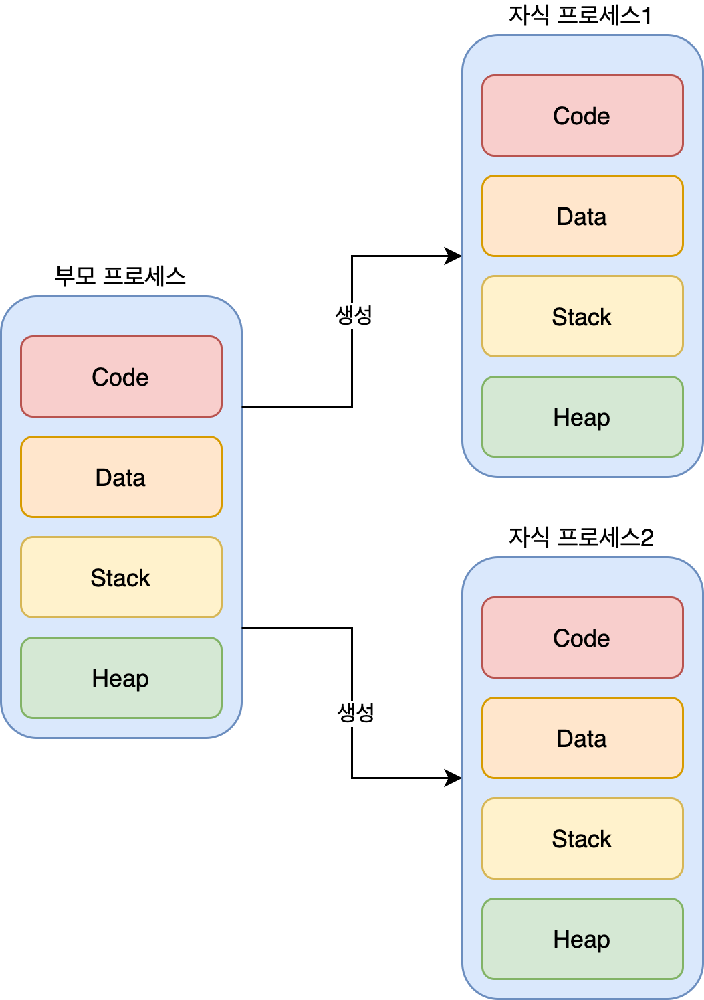
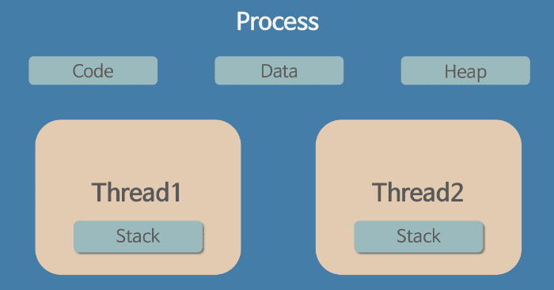
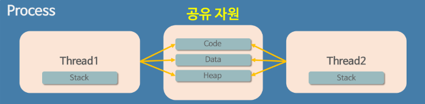

# 프로세스와 스레드

## 프로세스 (Process)

**운영체제로부터 자원을 할당받는 작업의 단위**

 
*이미지 출처 : https://gmlwjd9405.github.io/2018/09/14/process-vs-thread.html*

- 프로그램(Program)
    - 프로그램 : 컴퓨터에서 실행할 수 있는 파일 ex) *.exe, *.dmg
    - 정적 프로그램 : 아직 파일을 실행하지 않은 상태
    - 어떤 프로그램을 개발하기 위해서는 Java나 C언어 등의 언어를 이용하여 코드를 작성해서 완성함
    - 즉 프로그램은 쉽게 말하자면 코드 덩어리임
    
 

- 프로세스(Process)
    - 프로그램을 실행시켜 정적인 프로그램이 동적으로 변하여 **프로그램이 돌아가고 있는 상태**
    - 컴퓨터에서 작업중인 프로그램을 의미
    - 메모리에 올라와 실행되고 있는 프로그램의 인스턴스(독립적인 개체)
    - 스케줄링의 대상이 되는 작업(task)와 같은 의미로 쓰임
    - 프로세스 내부에는 최소 하나의 스레드(thread)를 가지고 있음
    - 작업 관리자를 열어보면 확인 가능

 
*이미지 출처 : https://inpa.tistory.com/entry/%F0%9F%91%A9%E2%80%8D%F0%9F%92%BB-%ED%94%84%EB%A1%9C%EC%84%B8%EC%8A%A4-%E2%9A%94%EF%B8%8F-%EC%93%B0%EB%A0%88%EB%93%9C-%EC%B0%A8%EC%9D%B4*
    
 

- 모든 프로그램은 운영체제가 실행되기 위한 메모리 공간을 할당해줘야 실행될 수 있음
- 프로그램을 실행하는 순간 파일은 컴퓨터 메모리에 올라감
- 이후 운영체제로부터 시스템 자원(CPU)를 할당받아 프로그램 코드를 실행시켜 서비스를 이용할 수 있게 됨

 
*이미지 출처 : https://inpa.tistory.com/entry/%F0%9F%91%A9%E2%80%8D%F0%9F%92%BB-%ED%94%84%EB%A1%9C%EC%84%B8%EC%8A%A4-%E2%9A%94%EF%B8%8F-%EC%93%B0%EB%A0%88%EB%93%9C-%EC%B0%A8%EC%9D%B4*    

 

- 프로그램과 프로세스 비교

|프로그램|프로세스|
|---|---|
|어떤 작업을 하기 위해 실행할 수 있는 파일|실행되어 작업중인 컴퓨터 프로그램|
|파일이 저장 장치에 있지만 메모리에는 올라가 있지 않은 정적인 상태|메모리에 적재되고 CPU 자원을 할당받아 프로그램이 실행되고 있는 상태|
|쉽게 말해 그냥 코드 덩어리|그 코드 덩어리를 실행한 것|
    
 

- 프로세스의 메모리 영역
    1. Code 영역
        - 프로그래머가 작성한 프로그램이 저장되는 영역
        - 실행할 프로그램의 코드나 명령어들이 기계어 형태로 저장된 영역
        - CPU는 코드영역에 저장된 명령어들을 하나씩 처리
    2. Data 영역
        - 코드에서 선언한 전역 변수와 정적 변수가 저장되는 영역
        - 코드가 실행되면서 사용한 환경이나 파일들의 각종 데이터들이 모여있음
        - 프로그램이 실행되면서 할당되고 종료되면서 소멸
        - 세분화된 영역 : 
            1. .data : 전역 변수 또는 static 변수 등 프로그램이 사용하는 데이터를 저장
            2. .BSS : 초기값 없는 전역 변수, static 변수가 저장
            3. .rodata : const같은 상수 키워드 선언 된 변수나 문자열 상수가 저장
    3. Stack 영역
        - 호출한 함수가 종료되면 되돌아올 메모리의 주소나 지역 변수 등이 저장
        - 함수 안에서 선언된 지역변수, 매개변수, 리터값등이 저장
        - 함수 호출시 기록되고 종료되면 제거
        - 만일 stack 영역을 초과하면 stack overflow 에러가 발생
    4. Heap 영역
        - 관리가 가능한 데이터 이외의 다른 형태의 데이터를 관리하기 위한 자유공간
        - 동적으로 할당되는 데이터를 위해 존재
    - 코드 영역과 데이터 영역은 선언할 때 그 크기가 결정되는 정적 영역이지만, 스택 영역과 힙 영역은 프로세스가 실행되는 동안 크기가 늘어났다 줄어들기도 하는 동적 영역
    
 

### 프로세스의 특징

1. 프로세스는 각각 독립된 메모리영역 (Code, Data, Stack, Heap) 을 할당받음
2. 기본적으로 프로세스당 최소 1개의 스레드를 가지고 있음
3. 각 프로세스는 별도의 주소 공간에서 실행되며, 한 프로세스는 다른 프로세스의 변수나 자료구조에 접근할 수 없음
4. 한 프로세스가 다른 프로세스의 자원에 접근하려면 프로세스 간 통신이 필요함 (IPC, Inter-Process-Communication)
    
 

### 멀티 프로세스 

 
*이미지 출처 : https://trumanfromkorea.tistory.com/51*

- **하나의 응용 프로그램을 여러 개의 프로세스로 구성하여 각 프로세스가 하나의 작업을 처리하도록 하는 것**
- CPU는 한번에 한가지 명령어밖에 처리하지 못함
- 멀티 프로세스는 동시에 여러 프로세스가 실행되는 것이 아니라 재빠르게 프로세스를 번갈아가며 실행하고 관리하는 것
- Context Switching : 
    - CPU가 프로세스를 번갈아가며 실행하고 관리하는 것
    - CPU에서 여러 프로세스를 돌아가면서 작업을 처리하는 과정
    - 동작 중인 프로세스가 대기하면서 해당 프로세스의 상태 (Context)를 PCB (Process Control Block)에 보관
    - 대기하고 있던 다음 순서의 프로세스가 동작하며 이전에 PCB에 보관했던 프로세스의 상태를 복구
- PCB (Process Control Block) :
    - 특정한 프로세스를 관리할 필요가 있는 정보를 포함하는 운영체제 커널의 자료구조
    - Context Switching시 사용
    - CPU가 여러 프로세스를 빠르게 번갈아가며 작업하기 위해서는 프로세스에 대한 정보 및 상태를 저장/복원 할 필요가 있기 때문
    - PCB에 포함되는 항목 : 
        1. 프로세스 식별자, 상태, 카운터, 계정 정보
        2. CPU 레지스터, 스케쥴링 정보
        3. 메모리 관리 정보
        4. 입출력 상태 정보
- 장점 : 
    - 여러개의 자식 프로세스 중 하나에 문제가 발생하면 그 자식 프로세스만 죽음
    - 문제가 발생하면 영향이 확산되지 않음
- 단점 : 
    - Context Switching 과정에서 캐시 메모리 초기화 등 무거운 작업이 진행되고 많은 시간이 소모되는 등 오버헤드가 발생
    - 프로세스는 각각의 독립된 메모리 영역을 할당받았기 때문에 프로세스 사이에서 공유하는 메모리가 없어 Context Switching이 발생하면 캐시에 있는 모든 데이터를 리셋하고 다시 캐시 정보를 불러와야 함

 

### 프로세스의 자원 공유

- 기본적으로 각 프로세스는 메모리에 별도의 주소 공간에서 실행되기 때문에 한 프로세스는 다른 프로세스의 변수나 자료구조에 접근할 수는 없음
- 특별한 방법을 통해 프로세스가 다른 프로세스의 정보에 접근하는 것이 가능
- 방법 : 
    1. IPC(Inter-Process Communication) 사용
    2. LPC(Local inter-Process Communication) 사용
    3. 별도로 공유 메모리를 만들어서 정보를 주고받도록 설정
- 그러나 프로세스 자원 공유는 단순히 CPU 레지스터 교체뿐만이 아니라 RAM과 CPU 사이의 캐시 메모리까지 초기화되기 때문에 자원 부담이 큼
- 그래서 다중 작업이 필요한경우 스레드를 이용하는 것이 훨씬 효율적
- 현대 컴퓨터의 운영체제에선 다중 프로세싱을 지원하고 있지만 다중 스레딩을 기본으로 하고 있음

 

## 스레드 (Thread)

- 프로세스의 한계
    - 과거에는 프로그램 실행 시 하나의 프로세스만 사용했음
    - 하지만 기술이 발전됨에 따라 프로그램이 복잡해지면서 프로세스 1개만 사용하여 프로그램을 실행하기에는 한계가 생김
    - 하지만 동일한 프로그램을 여러 개의 프로세스로 만들면 그만큼 메모리를 차지하고 할당받는 자원이 중복되는 문제 발생
    - 이러한 **프로세스의 특성의 한계를 해결하기 위해 스레드 등장**

 

### 스레드의 개념

**하나의 프로세스 내에서 동시에 진행되는 작업 갈래, 흐름의 단위**

- 하나의 프로세스 안에서 여러가지 작업들 흐름이 동시에 진행
- 스레드가 여러 개 있다면 다중 스레드라고 함
- 프로세스 안에 여러 개의 스레드가 있을 수 있으며 스레드 수가 많을수록 동시에 하는 작업이 많아져 성능이 올라감
- 일반적으로 하나의 프로그램은 하나 이상의 프로세스를 가지고 있고 하나의 프로세스는 반드시 하나 이상의 스레드를 가짐
- 따라서 프로세스를 생성하면 기본적으로 하나의 메인 스레드가 생성됨
- 스레드 2~개는 프로그램을 개발한 개발자가 직접 프로그래밍하여 위치시켜줘야 함
- ex) 크롬 브라우저 실행하면 프로세스 하나 생성됨 - 파일 다운받으면서 온라인 쇼핑 & 게임을 할 수 있음

 
*이미지 출처 : https://inpa.tistory.com/entry/%F0%9F%91%A9%E2%80%8D%F0%9F%92%BB-%ED%94%84%EB%A1%9C%EC%84%B8%EC%8A%A4-%E2%9A%94%EF%B8%8F-%EC%93%B0%EB%A0%88%EB%93%9C-%EC%B0%A8%EC%9D%B4*

 

### 스레드의 자원 공유
 
 
*이미지 출처 : https://inpa.tistory.com/entry/%F0%9F%91%A9%E2%80%8D%F0%9F%92%BB-%ED%94%84%EB%A1%9C%EC%84%B8%EC%8A%A4-%E2%9A%94%EF%B8%8F-%EC%93%B0%EB%A0%88%EB%93%9C-%EC%B0%A8%EC%9D%B4*

- 스레드가 여러 개 있으면 파일을 다운받으며 동시에 웹서핑이 가능
- 이는 스레드끼리 프로세스의 자원을 공유하면서 프로세스 실행 흐름의 일부가 되기 때문에 가능한 것
- 즉 하나의 프로세스 내에 여러 개의 스레드가 들어있는 상태
- 프로세스의 4가지 메모리 영역(Code, Data, Heap, Stack) 중 스레드는 Stack만 할당받아 복사하고 Code, Data, Heap은 프로세스내의 다른 스레드들과 공유됨
- 따라서 각각의 스레드는 별도의 stack을 가지고 있지만 heap 메모리는 고유하기 때문에 서로 다른 스레드에서 가져와 읽고 쓸 수 있게 됨
- 프로세스는 기본적으로 프로세스 끼리 다른 프로세스의 메모리에 직접 접근할 수 없음
- 이렇게 구성한 이유는 하나의 프로세스를 다수의 실행 단위인 스레드로 구분하여 자원을 공유하고 자원의 생성과 관리의 중복성을 최소화하여 수행 능력을 올리기 위함임
