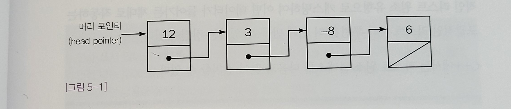
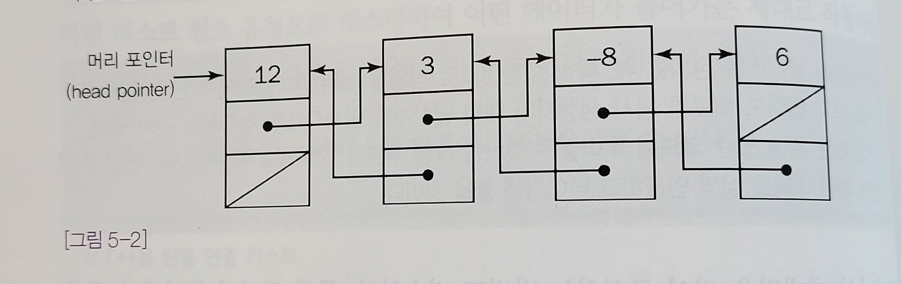

# 연결리스트
- 연결 리스트는 각 노드가 데이터와 포인터를 가지고 한 줄로 연결되어 있는 방식으로 데이터를 저장하는 자료 구조이다.

# 연결리스트 종류
- 단일 연결 리스트
- 원형 연결 리스트 
- 이중 연결 리스트 


## 단일 연결 리스트

그림[5-1]에 나와 있는 것 처럼 리스트에 들어가는 각 데이터 원소에는 리스트의 다음 원소에 대한 연결고리(포인터 또는 레퍼런스)가 들어있다.

단일 연결 리스트의 첫 번째 원소는 리스트의 머리(head)라고 부른다.
단일 연결리스트의 마지막 원소는 꼬리(tail)라고 부르며 연결고리는 비어있거나 NULL연결고리로 이어져 있다.

단일 연결 리스트에 있는 연결고리는 다음 노드를 가리키는 포인터나 레퍼런스로만
구성되기 때문에 앞으로만 종주할 수 있다.
따라서 리스트를 완전 종주하려면 항상 첫 번째 원소부터 시작해야한다.

즉, 리스트에 있는 모든 원소의 위치를 파악하기 위해서는 리스트의 첫 번째 원소에 대한 포인터나 레퍼런스가 있어야만 한다.

## C에서 단일 연결 리스트의 원소를 만드는 방법
같은 유형의 구조체에 대한 포인터 하나만 들어가 있는 구조체를 만드는 것.

``` C
typedef struct IntElement{
    struct IntElement *next;
    int data;
}IntElement;
```

## 자바에서 제네릭을 사용하여 구현하는 방법
```java
public class ListElement<T>{
    public ListElement(T value){data = value;}

    public  ListElement<T> next(){return next;}
    public T value(){return data;}
    public void setNext(ListElement<T> elem){next = elem;}
    public void setValue(T value){ data = value; }
    
    private ListElement<T> next;
    private T data;
}

```
## 이중 연결 리스트


그림[5-2]에 나와있는 이중 연결 리스트는 단일 연결 리스트의 여러가지 단점을 극복하기 위해 만들어진 것이다.<br/><br/>
이중 연결 리스트는 각 원소마다 리스트에서 그다음에 오는 원소에 대한 연결고리 외에 그 앞에 있는 원소에 대한 연결고리도 들어있다는 점에서
단일 연결 리스트와 다르다.

이렇게 연결 고리를 추가하면 리스트를 어느 방향으로든 종주할 수 있다.

이중 연결 리스트에도 단일 연결 리스트와 마찬가지로 머리와 꼬리 원소가 있다.<br/>
리스트의 머리의 이전 원소에 대한 연결고리는 꼬리의 다음 원소에 대한 연결고리와 마찬가지로 비워두거나 널로 지정한다.


면접에서 많이 나오지는 않음
## 원형 연결 리스트

연결리스트의 마지막 유형인 원형 연결 리스트는 단일 연결 리스트로 된 것도 있고,
이중 연결 리스트로 된 것도 있다.
<br/>
원형 연결 리스트에는 끝, 즉 머리나 꼬리가 없다.<br/><br/>
원형 연결 리스트의 모든 원소에서 다음 원소를 가리키는 포인터나 레퍼런스에는 반드시 null이 아닌 원소가 들어가야 한다.
원소가 하나밖에 없는 리스트라면 그냥 자기 자신을 가리키면 된다.


# 기초적인 연결 리스트 연산
- 머리원소 추적
- 리스트 종주
- 리스트 원소 추가 및 제거


## 단일 연결 리스트로 구현 할 때 빠질 수 있는 함정
### 머리원소 추적

단일 연결 리스트에서는 반드시 머리 원소를 추적해야한다.<br/>
그러지 않으면 언어에 따라 가비지 컬렉터에 의해 제거되거나 어딘가에서 길을 잃고 말게 된다. <br/>
따라서 새로운 원소 앞에 추가한다거나 리스트의 첫 번째 원소를 제거할 때 리스트의 머리에 대한 포인터 또는 레퍼런스를 갱신해야한다.<br/>


함수나 메서드 내에서 리스트를 변형시킬 때는 머리 원소를 제대로 추적할 수 있도록 주의해야한다.
함수나 메서드를 호출한 쪽에 바뀐 새로운 머리 원소를 알려줘야 하기 때문이다.

```
//java code
public ListElement<Integer> isertInFront(ListElement<Integer> list, int data){
    ListElement<Integer> l = new ListElement<Integer>(data);
    l.setNext(list);
    return l;
        }

```

메서드를 호출한 쪽에서는 머리 원소에 대한 레퍼런스를 적당히 갱신해줘야한다.

```
//java code
int data  = ....; //삽입할 데이터
ListElement<Integer> head = ...; //머리에 대한 레퍼런스

head = insertInFront(head, data);
```


#### 리스트의 맨 앞에 새로운 원소를 추가하는 다음과 같은 C코드

```
bool insertInFront(IntElement **head, int data){ 
    IntElement *newElem = malloc(sizeof(IntElement));
    if(!newElem) return false;
    
    newElem -> data = data;
    newElem -> next = *head;
    *head = newElem;
    return true;
}
```
위의 함수에서는 리턴 값으로 메모리 할당 성패 여부를 돌려주기 때문에 자바에서처럼 새로운 헤드 포인터를 돌려줄 수가 없다.
C++에서는 머리 포인터를 레퍼런스로 전달할 수도 있고, 새로운 머리 포인터를 리턴할 수 있다.


### 리스트 종주

머리 원소가 아닌 다른 리스트 원소를 가지고 작업을 해야하는 경우도 있다.
연결 리스트의 첫 번째 원소가 아닌 원소에 대한 연산을 하려면 리스트에 있는 원소 중 일부를 종주해야할 수도 있으며,
이때 항상 리스트가 끝나지 않았는지 확인을 해야한다.

```
public ListElement<Integer> find(ListElement<Integer>head, int data){
    ListElement<Integer> elem = head;
    while(elem ! null ** elem.value() != data){
    elem = elem.next();
    } 
    return elem;
}
```

리스트를 종주할 때는 반드시 연결 리스트가 끝났는지 확인해야한다.

### 원소의 삽입 및 삭제
```
bool deleteElement(IntElement **head, IntElement *deleteMe){
    IntElement *elem;
    
    if(!head || !*head || !deleteMe) //널포인터 확인
    return false;
    
    elem = *head;
    
    if(deleteMe == *head){ //머리 처리용 특별 케이스
        *head = elem -> next;
        free(deleteMe);
        return true;
        }
        
    while(elem){
        if(elem -> next == deleteMe){
        elem -> next = deleteMe -> next;
        free(deleteMe);
        return true;
            }
        elem  = elem -> next;
        }
        
       //deleteMe를 못찾았을 때
        return false;
    }    
    

```


C나 C++ 처럼 가비지 컬렉션이 없는 언어에서 삭제할 때는 한 가지 더 신경 써야할 문제가 있다.
연결 리스트에 있는 모든 원소를 지우는 경우를 생각해보자.

<br/>

#### 포인터 한 개 가지고 리스트를 종주하면서 원소들을 하나 씩 제거하는 방법?

- 다음 포인터로 넘어가는 작업과 원소를 제거하는 작업 중 어느 것을 먼저 해야할까?
  - 포인터로 넘어가는 일을 먼저 하면 , 제거해야할 원소의 포인터를 덮어쓴 상황이기 때문에 메모리 할당을 해재할 수 없다.
  - 제거를 먼저하면, 방금 제거한 원소에 있는 next 포인터가 있어야 다음 뭔소로 넘어갈 수 있기 때문에 다음 원소로 넘어가는 것이 불가능하다.


#### 포인터 두개 사용하기
```
void dleteList(IntElement **head){
    IntElement *deleteMe = *head;
    
    while(deleteMe){
        IntElement *next = deleteMe -> next;
        free(deleteMe);
        deleteMe = next;
     }
     
     *head = NULL;
     }
```

원소를 삭제할 때는 반드시 적어도 두개의 포인터 변수가 필요하다.
삽입할 때도 포인터 변수가 두 개 있어야 하는 것은 마찬가지지만,
둘 중 하나는 리스트에 있는 원소를 위해 쓰이고 다른 하나는 메모리 할당에 의해 반환되는 포인터 용으로 쓰이기 때문에
삽입 연산에서 포인터를 한 개만 쓰는 실수를 범하는 일은 거의 없다.
### 🍰 예상 질문 <br/>
- Array와 Linked list를 비교해서 설명해주세요.<br/>
- 미리 예상한 것보다 더 많은 수의 data를 저장하느라 Array의 size를 넘어서게 됐다. 어떻게 해결할 수 있을까?<br/>
- Array와 Linked List의 Memory Allocation은 언제 일어나며, 메모리의 어느 역역을 할당받나요?

- 연결리스트의 종류와 관련해서 설명해 주세요.
- 연결 리스트를 활용해서 C로 스택을 구현하고 그 자료구조를 사용한 이유를 설명해 주세요.


Ref)<br/>
&nbsp; &nbsp;&nbsp;&nbsp;&nbsp;&nbsp;프로그래밍 면접 이렇게 준비한다.<br/>
&nbsp;&nbsp;&nbsp;&nbsp;&nbsp;&nbsp; https://www.yes24.com/Product/Goods/75187284


