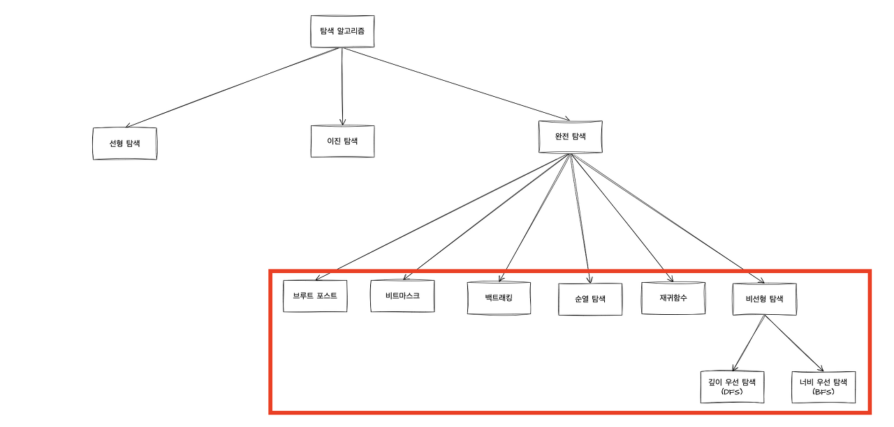

# 완전탐색

## 완전탐색의 개념

- 모든 경우의 수를 다 시도하여 정답을 찾는 알고리즘
- 컴퓨터의 빠른 계산 능력을 이용하여 가능한 경우의 수를 일일이 나열하면서 답을 찾는 방식
- '무식하게 풀기'라는 의미의 브루트 포스(Brute Force)라고 부르기도 함
- 상대적으로 구현이 간단하고 해가 존재하면 항상 찾을 수 있음
- 경우의 수에 따라 실행 시간이 비례하기 때문에 입력 값의 범위가 작은 경우 유용

<br/>

## 완전탐색의 종류

<br/>

 <br/>
*<span style="font-size:50%">이미지 출처 : https://adjh54.tistory.com/197</span>*

<br/>

### 1. 브루트 포스

- 모든 경우의 수를 탐색
- 경우의 수가 많아질수록 시간 오래 걸림
- for이나 while 등 반복문과 if 조건문 등을 활용

```java
    // 브루트 포스 사용 예인 최댓값 찾기
    public static int bruteForce(int[] arr) {
        int max = arr[0]; 

        for (int i = 1; i < arr.length; i++) {
            if (arr[i] > max) {
                max = arr[i]; 
            }
        }

        return max; 
    }
```

<br/>

### 2. 비트마스크

- 모든 경우의 수를 이진수로 표현하고 비트 연산을 통해 원하는 결과를 얻음
- 경우의 수가 많을수록 필요 메모리가 늘어남
- 모든 경우의 수가 각 원소에 포함되는 경우와 포함되지 않는 경우 두 가지 선택으로 구성되는 경우 유용
- 배열 활용만으로 해결할 수 없는 문제를 해결할 수 있음

```java
	public static void main(String[] args) {
		int a = 10; // 1010
		int b = 12; // 1100

		int result1 = a & b; // 1000
		int result2 = a | b; // 1110
		int result3 = a ^ b; // 0110
		int result4 = a << 1; // 10100
		int result5 = a >> 1; // 0101
		
		System.out.println(result1);
		System.out.println(result2);
		System.out.println(result3);
		System.out.println(result4);
		System.out.println(result5);

	}
```

<br/>

### 3. 백트래킹

- 결과를 얻기 위해 진행하는 도중에 막히게 되면 그 지점으로 다시 돌아가서 다른 경로 탐색
- 재귀 함수를 사용하여 스택 오버플로우가 발생할 수 있음

```java

// 1부터 N까지 자연수 중에서 중복 없이 M개를 고른 수열을 모두 구하는 문제
// N가지가 있으면 N가지를 다 할 수 있는데 M개를 어떤 순서로 할건지 고른다고 생각

public class BackTracking {

	static int n, m;
	static boolean boolArr[]; 
	static int arr[];
	static StringBuilder str = new StringBuilder();
	
	public static void main(String[] args) throws IOException {
		BufferedReader br = new BufferedReader(new InputStreamReader(System.in));
		StringTokenizer st = new StringTokenizer(br.readLine());
		
		n = Integer.parseInt(st.nextToken());
		m = Integer.parseInt(st.nextToken());
		
		boolArr = new boolean[n+1];
		arr = new int[n+1];
		
		go(0);
		
		System.out.println(str);
	}
	
	public static void go(int idx) {
		
		//인덱스가 마지막 위치에 도달하면 수열 출력
		if(idx == m) { 
			for(int i = 0; i < m; i++) {
				str.append(arr[i]).append(" ");
			}
			str.append('\n');
			return;
		}
		
		// 1부터 ~ N개의 수를 선택
		for(int i=1; i<=n; i++) {
			if(boolArr[i]) {
				continue; //이미 선택한적이 있으면 다음으로
			}
			boolArr[i] = true;  // 수 i를 사용
			arr[idx] = i; //해당 위치에 i를 넣는다.
			go(idx+1); //위치를 1증가 시키고 재귀
			boolArr[i] = false; // index 뒤에 일어날 모든 경우를 했기때문에 수 i를 사용하지 않았다고 바꾼다.
		}
	}

}
```

<br/>

### 4. 순열

- 서로 다른 n개 중에서 r개를 선택하여 나열하는 방법인 순열을 이용하여 탐색
- nPr
- 중복 허용 안함
- 순서가 상관있기 때문에 [1, 2, 3]과 [3, 2, 1]은 다른 경우
- 경우의 수가 많을 경우 시간 오래 걸림

```java
public class Permutation {

    public void swap(int[] arr, int i, int j) {
        int temp = arr[i];
        arr[i] = arr[j];
        arr[j] = temp;
    }
    
	public void permute(int[] arr, int k) {
		
        for (int i = k; i < arr.length; i++) {
            swap(arr, i, k);
            permute(arr, k + 1);
            swap(arr, k, i);
        }
        
        if (k == arr.length - 1) {
            System.out.println(Arrays.toString(arr));
        }
    }

    public static void main(String[] args) {
    	int[] arr = {1, 2, 3};

        Permutation permutation = new Permutation(); 
        
        permutation.permute(arr, 0);
    }

}

```

<br/>

### 5. 재귀함수

- 자기 자신을 호출하여 모든 가능한 경우의 수를 체크하며 최적의 해답을 얻음
- 코드가 간결
- 스택 오버 플로우가 발생할 가능성이 있음
- 재귀 탈출 조건이 반드시 있어야 함

```java
public class Recursive {

    public int factorial(int n) {
        if (n <= 1) {
            return 1;
        } else {
            return n * factorial(n - 1);
        }
    }
    
    public static void main(String[] args) {
        Recursive recursive = new Recursive();
        System.out.println(recursive.factorial(6));
    }
}

```

<br/>

### 6. 비선형 구조 탐색능

- 그래프에서 완전탐색을 할 때 대표적으로 사용하는 방법

<br/>

### 6.1 깊이 우선 탐색

- 루트 노드에서 시작하여 다음 분기로 넘어가기 전에 해당 분기를 완벽하게 탐색
- 주로 두 노드 사이의 최단 경로를 찾고 싶을 때 사용
- 최악의 경우 모든 노드를 방문해야 하기 때문에 시간이 오래 걸림

<br/>

### 6.2 너비 우선 탐색

- 루트 노드에서 시작하여 인접한 노드를 먼저 탐색
- 주로 모든 노드를 방문하고 싶을 때 사용 
- 최악의 경우 모든 노드를 방문해야 하기 때문에 시간이 오래 걸림

<br/>


