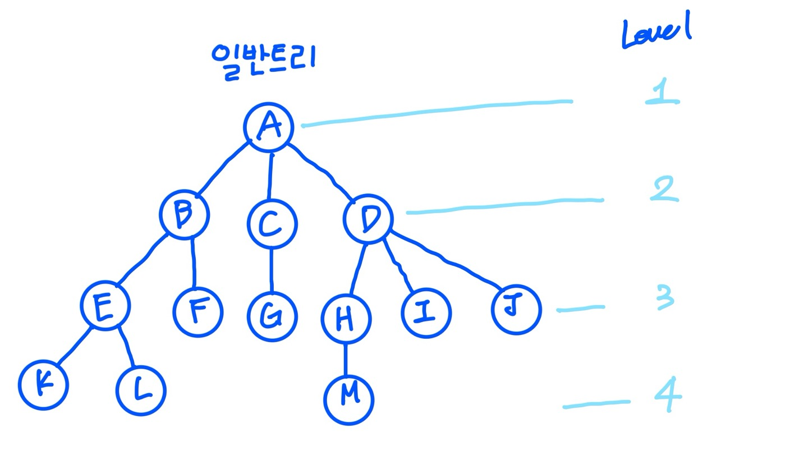

# 트리

한 노드 다음에 다음 노드 하나가 이어지는 선형구조와는 달리 한 항목 다음에 여러 개의 다음 노드가 오면서 계층적인 구조를 갖는다. 

하나 이상의 유한한 개수의 노드로 구성되며 반드시 근(Root) 노드부터 시작하여 노드와 노드의 관계는 가지(Branch)에 의해 표현된다. 

어떠한 두 노드 사이에도 사이클 존재하지 않는 연결그래프이다. 

---

## 트리 용어



- 근(Root) : A
- 단말노드(Leaf Node) : K, L, F, G, M, I, J
- 비단말노드 : A, B, C, D, E, H
- A의 차수 : 3, B의 차수 : 2, H의 차수 : 1
- 트리의 차수 : 3
- 높이, 깊이 : 4
- A는 B의 부모노드, B는 A의 자식노드
- B, C, D는 형제 노드
- 조상노드 : 루트 노드에서 임의의 노드까지의 경로를 이루고 있는 노드
- 후손노드 : 임의의 노드 하위에 연결된 모든 노드, 즉 어떤 노드의 서브 트리에 속하는 모든 노드들은 후손 노드이다.
- 단말노드 : 자식 노드가 없는 노드 ↔ 비단말노드
- 노드의 차수 : 어떤 노드가 가지고 있는 자식 노드의 개수(단말노드는 차수가 0)
- 트리의 높이 : 트리가 가지고 있는 최대 레벨

---

## 이진트리

1) 정의

- 모든 노드가 2개의 서브 트리를 가지고 있는 트리
- 서브 트리는 공집합일 수 있다. 따라서 이진트리의 노드에는 최대 2개까지의 자식 노드가 존재할 수 있고, 모든 노드의 차수가 2이하가 된다. (공집합도 이진 트리이다)
- 이진 트리에는 서브 트리간의 순서가 존재한다.

2) 성질

- n개의 노드를 가진 이진트리는 n - 1개의 간선을 갖는다.
- 높이가 h인 이진트리의 경우, 최소 h개의 노드를 가지며 최대 2^h - 1개의 노드를 가진다.
- 하나의 노드는 최대 2개의 자식을 가질 수 있으므로 레벨 i에서의 노드의 최대개수는 2^i-1이 된다. 따라서 전체 노드의 개수는 2^h -1이 된다.
- n개의 노드를 가지는 이진트리의 높이는 최대 n이 거나 최소 log(n + 1)이 된다.

3) 분류

- 포화이진트리
    - 트리의 각 레벨에 노드가 꽉 차있는 이진 트리
    - 높이 k인 포화 이진트리는 정확하기 2^k -1개의 노드를 가진다.
    - 포화이진트리에는 각 노드에 번호를 붙일 수 있다. 노드에 번호를 부여하는 방법은 레벨 단위로 왼쪽에서 오른쪽으로 번호를 붙이면 된다. 이 번호는 늘 일정하다.
- 완전이진트리
    - 높이가 k일때, 레벨 1부터 k - 1까지는 노드가 모두 채워져 있고 마지막 레벨 k에서는 왼쪽부터 오른쪽으로 노드가 순서대로 채워져 있는 이진트리
    - 포화 이진트리는 항상 완전 이진트리이지만 그 역은 항상 성립하지 않느다.

4) 표현법

- 배열을 이용한 방법
    - 인덱스 0은 사용하지 않음
    - 부모와 자식 인덱스 사이의 관계
        - 노드 i의 부모 노드 인덱스 = i / 2
        - 노드 i의왼쪽 자식 노드 인덱스 = 2 * i
        - 노드 i의 오른쪽 자식 노드 인덱스 = 2 * i + 1
- 링크 표현법
    - 포인터를 이용하여 노드와 노드를 연결
    - 하나의 노드가 3개의필드를 가진다. 데이터를 저장하는 필드와 왼쪽 자식 노드와 오른쪽 자식 노드를 가리키는 2개의 포인터 필드를 가진다. 이 2개의 포인터를 이용하여 부모노드와 자식 노드를 연결한다.
    - 루트 노드를 가리키는 포인터만 이으면 트리안의 모든 노드들에 접근 가능하다. 연결리스트와 유사하다. 연결 리스트는 1차원적인 연결된 구조라면 링크법으로 표현된 이진 트리는 2차원적으로 연결된 구조라 할 수 있다.
    - 노드들은 모두 동적 메모리 할당을 이용하여 생성되었다.

5) 이진트리의 순회

1) 전위순회(VLR)

루트 → 왼쪽 서브 트리 → 오른쪽 서브 트리

2) 중위순회(LVR)

왼쪽 서브 트리 → 루트 → 오른쪽 서브 트리

3) 후위순회(LRV)

왼쪽 서브 트리 → 오른쪽 서브 트리 → 루트

4) 레벨순회

각 노드를 레벨 순으로 순회

동일한 레벨인 경우 왼쪽에서 오른쪽으로 방문

*전위, 중위, 후위 순회는 스택을 사용한 순회법이고, 레벨 순회는 큐를 사용한 순회법이다.* 

---

## 이진트리 코드

```java
*Node.java*
****
public class Node {
	int value;
	Node left;
	Node right;

	public Node(int value) {
		this.value = value;
		this.left = null;
		this.right = null;
	}
}
```

```java
*BinararyTree.java*

public class BinaryTree {
	Node root;

	public void add(int value) {
		root = addRecursive(root, value);
	}

	public boolean fing(int value) {
		return findRecursive(root, value);
	}

	private Node addRecursive(Node current, int value) {
		if (current == null) {
			return new Node(value);
		}
		if (value < current.value) {
			current.left = addRecursive(current.left, value);
		} else if (value > current.value) {
			current.right = addRecursive(current.right, value);
		} else {
			return current;
		}
		return current;
	}
	private boolean findRecursive(Node current, int value) {
		if (current == null) {
			return false;
		}
		if (value == current.value) {
			return true;
		}
		return value < current.value
						? findRecursive(current.left, value);
						: findRecursive(current.right, value);
	}
}
```

```java
*중위순회의 dfs*

public List<Integer> dfsInOrder() {
	Stack<Node> stack = new Stack<>();
	List<Integer> result = new ArrayList<>();
	Node current = root;
	stack.push(root);
	while (!stack.isEmpty()) {
		while (current.left != null) {
			current = current.left;
			stack.push(current);
		}
		current = stack.pop();
		result.add(current.value);
		if (current.right != null) {
			current = current.right;
			stack.ush(current);
		}
	}
return result;
}
```

```java
*bfs로 노드를 순회하*

public List<Integer> bfs() {
	List<Integer> result = new ArrayList<>();

	if (root == null) {
		return result;
	}

	Queue<Node> nodes = new LinkedList<>();
	nodes.add(root);

	while (!nodes.isEmpty()) {
		Node node = nodes.remove();
		result.add(node.value);
		if (node.left != null) {
			nodes.add(node.left);
		}
		if (node.right != null) {
			nodes.add(node.right);
		}
	}
	return result;

}
```