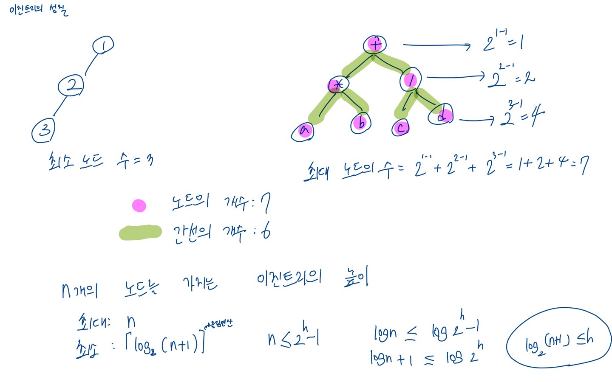
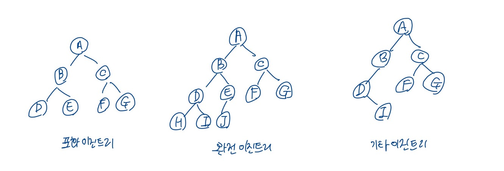
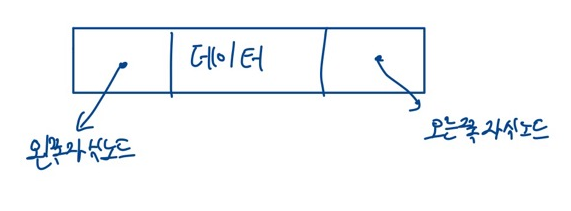
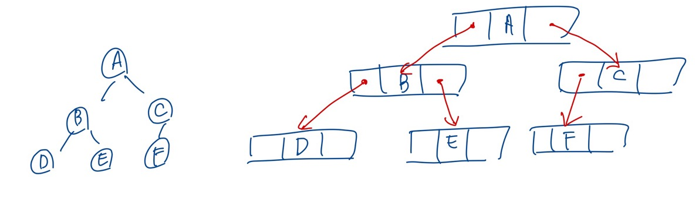
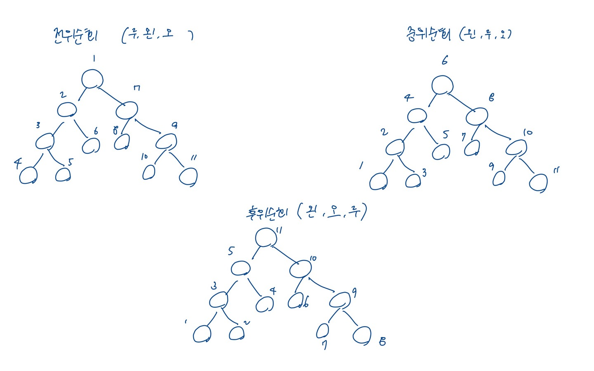
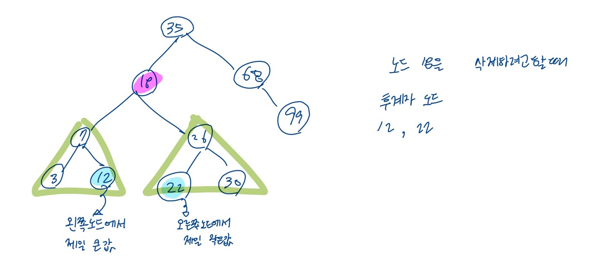

# 트리의 개념
 선형 자료구조 : 리스트, 스택, 큐
 
계층적인 구조 
 ex) 가족의 가계도, 회사의 조직도, 컴퓨터의 디렉토리 구조

트리는 계층적인 자료를 표현하는데 적합한 자료구조이다.

## 트리의 용어들

- 루트 : 계층적인 구조에서 가장 높은 곳에 있는 노드

- 서브트리 : 루트 노드를 제외한 나머지 노드들도 각각 하나의 Tree

- 간선(edge) : 루투노드와 서브트리들을 잇는 선

- 노드들 간의 관계 
  - 부모 관계
  - 형제 관계
  - 조상과 자손 관계

- 단말노드(leaf node) : 자식 노드가 없는 노드

- 비단말노드(nonterminal node) : 자식 노드가 있는 노드

- 차수(degree) : 어떤 노드가 가지고 있는 자식 노드의 개수

- 레벨 (level) : 트리의 각층에 번호를 매기는 것
  - 루트의 레벨 : 1  -> 한 층씩 내려갈 수록 1씩 증가
  

- 높이 : 트리가 가지고 있는 최대 레벨

## 트리의 종류

### 일반 트리

위의 그림과 같이 각 노드가 데이터를 저장하는 데이터 필드와 자식노드를 가리키는 링크 필드를 가지게 하는 방법
n은 자식 노드의 개수 , 즉 노드의 차수

#### 일반 트리의 문제점
노드의 크기가 고정되지 않는다는 점
 -> 프로그램을 복잡하게 만듦

그래서 이진트리를 사용.

### 이진트리

위의 그림처럼 이진 트리는 자식 노드의 개수가 2개이다.

## 이진트리
모든 노드가 2개의 서브 트리를 가지고 있는 트리

이진트리는 순환적으로 정의되어있음

### 이진트리의 성질

### 이진 트리의 분류
- 포화 이진 트리
  - 각 레벨에 노드가 꽉 차있는 이진트리
- 완전 이진 트리
  - 높이가 k일 때 레벨1 부터 k-1까지는 모두 노드가 채워져 있고, 마지막 레벨에서는 노드가 꽉차 있지 않아도 되지만, 중간에 빈 곳이 있어서는 안된다.
- 기타 이진 트리

## 이진 트리의 표현 방법 2가지

### 배열을 이용하는 방법

이진 트리의 깊이가 k이면 최대 2^k-1개의 공간을 연속적으로 할당한 다음
완전 이진트리의 번호대로 노드를 저장한다.

인덱스 0은 사용되지 않는다.

#### 배열 표현법에서의 부모와 자식의 인덱스 관계
- 노드 i 의 부모 노드 인덱스 = i/2
- 노드 i의 왼쪽 자식 노드 인덱스 = 2i
- 노드 i의 오른쪽 자식 노드 인덱스 - 2i + 1

#### 문제점
완전 이진트리가 아닌 일반적인 이진 트리(경사 이진트리)인 경우에는 배열 표현법을 사용하면 저장할 수는 있지만 기억공간의 낭비가 심해진다.

### 포인터를 이용하는 방법 -> 링크 표현법

노드가 구조체로 표현되고, 각 노드가 포인터를 가지고 있어서 이 포인터를 이용하여 노드와 노드를 연결하는 방법

데이터를 저장하는 필드 + 왼쪽 자식 노드, 오른쪽 자식 노드를 가리키는 2개의 포인터 필드

위의 그림은 이진트리를 링크 표현법으로 그린 것이다.

## 이진트리의 순회
- 전위 순회 (루트 -> 왼쪽 -> 오른쪽)
- 중위 순회 (왼쪽 -> 루트 -> 오른쪽)
- 후의 순회 (왼쪽 -> 오른쪽 -> 루트)

## 이진 탐색 트리

이진트리 기반의 탐색을 위한 자료구조

### 정의
- 모든 원소의 키는 유일한 키를 가진다.
- 왼쪽 서브 트리 키들은 루트 키보다 작다.
- 오른쪽 서브 트리의 키들은 루트의 키보다 크다.
- 왼쪽과 오른쪽 서브 트리도 이진 탐색 트리이다.

### 이진 탐색 트리에서 삽입 연산

먼저 탐색 수행

이진 탐색 트리에서는 같은 키 값을 갖는 노드가 없어야 하기 때문이고,
탐색에 실패한 위치에 새로운 노드를 삽입

### 이진 탐색 트리에서 삭제 연산

- 삭제하려는 노드가 단말 노드일 경우
- 삭제하려는 노드가 하나의 왼쪽이나 오른쪽 서브 트리 중 하나만 가지고 있는 경우
- 삭제하려는 노드가 두개의 서브 트리를 모두 가지고 있는 경우

세번째가 제일 까다롭다.

#### 서브트리에 있는 어떤 노드를 삭제 위치로 가져올 것인가?

노드 18을 삭제하려고 했을 경우의 후계자 대상 노드는 12 와 22가 된다.

## 이진 탐색 트리의 시간 복잡도

n개의 노드를 가지는 이진 탐색 트리의 경우 탐색, 삽입, 삭제 연산의 시간 복잡도

평균: O(logn)

최악(경사이진탐색트리) : O(n)

### 최악의 경우 방지

최악의 경우를 방지하기 위해서 트리의 높이를 log n 으로 한정시키는 균형 기법이 필요

트리를 균형지게 만드는 기법으로 AVL트리, Red-Black 트리가 개발 되었음.

### 🍰 예상 질문  

- 트리 자료구조에 대해 설명해주세요.
- 트리의 순회 방식에는 어떤게 있나요?
- 이진트리는 어떤 자료구조인가요?
- BST(이진탐색트리)는 어떤 자료구조인가요?
- BST의 시간 복잡도는 어떻게 되나요?
- BST의 worst case 해결 방법은 무엇인가요?