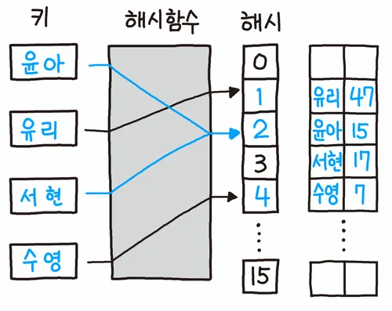
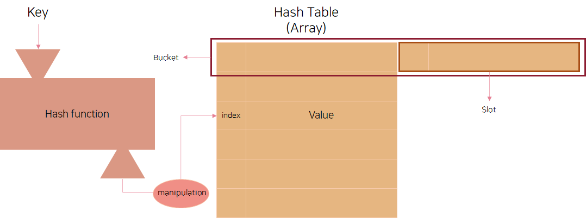

# 해시

## 해시의 개념

- 해시 (Hash) : 입력 데이터를 고정된 길이의 데이터로 변환된 값 
- 사용 예 : 암호, 블록체인, 메시지 인증 코드 등

<br/>

## 해시의 특징

- 해시 값(hash value), 해시 코드, 체크섬이라고도 불린다.
- 키(key)에 데이터(value)를 매핑할 수 있는 데이터 구조이다.
- 검색과 저장이 빠르게 진행된다.
- 같은 입력값에 대해서 출력 값을 보장한다.
- 일방향성을 갖기 때문에 해시값으로부터 key를 역산할 수 없다.

<br/>

## 해시 함수 (hash function)

<br/>

 <br/>
*<span style="font-size:60%">이미지 출처 : https://namu.wiki/w/%ED%95%B4%EC%8B%9C</span>*

<br/>

- 입력받은 데이터를 해시 값으로 출력시키는 알고리즘
- 임의의 길이를 갖는 데이터를 고정된 길이의 데이터로 변환
- 블록체인에서는 해시 함수가 하는 역할은 ‘암호화'로, 해시값 비교를 통해서 위변조 여부를 판별하고, 무결성을 검증하는 데 사용
- 비트코인의 블록체인에 사용된 해시 함수는 SHA-256(Secure Hash Algorithm-256)

<br/>

## 해시 테이블 (hash table)

<br/>

 <br/>
*<span style="font-size:60%">이미지 출처 : https://velog.io/@fore0919/TIL-%EC%9E%90%EB%A3%8C%EA%B5%AC%EC%A1%B0-%ED%95%B4%EC%89%AC%ED%85%8C%EC%9D%B4%EB%B8%94Hash-Table</span>*

<br/>

- 키 값의 연산에 의해 직접 접근이 가능한 데이터 구조
- 키와 값을 함께 저장
- 행과 열로 구성된 표에 저장되는 것과 유사
- 테이블에 데이터를 저장할 때 위치는 무작위로 지정되어 작성
- 버킷 (bucket) : 
	- 하나의 주소를 갖는 파일의 한 구역
	- 버킷의 크기는 같은 주소에 포함될 수 있는 레코드의 수
- 슬롯 (slot) : 
	- 한 개의 레코드를 저장할 수 있는 공간
	- 한 버킷 안에 여러 개의 슬롯이 있음

<br/>

## 해싱 (Hashing)

- 해시 함수에서 해시를 출력하고 해시 테이블에 저장하는 과정

<br/>

## 시간 복잡도

- 평균: O(1)
- 최악 (충돌 일어날 경우): O(n)

<br/>

## 코드

```java
public class Hash {

    public Slot[] hashTable; 

    public Hash(int size) {
        this.hashTable = new Slot[size];
    }

    public class Slot {
        String value;

        Slot(String value) {
            this.value = value;
        }
    }

    public int hashFunction(String key) {
        return (int)(key.charAt(0)) % this.hashTable.length;
    }
	
   public boolean saveData(String key, String value) {
	   int address;
	   
	   address = this.hashFunction(key);

		if(this.hashTable[address] != null) { 
        	this.hashTable[address].value = value;
        } else {
        	this.hashTable[address] = new Slot(value);
        }
        
        return true;
    }

    public String getData(String key) {

        int address = this.hashFunction(key);

        if(this.hashTable[address] != null) {
            return this.hashTable[address].value;
        } else {
            return null;
        }
    }
	
    public static void main(String[] args) {

        Hash hashTable = new Hash(10);

        hashTable.saveData("A", "123123");
        hashTable.saveData("B", "456456");
        hashTable.saveData("C", "789789");

        // 있는 경우
        System.out.println("A : " + hashTable.getData("A"));	// 123123
        System.out.println("B : " + hashTable.getData("B"));	// 456465
        System.out.println("C : " + hashTable.getData("C"));	// 789789

        // 없는 경우
        System.out.println("D: " + hashTable.getData("D"));		// null
    }

}

```

<br/>

## 종류

### MD5 (message idgest5)

- 임의의 길이로 입력받은 메세지를 512비트 단위로 처리해 128비트로 암호화하고 무결성 검증
- 입력 메시지 길이는 제한 없으나 해시값 길이는 128비트로 정해짐
- 전자서명 등 정보보호 또는 MySQL, 데이터베이스 패스워드 알고리즘 등에 이용됨
- 복호화가 쉽다는 문제점이 발견되어서 현재는 권장하지 않음

<br/>

### SHA (Secure Hash Algorithm)

- 1993년 미국 NIST에 의해 개발되었고 가장 많이 사용하는 방식
- MD4에 기반을 둠
- MD5의 취약성에 대처하기 위해 설계됨

<br/>

### RIPEMD (RIPE Message Digest)

- MD4에 기반을 둠
- RIPME-160 버전이 안정성 때문에 가장 많이 사용
- 비교적 높은 안전함이 있기 때문에 비트코인 및 기타 암호화폐에서 많이 사용


<br/>

## 충돌

**서로 다른 입력에 대해 동일한 해시값 출력**

- 좋은 해시함수는 충돌을 최소화해야 함
- 무한한 가짓수의 입력을 받아 유한한 가짓수의 출력을 생성하는 경우 충돌은 항상 존재
- 충돌을 방지하는 방법이 있으나 충돌을 완전히 방지하기는 어려움

<br/>

### 1. 분리 연결법 (Separate Chaining)

- 동일한 버킷의 데이터에 대해 자료구조를 활용해 추가 메모리를 사용하여 다음 데이터의 주소를 저장
- 한 버킷 당 들어갈 수 있는 엔트리의 수에 제한을 두지 않음

<br/>

### 2. 개방 주소법 (Open Adressing)

- 한 버킷 당 들어갈 수 있는 엔트리는 하나지만 해시 함수로 얻은 주소가 아닌 다른 주소에 데이터를 저장할 수 있도록 허용
- 선형 탐사법과 제곱 탐사법이 있음

<br/>

#### 2.1 선형 탐사법 (Linear Probing)

- 선형으로 순차적으로 검색
- 해시 함수로 나온 해시 index에 이미 다른 값이 저장되어 있다면 해당 해시값에서 고정 폭을 옮겨 다음 해시값에 해당하는 버킷에 액세스
- 특정 해시 값의 주변이 모두 채워져 있는 일차 군집화 문제에 취약
- 방법이 간단하고 캐쉬의 효율이 높음
- 해시 충돌이 해시 값 전체에 균등하게 발생할 때 유용한 방법

<br/>

#### 2.2 제곱 탐사법 (Quadratic Probing)

- 선형 탐사법과 비슷
- 고정폭이 아닌 제곱으로 늘어남
- 데이터의 밀집도가 선형 탐사법보다 낮기 때문에 다른 해시값까지 영향을 받아서 연쇄적으로 충돌이 발생할 가능성이 적음
- 많은 연산이 필요
- 선형 탐사법보다는 캐시의 성능이 떨어져서 속도의 문제가 발생

<br/>

#### 2.3 이중 해싱 (Double Hashing)

- 탐사할 해시값의 규칙값을 없애서 클러스터링을 방지
- 해시 함수를 이중으로 사용하여 하나는 최초의 해시값을 얻을 때, 다른 하나는 해시 충돌이 일어났을 때 탐사 이동폭을 얻기 위해 사용
- 최초 해시값이 같더라도 탐사 이동폭이 달라지고 탐사 이동폭이 같더라도 최초 해시값이 달라져 위의 두 방법 모두 완화 가능

<br/>

### 3. 체이닝 (Chaining)

- 동일한 버킷에 노드를 추가하여 여러 개의 데이터를 저장할 수 있게 함
- 충돌 시 linked list로 데이터들을 연결
- 삭제 방법 간단
- 버킷이 꽉 차도 계속 늘림
- 데이터의 수가 많아지면 동일한 버킷에 체이닝되는 데이터가 많아져 효율성이 감소