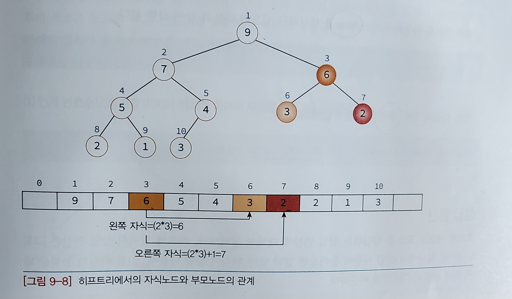
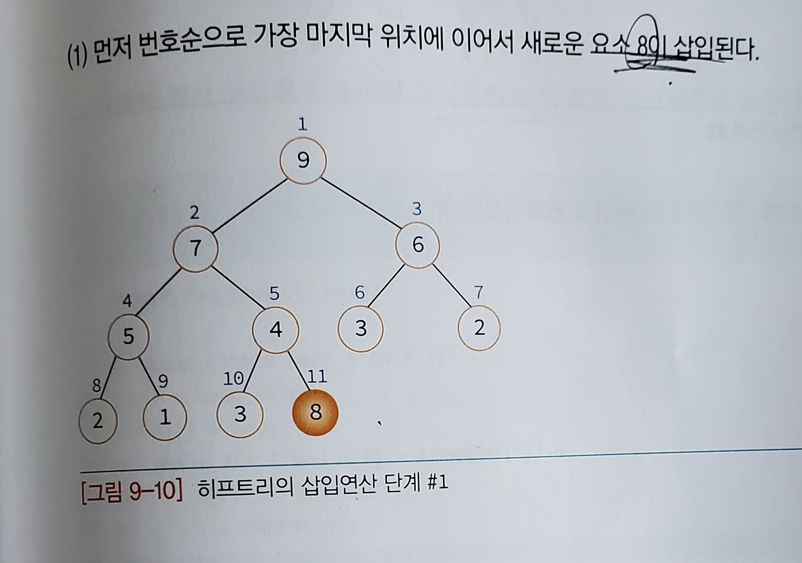
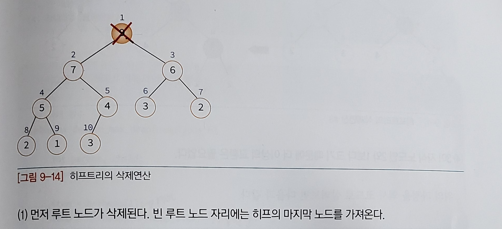

# 우선순위 큐

- 데이터들이 우선 순위를 가지고 있고 우선 순위가 높은 데이터가 먼저 나가도록 하는 자료구조

- 0개 이상의 요소의 모임이며 각 요소들은 우선 순위값을 가짐


- 최소 우선순위 큐 : 가장 우선 순위가 낮은 요소 먼저 삭제

- 최대 우선순위 큐 : 가장 우선 순위가 높은 요소 먼저 삭제


### 스택, 큐 우선순위 비교

- 스택: 가장 최근에 들어온 데이터 먼저 삭제
- 큐 : 가장 먼저 들어온 데이터 먼저 삭제
- 우선순위 큐: 가장 우선순위가 높은 데이터가 먼저 삭제

### 우선 순위 큐의 활동 분야
- 시뮬레이션 시스템(우선순위 : 사건의 시각)
- 네트워크 트레픽 제어
- 운영체제에서의 작업 스케쥴링
- 수치 해석적인 계산 등등

## 우선 순위 큐 구현 방법 3가지
1. 배열
2. 연결리스트
3. 힙


### 배열을 사용하는 방법 
- 정렬이 되어 있지 않은 배열을 사용할 경우
    - 삽입:  O(1) //배열의 맨 끝에 새로운 요소 추가
    - 삭제:  O(n) //가장 우선 순위가 높은 요소를 찾아야함 , 정렬이 안되어 있으므로 끝까지 스캔해야함


- 정렬이 되어 있는 배열을 사용할 경우
  - 삽입: O(n) // 다른 요소와 값을 비교하여 적절한 삽입 연산 결정
  - 삭제: O(1) //숫자가 높은 것이 우선순위가 높다고 가정하면 맨 뒤의 요소 삭제

### 연결 리스트를 사용하는 방법
- 정렬이 되어 있지 않은 연결리스트를 사용할 경우
  - 삽입 시에는  첫번 째 노드로 삽입하는 것이 유리
    - 삽입:  O(1) //포인터만 변경하면 됨
    - 삭제:  O(n) //포인터를 따라 모든 노드를 뒤져보아야 함

<br/>

- 정렬이 되어 있는 연결리스트를 사용할 경우
  - 우선 순위가 높은 요소가 앞에 위치하는 것이 유리
    - 삽입: O(n) // 우선순위값을 기준으로 삽입 위치를 찾아야함
    - 삭제: O(1) // 첫번 쨰 노드 삭제
### 힙을 사용하는 방법

힙은 완전 이진 트리의 일종으로 우선순위 큐를 위하여 특별히 만들어진 자료구조

<hr/>

# 힙

- 여러개의 값들 중에서 가장 큰 값이나 가장 작은 값을 빠르게 찾아내도록 만들어진 자료구조

```
key(부모노드) >= key(자식노드)
```
가 항상 성립하는 트리

- 히프 트리에서는 중복된 값을 허용한다.
- 느슨한 정렬 상태 유지 , 즉 큰 값이 상위 레벨에 있고 작은 값이 하위 레벨에 있다.
- 히프는 완전 이진 트리이다.


## 힙의 종류

- 최대 히프(max heap)
  - 부모 노드의 키값이 자식 노드의 키값보다 크거나 같은 완전 이진트리

```
key(부모노드) >= key(자식노드)
```
- 최소 히프(min heap)
  - 부모 노드의 키값이 자식 노드의 키값보다 작거나 같은 완전 이진 트리

```
key(부모노드) <= key(자식노드)
```


두가지 히프는 부등호만 다르고 나머지는 모두 동일하므로
최대 히프만 다루기로 한다.

## 힙의 구현

힙을 저장하는 표준적인 자료구조는 **배열**이다.

프로그램 구현을 쉽게 하기 위하여 배열의 첫 번째 인덱스인 0은 사용되지 않는다.

배열을 이용하여 힙을 저장하면 완전 이진 트리에서처럼 자식 노드와 부모 노드를 쉽개 알 수 있다.



## 힙에서의 삽입 연산 과정

1. 먼저 번호 순으로 가장 마지막 위치에 이어서 새로운 요소 삽입
2. 부모 노드와 비교하여 새로운 노드가 부모노드보다 크면 교확 아니면 더이상 교환 X





## 힙에서의 삭제 연산 과정

최대 히프에서 삭제 연산은 최대값을 가진 요소를 삭제하는 것

루트 노드 삭제 한다고 가정

1. 루트노드 삭제
2. 빈 루트 노드 자리에는 히프의 마지막 노드를 가져온다.
3. 새로운 루트와 자식 노드를 비교하며 자식노드가 더 크면 교환 아니면 더 이상 교환 X





## 힙의 시간 복잡도

삽입,삭제 : O(log n)


## 힙의 정렬 - 힙 정렬(heap sort)

최대 힙을 이용하면 정렬을 할 수 있다.

시간 복잡도 : O(n logn)


### 🍰 예상 질문 <br/>
- Heap 자료구조에 대해 설명해주세요.
- Heap 연산의 시간복잡도에 대해 설명해주세요.
- 힙을 배열로 구현하는 이유는?