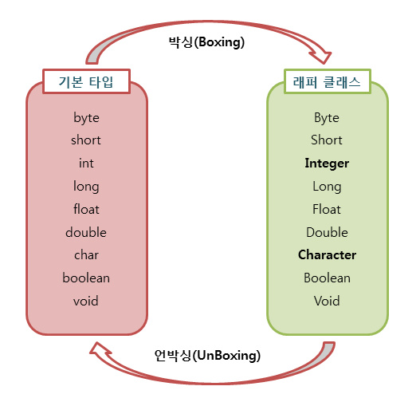

# **Auto Boxing & UnBoxing**

### 래퍼 클래스 (Wrapper Class)

기본 타입을 객체로 다루기 위해서 사용하는 클래스들을 래퍼 클래스라고 한다. 자바는 모든 기본 타입을 값을 갖는 객체를 생성할 수 있다.

이런 객체를 **포장 객체** 라고도 하는데, 기본 타입의 값을 내부에 두고 포장하는 것처럼 보이기 때문이다. 

포장된 물건을 바꿀수 없듯이, 래퍼 클래스로 감싸고 있는 기본 타입 값은 외부에서 변결할 수 없다. 만약 값을 변경하고 싶다면 새로운 포장 객체를 만들어야 한다. 

래퍼 클래스는 모두 java.lang 패키지에 포함되어 제공된다. 그래서 별다른 패키지 불러오기 없이 곧바로 소스 단에서 사용이 가능하다. 래퍼 클래스를 이용하면 각 타입에 해당하는 데이터를 파라미터로 전달받아 해당 값을 가지는 객체로 만들어준다.

```java
// 기본형 타입 정수를 래퍼 클래스로 감싸 객체화
Integer num1 = new Integer(5);
// 이런식으로도 표현 가능
Integer num1 = 5;

Double num2 = new Double(1.11);
Double num2 = 1.11;
```

| 기본 타입 | 래퍼 클래스 |
| --- | --- |
| byte | Byte |
| short | Short |
| int | Integer |
| long | Long |
| float | Float |
| double | Double |
| char | Character |
| boolean | Boolean |

## 박싱(Boxing) & 언박싱(UnBoxing)



위에서 래퍼 클래스는 값을 포장하여 객체로 만드는 것이라고 했다. 

값을 포장하여 객체로 만드는 것 까지는 좋지만, 값을 더하거나 등 변환시켜야 할 필요가 생길 경우, 포장을 다시 뜯을 필요가 있다. 

이러한 행위를 전문적인 용어로 말하자면, 박싱과 언박싱이라고 한다. 

박싱 : 기본 타입의 데이터 → 래퍼 클래스의 인스턴스로 변환

언박싱 : 래퍼 클래스의 인스턴스에 저장된 값 → 기본 타입의 데이터로 변환

```java
// 박싱(Boxing)
Integer num = new Integer(20); // Integer 래퍼 클래스 num에 20 값 저장

// 언박싱(intValue)
int n = num.intValue(); // 래퍼 클래스 num 의 값을 꺼내 가져온다. 

// 재포장 (Boxing)
n = n + 100; // 120
num = new Integer(n);
```

| 메소드 | 반환값 | 설명 |
| --- | --- | --- |
| booleanValue() | boolean | 기본형 데이터를 문자열로 바꾼 뒤에 반환 |
| byteValue() | byte | 객체의 값을 byte 값으로 변환하여 
반환 |
| doubleValue() | double | 객체의 값을 double 값으로 변환하여 
반환 |
| floatValue() | float | 객체의 값을 float 값으로 변환하여 
반환 |
| intValue() | int | 객체의 값을 int 값으로 변환하여 
반환 |
| longValue() | long | 객체의 값을 long 값으로 변환하여 
반환 |
| shortValue() | short | 객체의 값을 short 값으로 변환하여 
반환 |

## 자동 박싱(Auto Boxing) & 자동언박싱(AutoBoxing)

jdk 1.5부터는 박싱과 언박싱이 필요한 상황에 자바 컴파일러가 자동으로 처리해주기 시작했다. 

이러한 자동화된 박싱과 언박싱을 오토박싱과 오토언방싱이라고 부른다.

```java
/* 기존 박싱 & 언박싱 */
Integer num = new Integer(17); // 박싱
int n = num.intValue();        // 언박싱

/* 오토 박싱 & 언박싱 */
Integer num = 17; // new Integer() 생략
int n = num; // intValue() 생략
```

이처럼 오토 박싱을 이용하면 new 키워드를 사용하지 않고도 자동으로 인스턴스를 생성할 수 있으며, 언박싱 메소드를 사용하지 않고도, 오토 언박싱을 이용하여 인스턴스에 저장된 값을 바로 참조할 수 있다. 

### auto boxing

- primitive Date에서 Wrapper Class로 자동으로 변환되는 것
- 가벼운 데이터를 무거운 데이터에 넣기
- 컴파일러가 primitive Date를 Object Date로 자동 변환하는 것
- 기본타입의 값을 포장 객체로 만드는 과정
- 래퍼 클래스에 기본 자료형의 데이터 대입

### auto unboxing

- Wrapper Class에서 primitive Date로 자동 변환되는 것
- 컴파일러가 Object Data를 primitive Date로 자동변환 하는 것
- 무거운 데이터를 가벼운 데이터에 넣기
- 포장 객체에서 기본 타입의 값을 얻어내는 과정
- 기본 자료형에 래퍼 객체 대입

📚 출처

- [https://inpa.tistory.com/entry/JAVA-☕-wrapper-class-Boxing-UnBoxing](https://inpa.tistory.com/entry/JAVA-%E2%98%95-wrapper-class-Boxing-UnBoxing)
- https://terry9611.tistory.com/65