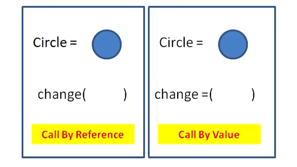

# Call by Value vs Call by Reference

함수 호출 방법에는 크게 두 가지가 있다.

Call by value(값에 의한 호출) : 인자로 받은 값을 복사하여 처리

Call by reference(참조에 의한 호출) : 인자로 받은 값의 주소를 참조하여 직접 값에 영향을 줌

즉 **값을 복사하여 처리하느냐, 아니면 직접 참조를 하느냐** 의 차이다.



### Call by Value

함수가 인수로 전달받은 값을 복사하여 처리하는 방식

이때, 전달된 값은 기본형, 즉 JS의 원시 타입 데이터인 경우에 해당하며, 변수가 가진 값을 복사하여 전달하므로 함수 내에서 값을 변경해도 원본 값은 변경되지 않는다. 따라서 값의 불변성을 유지하는데 용이하다.

장점

복사하여 처리하기 때문에 안전하다.

원래의 값이 보존된다. 

단점

복사를 하기 때문에 메모리 사용량이 늘어난다.

### Call by Reference

함수 호출 시 인수로 전달되는 변수의 참조 값을 함수 내부로 전달하는 방식

이 방식에서는 함수 내에서 인자로 전달된 변수의 값을 변경하면, 호출한 쪽에서도 해당 변수의 값이 변경된다. 이는 인자로 전달되는 값이 변수의 주소이므로, 함수 내에서 변수의 값을 변경하면 해당 주소에 저장된 값이 변경되기 때문이다.

장점 

복사하지 않고 직접 참조를 하기에 빠르다.

단점

직접 참조를 하기에 원래 값이 영향을 받는다.

## 콜 바이 레퍼런스 단점의 보완

콜 바이 레퍼런스는 참조타입을 전달하는 방식이다. 참조 타입의 경우 객체의 참조 값이 복사되므로, 객체 내부의 값이 변경되면, 원본 객체도 함께 변경되는 문제가 발생한다. 그렇다면 데이터의 원본이 수정된다. 

이런 문제점을 해결하기 위해 깊은 복사를 이용하는 방법이 있다. 

깊은 복사도 마찬가지로 객체를 복사했을 때, 원본에 영향을 주지 않는 방식을 사용하고 있다. 

(깊은 복사를 사용하게 되면 메모리 소모와 속도가 느려진다는 단점이 있다)

```jsx
function changeName(obj) {
	obj = JSON.parse(JSON.stringify(obj)); // 깊은 복사
	obj.name = 'John';
	return obj;
}

let person = { name: 'Jane', age: 25 };
let result = changeName(person);
console.log(result); // { name : 'John', age : 25 }
console.log(person); // { name : 'Jane', age : 25 } (원본 값 유지)

```

📚 출처

- https://wayhome25.github.io/cs/2017/04/11/cs-13/
- https://devlog-wjdrbs96.tistory.com/44
- https://sudo-minz.tistory.com/91
- [https://velog.io/@kwontae1313/JS의-Call-by-Value-와-Call-by-Reference](https://velog.io/@kwontae1313/JS%EC%9D%98-Call-by-Value-%EC%99%80-Call-by-Reference)