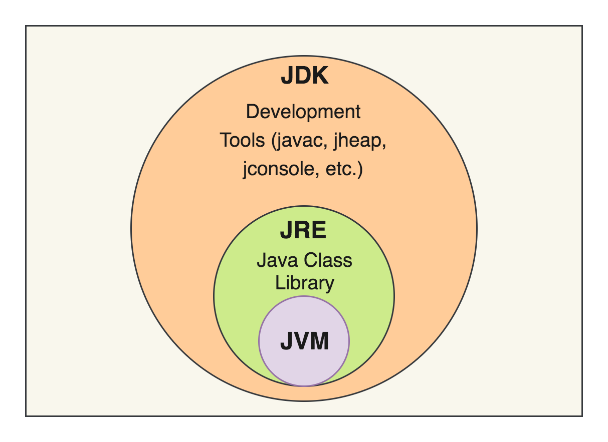

# JRE, JDK, JVM의 구분

# JVM

자바 가상 머신

자바 프로그램을 컴파일 해서 나온 결과인 바이트 코드를 실행시켜 주는 가상 머신

JVM - Write Once Run Anywhere

- 어플리케이션을 실행시켜주는 가상머시을 사용함으로써, 윈도우와 리눅스/맥 등 다양한 환경에서 언제나 동일하게 실행되도록 할 수 있다는 장점을 가지고 있다. (운영체제에 독립적)
- 각 운영체제별 jvm은 자바측에서 개발하여 배포하므로, 프로그래머는 운영체제에 관계없이 프로그램을 개발할 수 있어, 한 번 컴파일 됐으면 운영체제에 따라 다시 컴파일할 필요가 없는 wora를 만족한다.

# JRE

Java Runtime Environment의 약자로, 자바 실행 환경을 의미한다.

JVM을 동작하는데 필요한 각종 자바 라이브러리를 담고 있다.

# JDK

Java Development Kit의 약자로, 자바 개발 키트를 의미한다. 

JRE와 javac 등의 컴파일러, 디버거 등을 포함하는 프로그램

📚 출처

- https://cryptosalamander.tistory.com/4